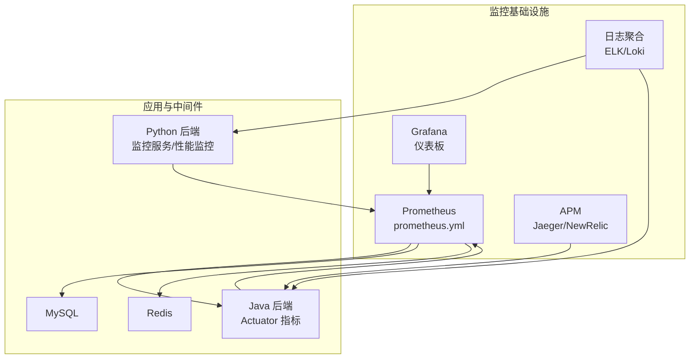
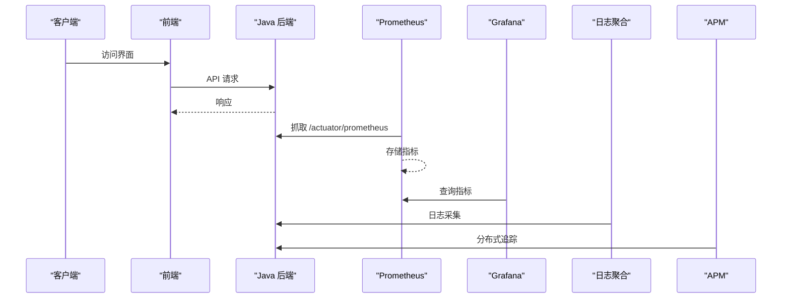
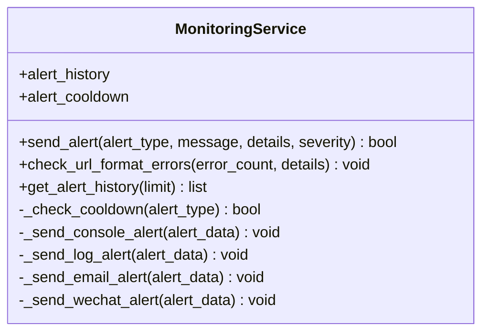
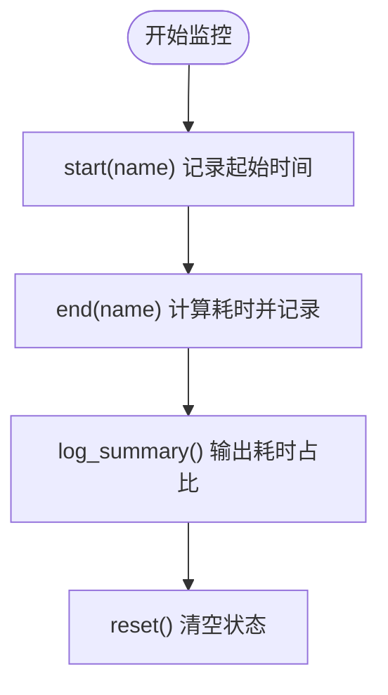
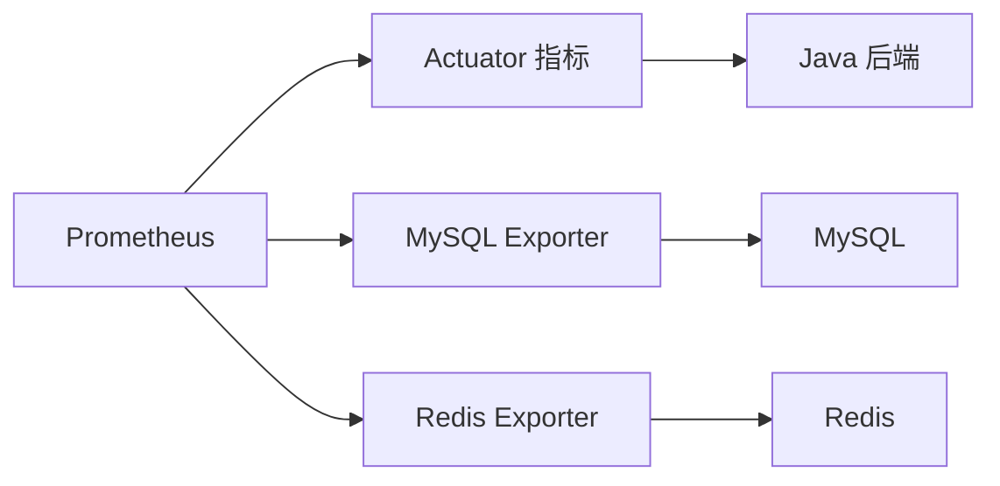

# 监控与告警

<cite>
**本文引用的文件**
- [prometheus.yml](file://prometheus/prometheus.yml)
- [monitoring_service.py](file://backend/app/services/monitoring_service.py)
- [performance_monitor.py](file://backend/app/utils/performance_monitor.py)
- [docker-compose.yml](file://docker-compose.yml)
- [docker-compose.prod.yml](file://docker-compose.prod.yml)
- [application.yml](file://java-backend/src/main/resources/application.yml)
</cite>

## 目录
1. [简介](#简介)
2. [项目结构](#项目结构)
3. [核心组件](#核心组件)
4. [架构总览](#架构总览)
5. [详细组件分析](#详细组件分析)
6. [依赖关系分析](#依赖关系分析)
7. [性能考量](#性能考量)
8. [故障排查指南](#故障排查指南)
9. [结论](#结论)
10. [附录](#附录)

## 简介
本文件面向“思觉智贸系统”的监控与告警体系，围绕以下目标展开：
- Prometheus 指标采集配置：覆盖应用性能指标、系统资源监控与业务指标跟踪
- Grafana 仪表板设计与关键指标展示建议
- 告警规则配置、通知渠道设置与告警分级管理
- 日志聚合方案：ELK Stack 或 Loki 的配置与使用建议
- APM 工具集成：Jaeger 分布式追踪与 New Relic 性能监控
- 监控数据的存储策略、保留周期与查询优化
- 故障排查与性能调优指南

本文件基于仓库中现有的 Prometheus 配置、Java 后端 Actuator 指标导出、Python 监控告警服务与性能监控工具进行说明，并提供可落地的实施建议。

## 项目结构
当前仓库中与监控相关的关键位置如下：
- Prometheus 配置：prometheus/prometheus.yml
- Java 后端指标导出：application.yml 中启用 actuator.metrics.prometheus
- Python 监控告警服务：backend/app/services/monitoring_service.py
- Python 性能监控工具：backend/app/utils/performance_monitor.py
- Compose 编排：docker-compose.yml、docker-compose.prod.yml

图表来源
- [prometheus.yml:1-33](file://prometheus/prometheus.yml#L1-L33)
- [application.yml:176-195](file://java-backend/src/main/resources/application.yml#L176-L195)
- [monitoring_service.py:1-228](file://backend/app/services/monitoring_service.py#L1-L228)
- [performance_monitor.py:1-158](file://backend/app/utils/performance_monitor.py#L1-L158)

章节来源
- [prometheus.yml:1-33](file://prometheus/prometheus.yml#L1-L33)
- [docker-compose.yml:1-36](file://docker-compose.yml#L1-L36)
- [docker-compose.prod.yml:1-77](file://docker-compose.prod.yml#L1-L77)
- [application.yml:176-195](file://java-backend/src/main/resources/application.yml#L176-L195)

## 核心组件
- Prometheus 指标采集器：负责从 Java 后端 Actuator、MySQL Exporter、Redis Exporter 等目标抓取指标
- Java 后端指标导出：通过 Spring Boot Actuator 暴露 /actuator/prometheus 接口
- Python 监控告警服务：提供告警发送、冷却控制与历史记录管理
- Python 性能监控工具：提供函数/协程耗时测量与摘要日志输出
- Compose 编排：定义后端、前端、MySQL、Redis 的容器与端口映射

章节来源
- [prometheus.yml:8-33](file://prometheus/prometheus.yml#L8-L33)
- [application.yml:176-195](file://java-backend/src/main/resources/application.yml#L176-L195)
- [monitoring_service.py:23-228](file://backend/app/services/monitoring_service.py#L23-L228)
- [performance_monitor.py:9-158](file://backend/app/utils/performance_monitor.py#L9-L158)
- [docker-compose.prod.yml:20-77](file://docker-compose.prod.yml#L20-L77)

## 架构总览
下图展示了监控体系在系统中的交互关系：Prometheus 抓取后端与中间件指标；Java 后端通过 Actuator 暴露指标；Python 侧提供告警与性能监控；Grafana 作为可视化；日志与追踪分别接入 ELK/Loki 与 Jaeger/NewRelic。

图表来源
- [application.yml:176-195](file://java-backend/src/main/resources/application.yml#L176-L195)
- [prometheus.yml:8-33](file://prometheus/prometheus.yml#L8-L33)

## 详细组件分析

### Prometheus 指标采集配置
- 抓取间隔与评估间隔：全局 scrape_interval 与 evaluation_interval
- 后端指标：job_name 为 sjzm-backend，metrics_path 指向 /actuator/prometheus，目标为 backend:8080
- 系统资源：MySQL Exporter 与 Redis Exporter 作为静态目标
- Prometheus 自身：本地 9090 端口

建议补充：
- 为后端增加标签 cluster 与 environment，便于多环境区分
- 为 MySQL/Redis 添加更细粒度的指标过滤与超时配置
- 为 Python 后端增加指标导出（例如通过自定义指标端点或 Pushgateway）

章节来源
- [prometheus.yml:1-33](file://prometheus/prometheus.yml#L1-L33)
- [application.yml:176-195](file://java-backend/src/main/resources/application.yml#L176-L195)

### Java 后端指标导出与健康探针
- Actuator 指标暴露：management.endpoints.web.exposure.include 包含 metrics、prometheus 等
- 指标导出开关：management.metrics.export.prometheus.enabled
- Tracing 采样：management.tracing.sampling.probability 设置为 1.0
- 健康探针：management.endpoint.health.probes.enabled=true
- Undertow 线程池参数：io-threads、worker-threads、max-connections 等

建议：
- 在生产环境开启更严格的采样率以降低开销
- 结合 JVM 指标与业务指标共同分析

章节来源
- [application.yml:176-195](file://java-backend/src/main/resources/application.yml#L176-L195)
- [application.yml:1-12](file://java-backend/src/main/resources/application.yml#L1-L12)

### Python 监控告警服务
- 功能：告警类型、消息体、严重级别、冷却时间控制、历史记录
- 渠道：控制台与日志通道默认启用，预留邮件与企业微信扩展点
- 使用场景：URL 格式错误检测与告警触发

建议：
- 扩展通知渠道（邮件、Webhook、企业微信）
- 增加告警去重与静默窗口
- 将告警历史持久化到数据库或日志系统

图表来源
- [monitoring_service.py:23-228](file://backend/app/services/monitoring_service.py#L23-L228)

章节来源
- [monitoring_service.py:1-228](file://backend/app/services/monitoring_service.py#L1-L228)

### Python 性能监控工具
- 能力：阶段计时、异步任务计时、耗时统计与摘要日志
- 场景：热重载性能分析、函数/协程耗时测量装饰器

建议：
- 将性能指标推送至指标系统（如 Prometheus Pushgateway）
- 与告警联动：当耗时超过阈值时触发告警

图表来源
- [performance_monitor.py:22-108](file://backend/app/utils/performance_monitor.py#L22-L108)

章节来源
- [performance_monitor.py:1-158](file://backend/app/utils/performance_monitor.py#L1-L158)

### Compose 编排与端口映射
- 生产环境后端容器名与端口映射：prod-backend:7090、prod-frontend:80
- MySQL/Redis 健康检查与资源限制
- 日志卷与模型缓存卷挂载

建议：
- 为 Prometheus 与 Grafana 增加独立容器与持久化卷
- 为日志聚合与追踪服务预留端口与网络

章节来源
- [docker-compose.yml:1-36](file://docker-compose.yml#L1-L36)
- [docker-compose.prod.yml:1-77](file://docker-compose.prod.yml#L1-L77)

## 依赖关系分析
- Prometheus 依赖 Java 后端 Actuator 指标端点与 MySQL/Redis Exporter
- Java 后端依赖 MySQL 与 Redis，受 Compose 健康检查保障
- Python 监控服务与性能监控工具为独立模块，可按需集成指标上报

图表来源
- [prometheus.yml:8-33](file://prometheus/prometheus.yml#L8-L33)
- [application.yml:176-195](file://java-backend/src/main/resources/application.yml#L176-L195)

章节来源
- [prometheus.yml:8-33](file://prometheus/prometheus.yml#L8-L33)
- [application.yml:176-195](file://java-backend/src/main/resources/application.yml#L176-L195)

## 性能考量
- 指标抓取频率：全局 15s，后端 10s，建议根据负载调整
- Java Undertow 线程池与连接数上限：合理设置以避免过载
- 指标导出采样：生产环境建议降低采样概率
- 日志与追踪：避免高频日志与全量追踪，采用采样与分层策略
- 存储与保留：Prometheus 仅适合短期高分辨率指标，长期趋势建议归档至远端存储

## 故障排查指南
- 指标缺失
  - 检查 Actuator 指标端点是否暴露
  - 确认 Prometheus 抓取路径与目标可达
  - 核对网络连通性与防火墙
- 告警风暴
  - 检查冷却时间与去重策略
  - 临时静默或抑制告警，定位根因
- 性能异常
  - 使用性能监控工具定位热点阶段
  - 对比热重载前后耗时，识别回归点
- 日志与追踪
  - 确认日志聚合服务可用性与索引建立
  - 在 APM 中核对 Trace ID 与 Span 关系

## 结论
本监控体系以 Prometheus 为核心，结合 Java 后端 Actuator 指标、Python 监控告警与性能工具，形成可观测性基础。建议进一步完善通知渠道、指标上报、日志与追踪集成，并制定数据保留与查询优化策略，持续提升稳定性与可维护性。

## 附录
- Grafana 仪表板建议
  - 应用层：请求速率、错误率、P95/P99 延迟、线程池与连接池使用率
  - 数据层：MySQL/Redis QPS、慢查询、连接数、命中率
  - 业务层：关键业务指标（如下载任务成功率、搜索响应时间）
- 告警规则建议
  - 错误率阈值、延迟阈值、资源使用率阈值、健康探针失败
  - 分级：warning/warning/error/critical，配合静默与抑制
- 日志聚合
  - ELK：Filebeat 收集 → Logstash 处理 → Elasticsearch 存储 → Kibana 可视化
  - Loki：Promtail 收集 → Loki 存储 → Grafana 查询
- APM 集成
  - Jaeger：在 Java 后端启用 OpenTelemetry/Spring Cloud Sleuth，配置 Jaeger Agent
  - New Relic：按平台指引接入，关注事务与数据库调用