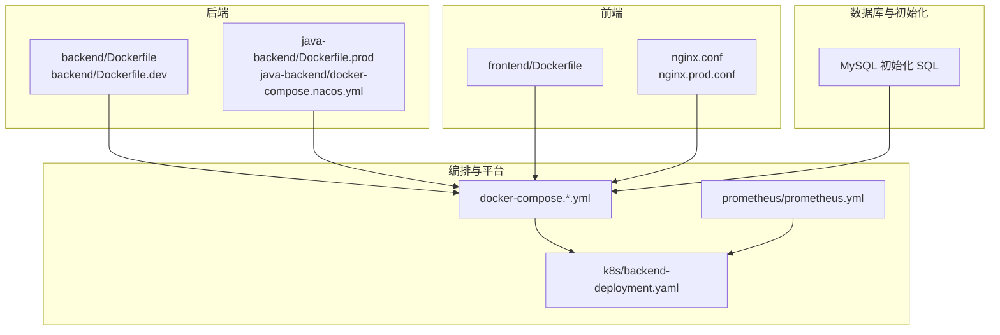
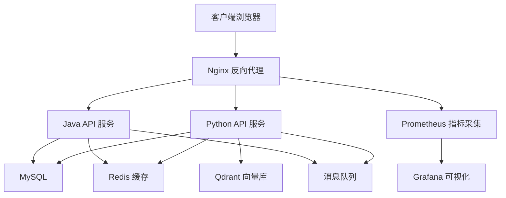
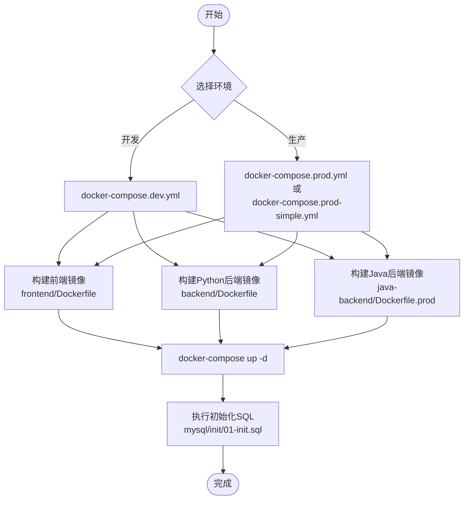
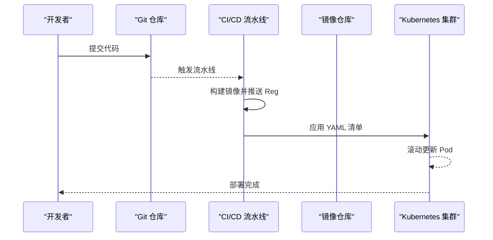
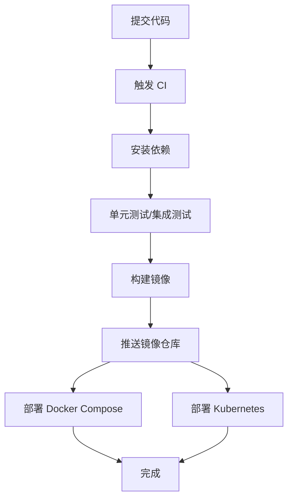
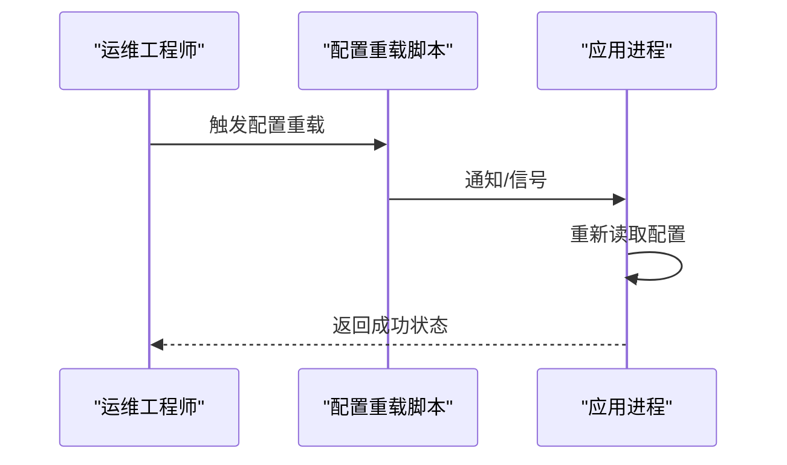
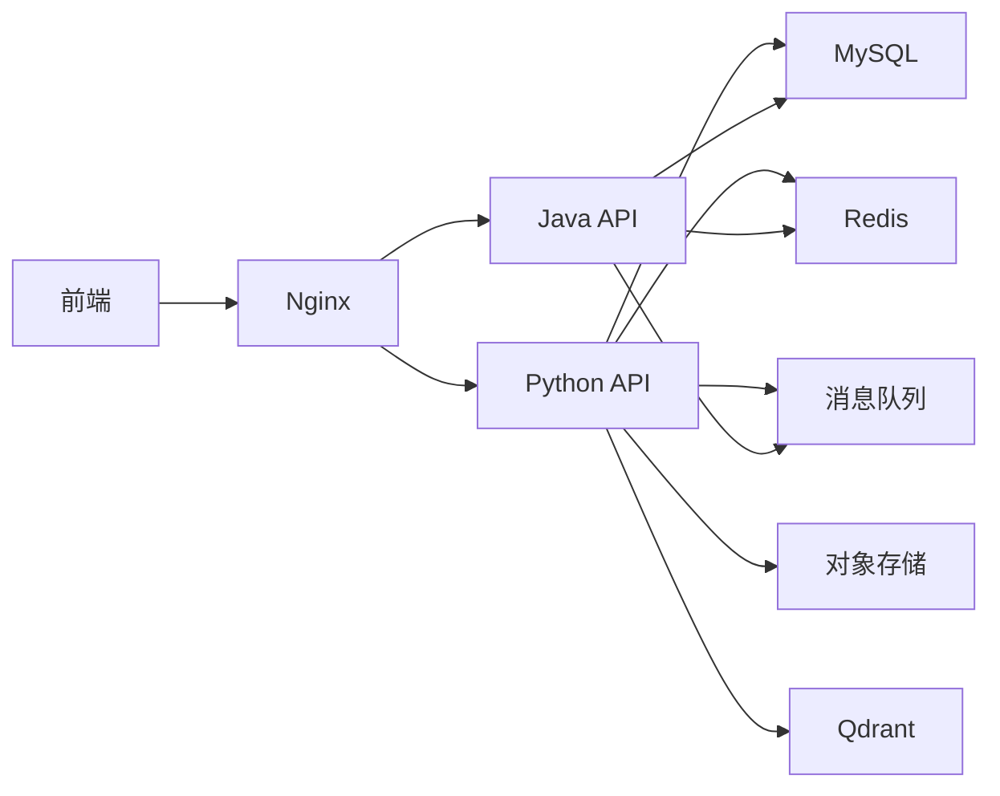

# 部署与运维

<cite>
**本文引用的文件**
- [docker-compose.yml](file://docker-compose.yml)
- [docker-compose.base.yml](file://docker-compose.base.yml)
- [docker-compose.dev.yml](file://docker-compose.dev.yml)
- [docker-compose.prod.yml](file://docker-compose.prod.yml)
- [docker-compose.prod-simple.yml](file://docker-compose.prod-simple.yml)
- [backend/Dockerfile](file://backend/Dockerfile)
- [backend/Dockerfile.base](file://backend/Dockerfile.base)
- [backend/Dockerfile.dev](file://backend/Dockerfile.dev)
- [.dockerignore](file://backend/.dockerignore)
- [frontend/Dockerfile](file://frontend/Dockerfile)
- [nginx.conf](file://nginx.conf)
- [nginx.prod.conf](file://nginx.prod.conf)
- [k8s/backend-deployment.yaml](file://k8s/backend-deployment.yaml)
- [prometheus/prometheus.yml](file://prometheus/prometheus.yml)
- [.github/workflows/ci.yml](file://.github/workflows/ci.yml)
- [scripts/ci/workflows/test.yml](file://scripts/ci/workflows/test.yml)
- [scripts/ci/workflows/naming-convention-check.yml](file://scripts/ci/workflows/naming-convention-check.yml)
- [scripts/deployment/blue_green_deployment.py](file://scripts/deployment/blue_green_deployment.py)
- [scripts/deployment/canary_deployment.py](file://scripts/deployment/canary_deployment.py)
- [scripts/startup/start_prod_multiprocess.py](file://scripts/startup/start_prod_multiprocess.py)
- [scripts/utils/system/hot_reload.py](file://scripts/utils/system/hot_reload.py)
- [scripts/utils/system/config_reloader.py](file://scripts/utils/system/config_reloader.py)
- [scripts/monitoring/performance_monitor.py](file://scripts/monitoring/performance_monitor.py)
- [docs/生产部署检查清单.md](file://docs/生产部署检查清单.md)
- [docs/架构/Docker生产环境独立部署方案.md](file://docs/架构/Docker生产环境独立部署方案.md)
- [docs/docker使用经验/README.md](file://docs/docker使用经验/README.md)
- [docs/问题记录/生产数据库误删事故.md](file://docs/问题记录/生产数据库误删事故.md)
- [docs/问题记录/生产环境图片加载失败-COS_BUCKET配置错误.md](file://docs/问题记录/生产环境图片加载失败-COS_BUCKET配置错误.md)
- [docs/问题记录/生产环境登录失败-数据库密码hash不一致.md](file://docs/问题记录/生产环境登录失败-数据库密码hash不一致.md)
- [docs/架构/端口.md](file://docs/架构/端口.md)
- [config/ports.json](file://config/ports.json)
- [mysql/init/01-init.sql](file://mysql/init/01-init.sql)
- [java-backend/src/main/resources/application.yml](file://java-backend/src/main/resources/application.yml)
- [java-backend/src/main/resources/application-prod.yml](file://java-backend/src/main/resources/application-prod.yml)
- [java-backend/Dockerfile.prod](file://java-backend/Dockerfile.prod)
- [java-backend/docker-compose.nacos.yml](file://java-backend/docker-compose.nacos.yml)
- [java-backend/jvm-config/jvm-options.env](file://java-backend/jvm-config/jvm-options.env)
- [DOCKER_DEPLOY.md](file://DOCKER_DEPLOY.md)
- [prod.sh](file://prod.sh)
- [dev.sh](file://dev.sh)
- [start_dev_java.bat](file://start_dev_java.bat)
- [init-db.bat](file://init-db.bat)
- [init-db.ps1](file://init-db.ps1)
- [scripts/deploy/deploy_frontend_to_production.bat](file://scripts/deploy/deploy_frontend_to_production.bat)
- [scripts/environment/setup_dev_environment.py](file://scripts/environment/setup_dev_environment.py)
- [scripts/environment/create_dev_database.py](file://scripts/environment/create_dev_database.py)
- [scripts/environment/setup_frontend_isolation.py](file://scripts/environment/setup_frontend_isolation.py)
- [scripts/git_sync/git_sync_config.json](file://scripts/git_sync/git_sync_config.json)
- [scripts/git_sync/auto_sync.py](file://scripts/git_sync/auto_sync.py)
- [scripts/git_sync/conflict_manager.py](file://scripts/git_sync/conflict_manager.py)
- [scripts/git_sync/git_manager.py](file://scripts/git_sync/git_manager.py)
- [scripts/git_sync/hook_manager.py](file://scripts/git_sync/hook_manager.py)
- [scripts/env_consistency/alert_system.py](file://scripts/env_consistency/alert_system.py)
- [scripts/env_consistency/core_validator.py](file://scripts/env_consistency/core_validator.py)
- [scripts/env_consistency/data_sync.py](file://scripts/env_consistency/data_sync.py)
- [scripts/env_consistency/validate_env_consistency.py](file://scripts/env_consistency/validate_env_consistency.py)
- [scripts/scheduler/update_aggregation_tables.py](file://scripts/scheduler/update_aggregation_tables.py)
- [scripts/migrations/add_listing_date_field.py](file://scripts/migrations/add_listing_date_field.py)
- [scripts/migrations/add_main_category_fields.py](file://scripts/migrations/add_main_category_fields.py)
- [scripts/migrations/add_original_zip_fields.py](file://scripts/migrations/add_original_zip_fields.py)
- [scripts/database/check_table_structure.py](file://scripts/database/check_table_structure.py)
- [scripts/database/create_aggregation_tables.py](file://scripts/database/create_aggregation_tables.py)
- [scripts/database/add_performance_indexes.py](file://scripts/database/add_performance_indexes.py)
- [scripts/database/extract_categories.py](file://scripts/database/extract_categories.py)
- [scripts/database/analyze_product_data.py](file://scripts/database/analyze_product_data.py)
- [scripts/utils/qdrant_monitor.py](file://scripts/utils/qdrant_monitor.py)
- [scripts/utils/error_logger.py](file://scripts/utils/error_logger.py)
- [scripts/utils/middleware/timeout_middleware.py](file://scripts/utils/middleware/timeout_middleware.py)
- [scripts/utils/validation/composite_product_validator.py](file://scripts/utils/validation/composite_product_validator.py)
- [scripts/utils/task/task_manager.py](file://scripts/utils/task/task_manager.py)
- [scripts/utils/system/system_check.py](file://scripts/utils/system/system_check.py)
- [scripts/utils/system/file_watcher.py](file://scripts/utils/system/file_watcher.py)
- [scripts/utils/middleware/__init__.py](file://scripts/utils/middleware/__init__.py)
- [scripts/utils/validation/__init__.py](file://scripts/utils/validation/__init__.py)
- [scripts/utils/__init__.py](file://scripts/utils/__init__.py)
- [scripts/utils/utils.py](file://scripts/utils/utils.py)
- [scripts/utils/__init__.py](file://scripts/utils/__init__.py)
- [scripts/utils/utils.py](file://scripts/utils/utils.py)
</cite>

## 目录
1. [简介](#简介)
2. [项目结构](#项目结构)
3. [核心组件](#核心组件)
4. [架构总览](#架构总览)
5. [详细组件分析](#详细组件分析)
6. [依赖关系分析](#依赖关系分析)
7. [性能考虑](#性能考虑)
8. [故障排除指南](#故障排除指南)
9. [结论](#结论)
10. [附录](#附录)

## 简介
本指南面向运维工程师，提供从环境搭建到日常维护的完整部署与运维操作手册。内容覆盖：
- Docker 容器化部署的完整流程与配置选项
- Kubernetes 集群部署策略与资源配置
- CI/CD 流水线配置、自动化构建与部署
- 监控告警、性能指标与日志管理
- 负载均衡、高可用与灾难恢复
- 环境管理、配置热更新与滚动升级
- 运维脚本使用与故障排除

## 项目结构
系统由多语言后端（Python、Java）、前端（Vue）与基础设施组成，支持 Docker Compose 与 Kubernetes 双栈部署，并提供完善的 CI/CD、监控与运维脚本。

**图表来源**
- [docker-compose.yml:1-200](file://docker-compose.yml#L1-L200)
- [docker-compose.prod.yml:1-200](file://docker-compose.prod.yml#L1-L200)
- [backend/Dockerfile:1-120](file://backend/Dockerfile#L1-L120)
- [frontend/Dockerfile:1-120](file://frontend/Dockerfile#L1-L120)
- [nginx.conf:1-200](file://nginx.conf#L1-L200)
- [k8s/backend-deployment.yaml:1-200](file://k8s/backend-deployment.yaml#L1-L200)
- [prometheus/prometheus.yml:1-120](file://prometheus/prometheus.yml#L1-L120)
- [mysql/init/01-init.sql:1-200](file://mysql/init/01-init.sql#L1-L200)

**章节来源**
- [docker-compose.yml:1-200](file://docker-compose.yml#L1-L200)
- [docker-compose.prod.yml:1-200](file://docker-compose.prod.yml#L1-L200)
- [backend/Dockerfile:1-120](file://backend/Dockerfile#L1-L120)
- [frontend/Dockerfile:1-120](file://frontend/Dockerfile#L1-L120)
- [nginx.conf:1-200](file://nginx.conf#L1-L200)
- [k8s/backend-deployment.yaml:1-200](file://k8s/backend-deployment.yaml#L1-L200)
- [prometheus/prometheus.yml:1-120](file://prometheus/prometheus.yml#L1-L120)
- [mysql/init/01-init.sql:1-200](file://mysql/init/01-init.sql#L1-L200)

## 核心组件
- 前端镜像与 Nginx：通过前端 Dockerfile 构建静态资源镜像，使用 nginx.conf/nginx.prod.conf 提供反向代理与静态资源服务。
- Python 后端镜像：通过 backend/Dockerfile 构建 API 服务镜像，支持开发与生产两种构建方式。
- Java 后端镜像：通过 java-backend/Dockerfile.prod 构建 Spring Boot 应用镜像，配合 Nacos 编排。
- 数据库：MySQL 初始化脚本位于 mysql/init/01-init.sql，用于首次部署与迁移。
- 编排与平台：docker-compose.*.yml 定义服务编排；k8s/backend-deployment.yaml 定义 Kubernetes 部署策略。
- 监控：prometheus/prometheus.yml 配置指标采集。

**章节来源**
- [frontend/Dockerfile:1-120](file://frontend/Dockerfile#L1-L120)
- [nginx.conf:1-200](file://nginx.conf#L1-L200)
- [backend/Dockerfile:1-120](file://backend/Dockerfile#L1-L120)
- [java-backend/Dockerfile.prod:1-120](file://java-backend/Dockerfile.prod#L1-L120)
- [mysql/init/01-init.sql:1-200](file://mysql/init/01-init.sql#L1-L200)
- [k8s/backend-deployment.yaml:1-200](file://k8s/backend-deployment.yaml#L1-L200)
- [prometheus/prometheus.yml:1-120](file://prometheus/prometheus.yml#L1-L120)

## 架构总览
系统采用“前端静态 + 后端 API + 数据库 + 缓存/消息中间件 + 监控”的分层架构。支持 Docker Compose 快速部署与 Kubernetes 生产级编排。

**图表来源**
- [docker-compose.prod.yml:1-200](file://docker-compose.prod.yml#L1-L200)
- [prometheus/prometheus.yml:1-120](file://prometheus/prometheus.yml#L1-L120)

**章节来源**
- [docker-compose.prod.yml:1-200](file://docker-compose.prod.yml#L1-L200)
- [prometheus/prometheus.yml:1-120](file://prometheus/prometheus.yml#L1-L120)

## 详细组件分析

### Docker 容器化部署
- 构建与运行
  - 使用 docker-compose.base.yml 定义基础服务与网络；在开发环境使用 docker-compose.dev.yml 扩展开发特性；在生产环境使用 docker-compose.prod.yml 或 docker-compose.prod-simple.yml。
  - 前端镜像通过 frontend/Dockerfile 构建，Nginx 配置见 nginx.conf 与 nginx.prod.conf。
  - Python 后端镜像通过 backend/Dockerfile 构建，开发镜像通过 backend/Dockerfile.dev。
  - Java 后端镜像通过 java-backend/Dockerfile.prod 构建，配合 java-backend/docker-compose.nacos.yml 进行服务注册与配置中心集成。
- 关键配置
  - 端口映射与暴露：参考 docs/架构/端口.md 与 config/ports.json。
  - 环境变量与卷挂载：在 docker-compose 文件中定义数据库、缓存、对象存储等外部依赖。
  - 初始化脚本：mysql/init/01-init.sql 在首次启动时初始化数据库结构与种子数据。
- 镜像构建优化
  - 使用 .dockerignore 排除不必要的构建上下文，减少镜像体积与构建时间。

**图表来源**
- [docker-compose.dev.yml:1-200](file://docker-compose.dev.yml#L1-L200)
- [docker-compose.prod.yml:1-200](file://docker-compose.prod.yml#L1-L200)
- [frontend/Dockerfile:1-120](file://frontend/Dockerfile#L1-L120)
- [backend/Dockerfile:1-120](file://backend/Dockerfile#L1-L120)
- [java-backend/Dockerfile.prod:1-120](file://java-backend/Dockerfile.prod#L1-L120)
- [mysql/init/01-init.sql:1-200](file://mysql/init/01-init.sql#L1-L200)

**章节来源**
- [docker-compose.base.yml:1-200](file://docker-compose.base.yml#L1-L200)
- [docker-compose.dev.yml:1-200](file://docker-compose.dev.yml#L1-L200)
- [docker-compose.prod.yml:1-200](file://docker-compose.prod.yml#L1-L200)
- [docker-compose.prod-simple.yml:1-200](file://docker-compose.prod-simple.yml#L1-L200)
- [frontend/Dockerfile:1-120](file://frontend/Dockerfile#L1-L120)
- [backend/Dockerfile:1-120](file://backend/Dockerfile#L1-L120)
- [backend/Dockerfile.dev:1-120](file://backend/Dockerfile.dev#L1-L120)
- [java-backend/Dockerfile.prod:1-120](file://java-backend/Dockerfile.prod#L1-L120)
- [nginx.conf:1-200](file://nginx.conf#L1-L200)
- [nginx.prod.conf:1-200](file://nginx.prod.conf#L1-L200)
- [.dockerignore:1-200](file://backend/.dockerignore#L1-L200)
- [docs/架构/端口.md:1-200](file://docs/架构/端口.md#L1-L200)
- [config/ports.json:1-200](file://config/ports.json#L1-L200)
- [mysql/init/01-init.sql:1-200](file://mysql/init/01-init.sql#L1-L200)

### Kubernetes 集群部署
- 部署策略
  - 使用 k8s/backend-deployment.yaml 描述 Deployment、Service、ConfigMap、Secret 等资源，实现副本数、滚动更新、健康检查与资源限制。
- 资源配置
  - CPU/内存请求与限制：根据业务峰值与并发场景合理设置，避免资源争抢。
  - 存储：持久卷（PVC）用于数据库与缓存数据目录挂载。
  - 网络：Ingress 控制器统一入口，TLS 终止与证书管理。
- 高可用
  - 多副本与亲和性/反亲和性策略，确保 Pod 分布在不同节点。
  - 数据库主从或集群模式，启用备份与快照。
- 灾难恢复
  - 定期备份策略：数据库全量+增量备份，对象存储归档。
  - 故障演练：定期进行故障注入与恢复演练。

**图表来源**
- [.github/workflows/ci.yml:1-200](file://.github/workflows/ci.yml#L1-L200)
- [k8s/backend-deployment.yaml:1-200](file://k8s/backend-deployment.yaml#L1-L200)

**章节来源**
- [k8s/backend-deployment.yaml:1-200](file://k8s/backend-deployment.yaml#L1-L200)
- [java-backend/docker-compose.nacos.yml:1-200](file://java-backend/docker-compose.nacos.yml#L1-L200)

### CI/CD 流水线
- 流水线组成
  - .github/workflows/ci.yml：主流水线，负责拉取代码、安装依赖、单元测试、构建镜像、推送镜像与部署。
  - scripts/ci/workflows/test.yml：独立测试工作流，校验测试覆盖率与质量门禁。
  - scripts/ci/workflows/naming-convention-check.yml：命名规范检查，保证代码风格一致性。
- 自动化构建
  - 前端：基于 package.json 的构建脚本，生成静态产物。
  - 后端：Python 与 Java 分别构建镜像，支持多阶段构建优化体积。
- 自动化部署
  - Docker Compose：一键启动多服务。
  - Kubernetes：应用 YAML 清单，支持蓝绿/金丝雀发布脚本。

**图表来源**
- [.github/workflows/ci.yml:1-200](file://.github/workflows/ci.yml#L1-L200)
- [scripts/ci/workflows/test.yml:1-200](file://scripts/ci/workflows/test.yml#L1-L200)
- [scripts/ci/workflows/naming-convention-check.yml:1-200](file://scripts/ci/workflows/naming-convention-check.yml#L1-L200)

**章节来源**
- [.github/workflows/ci.yml:1-200](file://.github/workflows/ci.yml#L1-L200)
- [scripts/ci/workflows/test.yml:1-200](file://scripts/ci/workflows/test.yml#L1-L200)
- [scripts/ci/workflows/naming-convention-check.yml:1-200](file://scripts/ci/workflows/naming-convention-check.yml#L1-L200)

### 监控与告警
- 指标采集
  - Prometheus：在 prometheus/prometheus.yml 中配置抓取目标，包括 Python/Java 服务、Nginx、数据库与外部组件。
- 可视化
  - Grafana：连接 Prometheus 数据源，创建仪表盘展示关键指标（QPS、延迟、错误率、内存/CPU 使用率、队列长度等）。
- 告警
  - Alertmanager：配置阈值告警与静默窗口，邮件/IM 通知到值班群组。
- 日志管理
  - 结构化日志：统一 JSON 格式，包含时间戳、级别、模块、请求 ID。
  - 日志聚合：ELK/EFK 或 Loki/Grafana stack 收集与检索。
  - 日志轮转：按大小/时间轮转，保留周期与压缩策略。

**章节来源**
- [prometheus/prometheus.yml:1-120](file://prometheus/prometheus.yml#L1-L120)

### 负载均衡、高可用与灾难恢复
- 负载均衡
  - Nginx：作为边缘代理，支持健康检查与会话保持（如需）。
  - Kubernetes：Ingress + 负载均衡器（云厂商或 MetalLB），实现流量分发。
- 高可用
  - 多副本：Deployment 设置 replicas，Pod 失败自动重启。
  - 多可用区：节点亲和性与污点容忍，避免单点故障。
- 灾难恢复
  - 数据备份：定时全量备份 + 增量备份，异地归档。
  - 快速回滚：版本化镜像标签与 Helm/Kustomize 管理，支持一键回滚。
  - 故障演练：定期演练数据库主从切换、节点隔离与网络分区恢复。

**章节来源**
- [nginx.conf:1-200](file://nginx.conf#L1-L200)
- [k8s/backend-deployment.yaml:1-200](file://k8s/backend-deployment.yaml#L1-L200)

### 环境管理、配置热更新与滚动升级
- 环境管理
  - 环境变量：通过 docker-compose 的 env 文件或 Kubernetes ConfigMap/Secret 注入。
  - 端口与网络：集中定义在 config/ports.json 与 docs/架构/端口.md。
- 配置热更新
  - Python/Java：监听配置文件变更或通过配置中心（Nacos）动态刷新。
  - 运维脚本：scripts/utils/system/config_reloader.py 实现配置重载。
- 滚动升级
  - Docker：docker-compose pull && up -d，逐个替换容器。
  - Kubernetes：kubectl set image 或滚动更新策略，配合 readiness/liveness 探针。

**图表来源**
- [scripts/utils/system/config_reloader.py:1-200](file://scripts/utils/system/config_reloader.py#L1-L200)

**章节来源**
- [config/ports.json:1-200](file://config/ports.json#L1-L200)
- [docs/架构/端口.md:1-200](file://docs/架构/端口.md#L1-L200)
- [scripts/utils/system/config_reloader.py:1-200](file://scripts/utils/system/config_reloader.py#L1-L200)

### 运维脚本使用指南
- 启动与停止
  - prod.sh：一键启动生产环境（多进程启动 Python/Java/Nginx）。
  - dev.sh：开发环境启动脚本。
  - init-db.bat / init-db.ps1：初始化数据库。
- 部署与同步
  - scripts/deploy/deploy_frontend_to_production.bat：前端静态资源部署。
  - scripts/deployment/blue_green_deployment.py 与 canary_deployment.py：蓝绿与金丝雀发布。
- 环境准备
  - scripts/environment/setup_dev_environment.py：开发环境初始化。
  - scripts/environment/create_dev_database.py：创建开发数据库。
  - scripts/environment/setup_frontend_isolation.py：前端隔离部署。
- 监控与巡检
  - scripts/monitoring/performance_monitor.py：性能监控脚本。
  - scripts/utils/system/system_check.py：系统健康检查。
- 数据与迁移
  - scripts/database/*：表结构检查、索引添加、聚合表更新。
  - scripts/migrations/*：数据库迁移脚本。
- Git 同步与一致性
  - scripts/git_sync/*：自动同步、冲突管理、钩子管理。
- 环境一致性验证
  - scripts/env_consistency/*：告警系统、核心校验、数据同步与一致性验证。

**章节来源**
- [prod.sh:1-200](file://prod.sh#L1-L200)
- [dev.sh:1-200](file://dev.sh#L1-L200)
- [init-db.bat:1-200](file://init-db.bat#L1-L200)
- [init-db.ps1:1-200](file://init-db.ps1#L1-L200)
- [scripts/deploy/deploy_frontend_to_production.bat:1-200](file://scripts/deploy/deploy_frontend_to_production.bat#L1-L200)
- [scripts/deployment/blue_green_deployment.py:1-200](file://scripts/deployment/blue_green_deployment.py#L1-L200)
- [scripts/deployment/canary_deployment.py:1-200](file://scripts/deployment/canary_deployment.py#L1-L200)
- [scripts/environment/setup_dev_environment.py:1-200](file://scripts/environment/setup_dev_environment.py#L1-L200)
- [scripts/environment/create_dev_database.py:1-200](file://scripts/environment/create_dev_database.py#L1-L200)
- [scripts/environment/setup_frontend_isolation.py:1-200](file://scripts/environment/setup_frontend_isolation.py#L1-L200)
- [scripts/monitoring/performance_monitor.py:1-200](file://scripts/monitoring/performance_monitor.py#L1-L200)
- [scripts/utils/system/system_check.py:1-200](file://scripts/utils/system/system_check.py#L1-L200)
- [scripts/database/check_table_structure.py:1-200](file://scripts/database/check_table_structure.py#L1-L200)
- [scripts/database/create_aggregation_tables.py:1-200](file://scripts/database/create_aggregation_tables.py#L1-L200)
- [scripts/database/add_performance_indexes.py:1-200](file://scripts/database/add_performance_indexes.py#L1-L200)
- [scripts/database/extract_categories.py:1-200](file://scripts/database/extract_categories.py#L1-L200)
- [scripts/database/analyze_product_data.py:1-200](file://scripts/database/analyze_product_data.py#L1-L200)
- [scripts/migrations/add_listing_date_field.py:1-200](file://scripts/migrations/add_listing_date_field.py#L1-L200)
- [scripts/migrations/add_main_category_fields.py:1-200](file://scripts/migrations/add_main_category_fields.py#L1-L200)
- [scripts/migrations/add_original_zip_fields.py:1-200](file://scripts/migrations/add_original_zip_fields.py#L1-L200)
- [scripts/git_sync/git_sync_config.json:1-200](file://scripts/git_sync/git_sync_config.json#L1-L200)
- [scripts/git_sync/auto_sync.py:1-200](file://scripts/git_sync/auto_sync.py#L1-L200)
- [scripts/git_sync/conflict_manager.py:1-200](file://scripts/git_sync/conflict_manager.py#L1-L200)
- [scripts/git_sync/git_manager.py:1-200](file://scripts/git_sync/git_manager.py#L1-L200)
- [scripts/git_sync/hook_manager.py:1-200](file://scripts/git_sync/hook_manager.py#L1-L200)
- [scripts/env_consistency/alert_system.py:1-200](file://scripts/env_consistency/alert_system.py#L1-L200)
- [scripts/env_consistency/core_validator.py:1-200](file://scripts/env_consistency/core_validator.py#L1-L200)
- [scripts/env_consistency/data_sync.py:1-200](file://scripts/env_consistency/data_sync.py#L1-L200)
- [scripts/env_consistency/validate_env_consistency.py:1-200](file://scripts/env_consistency/validate_env_consistency.py#L1-L200)

## 依赖关系分析
- 服务间耦合
  - 前端通过 Nginx 访问后端 API；后端依赖数据库、缓存、消息队列与向量库。
  - Java 后端通过 Nacos 进行配置与服务发现。
- 外部依赖
  - 对象存储（COS/OSS）用于图片与文件存储；需要正确配置桶名与访问密钥。
- 潜在风险
  - 配置错误导致图片加载失败或登录失败；数据库误删事故需要完善备份与权限控制。

**图表来源**
- [docker-compose.prod.yml:1-200](file://docker-compose.prod.yml#L1-L200)
- [java-backend/docker-compose.nacos.yml:1-200](file://java-backend/docker-compose.nacos.yml#L1-L200)

**章节来源**
- [docker-compose.prod.yml:1-200](file://docker-compose.prod.yml#L1-L200)
- [java-backend/docker-compose.nacos.yml:1-200](file://java-backend/docker-compose.nacos.yml#L1-L200)

## 性能考虑
- 资源规划
  - 根据峰值 QPS 与响应时间估算 CPU/内存；为数据库与缓存预留充足资源。
- 缓存策略
  - Redis 缓存热点数据与接口结果；结合本地缩略图缓存降低带宽与延迟。
- 异步任务
  - Celery 任务队列处理耗时任务（下载、图像分析、数据聚合），避免阻塞主线程。
- 索引与查询优化
  - 添加性能索引，定期分析慢查询日志。
- JVM 参数
  - java-backend/jvm-config/jvm-options.env 中设置堆大小、GC 策略与线程参数。

**章节来源**
- [java-backend/jvm-config/jvm-options.env:1-200](file://java-backend/jvm-config/jvm-options.env#L1-L200)
- [scripts/database/add_performance_indexes.py:1-200](file://scripts/database/add_performance_indexes.py#L1-L200)
- [scripts/utils/system/hot_reload.py:1-200](file://scripts/utils/system/hot_reload.py#L1-L200)

## 故障排除指南
- 常见问题定位
  - 生产数据库误删：检查备份策略与权限；启用审计日志。
  - 生产环境图片加载失败：核对 COS_BUCKET、访问密钥与桶权限。
  - 登录失败：核对数据库密码 hash 一致性与用户状态。
- 日志与诊断
  - 查看 Nginx 错误日志与访问日志；后端服务日志输出到标准输出或文件。
  - 使用 scripts/utils/error_logger.py 统一错误记录格式。
- 快速恢复
  - 回滚到上一个稳定版本镜像；恢复数据库备份；重启异常 Pod/容器。
- 工具与脚本
  - scripts/utils/system/system_check.py：系统健康检查。
  - scripts/utils/qdrant_monitor.py：向量库健康检查。
  - scripts/utils/middleware/timeout_middleware.py：超时中间件排查。

**章节来源**
- [docs/问题记录/生产数据库误删事故.md:1-200](file://docs/问题记录/生产数据库误删事故.md#L1-L200)
- [docs/问题记录/生产环境图片加载失败-COS_BUCKET配置错误.md:1-200](file://docs/问题记录/生产环境图片加载失败-COS_BUCKET配置错误.md#L1-L200)
- [docs/问题记录/生产环境登录失败-数据库密码hash不一致.md:1-200](file://docs/问题记录/生产环境登录失败-数据库密码hash不一致.md#L1-L200)
- [scripts/utils/error_logger.py:1-200](file://scripts/utils/error_logger.py#L1-L200)
- [scripts/utils/system/system_check.py:1-200](file://scripts/utils/system/system_check.py#L1-L200)
- [scripts/utils/qdrant_monitor.py:1-200](file://scripts/utils/qdrant_monitor.py#L1-L200)
- [scripts/utils/middleware/timeout_middleware.py:1-200](file://scripts/utils/middleware/timeout_middleware.py#L1-L200)

## 结论
本指南提供了从容器化到 Kubernetes 的全栈部署与运维实践，结合 CI/CD、监控告警与自动化脚本，帮助团队实现高效、稳定、可扩展的线上交付。建议在生产环境中严格执行备份与演练、配置热更新与滚动升级流程，并持续优化性能与可观测性。

## 附录
- 生产部署检查清单：参考 docs/生产部署检查清单.md，确保每个环节无遗漏。
- Docker 生产环境独立部署方案：参考 docs/架构/Docker生产环境独立部署方案.md。
- Docker 使用经验：参考 docs/docker使用经验/README.md。

**章节来源**
- [docs/生产部署检查清单.md:1-200](file://docs/生产部署检查清单.md#L1-L200)
- [docs/架构/Docker生产环境独立部署方案.md:1-200](file://docs/架构/Docker生产环境独立部署方案.md#L1-L200)
- [docs/docker使用经验/README.md:1-200](file://docs/docker使用经验/README.md#L1-L200)