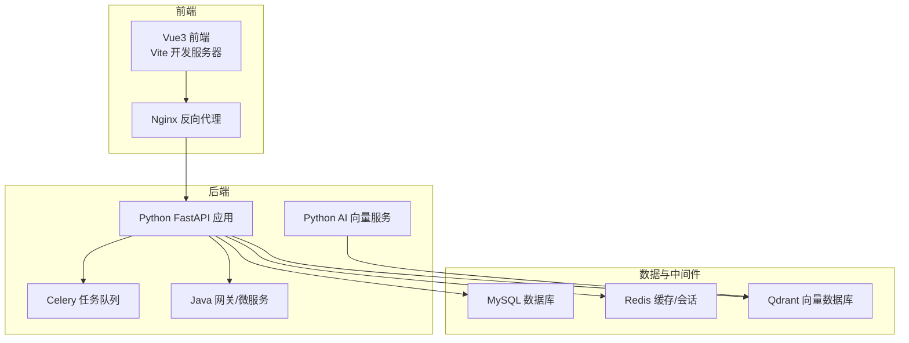
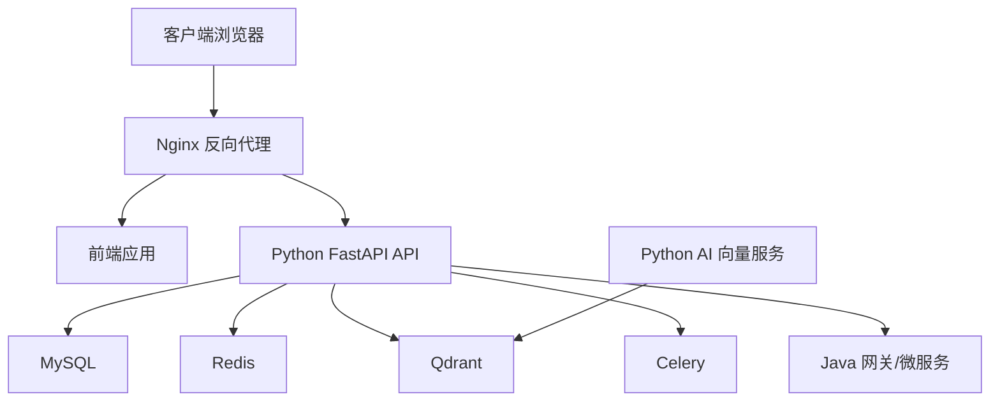
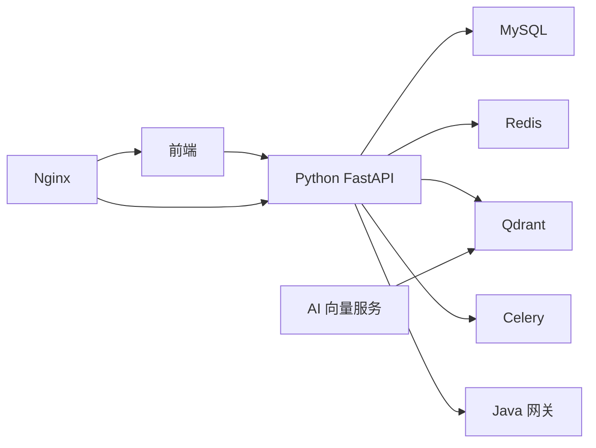

# 快速开始指南

<cite>
**本文引用的文件**
- [README.md](file://README.md)
- [启动.md](file://启动.md)
- [docker-compose.yml](file://docker-compose.yml)
- [docker-compose.dev.yml](file://docker-compose.dev.yml)
- [docker-compose.prod.yml](file://docker-compose.prod.yml)
- [docker-compose.prod-simple.yml](file://docker-compose.prod-simple.yml)
- [Dockerfile](file://backend/Dockerfile)
- [Dockerfile.dev](file://backend/Dockerfile.dev)
- [requirements.txt](file://backend/requirements.txt)
- [backend/main.py](file://backend/app/main.py)
- [backend/config.py](file://backend/app/config.py)
- [backend/start_celery.py](file://backend/start_celery.py)
- [backend/tasks/celery_app.py](file://backend/app/tasks/celery_app.py)
- [backend/middleware/auth_middleware.py](file://backend/app/middleware/auth_middleware.py)
- [backend/middleware/error_handler.py](file://backend/app/middleware/error_handler.py)
- [backend/middleware/logging.py](file://backend/app/middleware/logging.py)
- [backend/middleware/timeout.py](file://backend/app/middleware/timeout.py)
- [backend/services/token_service.py](file://backend/app/services/token_service.py)
- [backend/services/cache_warmup_service.py](file://backend/app/services/cache_warmup_service.py)
- [backend/services/monitoring_service.py](file://backend/app/services/monitoring_service.py)
- [backend/repositories/mysql_repo.py](file://backend/app/repositories/mysql_repo.py)
- [backend/repositories/redis_repo.py](file://backend/app/repositories/redis_repo.py)
- [backend/repositories/qdrant_repo.py](file://backend/app/repositories/qdrant_repo.py)
- [backend/utils/jwt_utils.py](file://backend/app/utils/jwt_utils.py)
- [backend/utils/performance_monitor.py](file://backend/app/utils/performance_monitor.py)
- [backend/db/migrations/create_final_drafts_table.sql](file://backend/app/db/migrations/create_final_drafts_table.sql)
- [backend/scripts/_parquet_cols.py](file://backend/scripts/_parquet_cols.py)
- [mysql/init/01-init.sql](file://mysql/init/01-init.sql)
- [java-backend/src/main/resources/application.yml](file://java-backend/src/main/resources/application.yml)
- [java-backend/src/main/resources/application-prod.yml](file://java-backend/src/main/resources/application-prod.yml)
- [python-ai/app/main.py](file://python-ai/app/main.py)
- [python-ai/app/config.py](file://python-ai/app/config.py)
- [python-ai/requirements.txt](file://python-ai/requirements.txt)
- [frontend/index.html](file://frontend/index.html)
- [frontend/vite.config.js](file://frontend/vite.config.js)
- [frontend/package.json](file://frontend/package.json)
- [nginx.conf](file://nginx.conf)
- [nginx.prod.conf](file://nginx.prod.conf)
- [config/ports.json](file://config/ports.json)
- [scripts/startup/start_prod_multiprocess.py](file://scripts/startup/start_prod_multiprocess.py)
- [scripts/environment/setup_dev_environment.py](file://scripts/environment/setup_dev_environment.py)
- [scripts/environment/create_dev_database.py](file://scripts/environment/create_dev_database.py)
- [documents/生产环境启动计划.md](file://documents/生产环境启动计划.md)
- [docs/生产部署检查清单.md](file://docs/生产部署检查清单.md)
- [docs/架构/架构分析与优化.md](file://docs/架构/架构分析与优化.md)
- [docs/docker使用经验/README.md](file://docs/docker使用经验/README.md)
- [docs/项目逻辑/Docker部署踩坑总结.md](file://docs/项目逻辑/Docker部署踩坑总结.md)
- [docs/问题记录/生产环境图片加载失败-COS_BUCKET配置错误.md](file://docs/问题记录/生产环境图片加载失败-COS_BUCKET配置错误.md)
- [docs/问题记录/生产环境登录失败-数据库密码hash不一致.md](file://docs/问题记录/生产环境登录失败-数据库密码hash不一致.md)
</cite>

## 目录
1. [简介](#简介)
2. [项目结构](#项目结构)
3. [核心组件](#核心组件)
4. [架构总览](#架构总览)
5. [详细组件分析](#详细组件分析)
6. [依赖关系分析](#依赖关系分析)
7. [性能考虑](#性能考虑)
8. [故障排查指南](#故障排查指南)
9. [结论](#结论)
10. [附录](#附录)

## 简介
本指南面向首次接触“思觉智贸系统”的新用户，帮助你在最短时间内完成环境准备、依赖安装、配置设置与系统启动，并覆盖生产与开发两种部署方式的关键步骤。你将了解环境变量配置、数据库初始化、服务启动顺序、常见问题排查与验证方法。

## 项目结构
系统采用多语言混合架构：前端使用 Vue3 + Vite，后端由 Python FastAPI 提供 API 服务，Java 提供网关与部分微服务，AI 向量检索服务独立部署，MySQL 存储业务数据，Redis 缓存与队列，Qdrant 用于向量检索，Nginx 作为反向代理与静态资源服务。

**图表来源**
- [docker-compose.yml](file://docker-compose.yml)
- [backend/app/main.py](file://backend/app/main.py)
- [python-ai/app/main.py](file://python-ai/app/main.py)
- [java-backend/src/main/resources/application.yml](file://java-backend/src/main/resources/application.yml)

**章节来源**
- [README.md](file://README.md)
- [启动.md](file://启动.md)

## 核心组件
- Python 后端（FastAPI）：提供 REST API、认证授权、下载任务、文件上传、日志与监控等核心能力。
- Java 网关/微服务：提供网关路由与部分业务微服务，支持生产环境独立部署。
- Python AI 向量服务：负责向量检索与相似度匹配，对接 Qdrant。
- 数据与中间件：MySQL 初始化脚本与迁移；Redis 缓存；Qdrant 向量存储。
- 前端：Vue3 应用，通过 Nginx 对外提供静态资源与反向代理。
- 运维与编排：Docker Compose 提供开发与生产环境编排；Nginx 配置提供生产级反向代理。

**章节来源**
- [backend/app/main.py](file://backend/app/main.py)
- [python-ai/app/main.py](file://python-ai/app/main.py)
- [java-backend/src/main/resources/application.yml](file://java-backend/src/main/resources/application.yml)
- [docker-compose.yml](file://docker-compose.yml)

## 架构总览
系统采用前后端分离与微服务化的架构，通过 Nginx 统一入口，后端以 Python FastAPI 为核心，配合 Java 网关与 AI 服务，实现高可用与可扩展性。

**图表来源**
- [nginx.conf](file://nginx.conf)
- [backend/app/main.py](file://backend/app/main.py)
- [python-ai/app/main.py](file://python-ai/app/main.py)
- [java-backend/src/main/resources/application.yml](file://java-backend/src/main/resources/application.yml)

## 详细组件分析

### 环境准备与依赖安装
- 前端依赖安装
  - 使用包管理器安装依赖，确保开发与构建顺利进行。
  - 参考路径：[frontend/package.json](file://frontend/package.json)
- 后端依赖安装
  - 安装 Python 依赖，确保后端服务正常运行。
  - 参考路径：[requirements.txt](file://backend/requirements.txt)
- AI 服务依赖安装
  - 安装 AI 服务所需依赖，保证向量检索功能可用。
  - 参考路径：[python-ai/requirements.txt](file://python-ai/requirements.txt)
- Java 服务准备
  - 准备 Java 运行环境，编译并打包微服务模块。
  - 参考路径：[java-backend/pom.xml](file://java-backend/pom.xml)

**章节来源**
- [frontend/package.json](file://frontend/package.json)
- [backend/requirements.txt](file://backend/requirements.txt)
- [python-ai/requirements.txt](file://python-ai/requirements.txt)
- [java-backend/pom.xml](file://java-backend/pom.xml)

### 环境变量配置
- Python 后端配置
  - 关键配置项包括数据库连接、Redis、COS/对象存储、JWT 密钥、Celery Broker 等。
  - 参考路径：[backend/app/config.py](file://backend/app/config.py)
- Java 网关配置
  - 网关与微服务的配置文件包含数据库、注册中心、路由规则等。
  - 参考路径：[java-backend/src/main/resources/application.yml](file://java-backend/src/main/resources/application.yml)
- AI 服务配置
  - 向量服务的 Qdrant 地址、模型路径等参数需正确配置。
  - 参考路径：[python-ai/app/config.py](file://python-ai/app/config.py)
- 前端环境
  - 前端通过 Vite 配置代理与 API 基础路径，确保开发调试顺畅。
  - 参考路径：[frontend/vite.config.js](file://frontend/vite.config.js)

**章节来源**
- [backend/app/config.py](file://backend/app/config.py)
- [java-backend/src/main/resources/application.yml](file://java-backend/src/main/resources/application.yml)
- [python-ai/app/config.py](file://python-ai/app/config.py)
- [frontend/vite.config.js](file://frontend/vite.config.js)

### 数据库初始化
- 初始化 SQL 脚本
  - 提供基础表结构与初始数据的 SQL 文件，用于本地或生产数据库初始化。
  - 参考路径：[mysql/init/01-init.sql](file://mysql/init/01-init.sql)
- 迁移脚本
  - 包含多版本迁移脚本，按顺序执行以升级数据库结构。
  - 参考路径：[backend/app/db/migrations/create_final_drafts_table.sql](file://backend/app/db/migrations/create_final_drafts_table.sql)
- 开发环境数据库准备
  - 提供一键创建开发数据库与初始化脚本的工具。
  - 参考路径：[scripts/environment/create_dev_database.py](file://scripts/environment/create_dev_database.py)

**章节来源**
- [mysql/init/01-init.sql](file://mysql/init/01-init.sql)
- [backend/app/db/migrations/create_final_drafts_table.sql](file://backend/app/db/migrations/create_final_drafts_table.sql)
- [scripts/environment/create_dev_database.py](file://scripts/environment/create_dev_database.py)

### 服务启动顺序
- 开发环境启动
  - 建议顺序：MySQL → Redis → Qdrant → Python 后端 → Celery Worker → Java 网关 → AI 向量服务 → 前端开发服务器。
  - 参考路径：[docker-compose.dev.yml](file://docker-compose.dev.yml)
- 生产环境启动
  - 建议顺序：MySQL → Redis → Qdrant → Python 后端 → Celery Worker → Java 网关 → AI 向量服务 → Nginx → 前端静态资源。
  - 参考路径：[docker-compose.prod.yml](file://docker-compose.prod.yml)
- 多进程生产启动脚本
  - 提供多进程启动脚本，便于生产环境快速拉起。
  - 参考路径：[scripts/startup/start_prod_multiprocess.py](file://scripts/startup/start_prod_multiprocess.py)

**章节来源**
- [docker-compose.dev.yml](file://docker-compose.dev.yml)
- [docker-compose.prod.yml](file://docker-compose.prod.yml)
- [scripts/startup/start_prod_multiprocess.py](file://scripts/startup/start_prod_multiprocess.py)

### 认证与授权
- JWT 工具与令牌服务
  - 提供 JWT 生成、校验与刷新机制，保障接口安全。
  - 参考路径：[backend/app/utils/jwt_utils.py](file://backend/app/utils/jwt_utils.py)
  - 参考路径：[backend/app/services/token_service.py](file://backend/app/services/token_service.py)
- 中间件
  - 认证中间件、错误处理中间件、超时中间件与日志中间件共同保障请求链路稳定。
  - 参考路径：[backend/app/middleware/auth_middleware.py](file://backend/app/middleware/auth_middleware.py)
  - 参考路径：[backend/app/middleware/error_handler.py](file://backend/app/middleware/error_handler.py)
  - 参考路径：[backend/app/middleware/logging.py](file://backend/app/middleware/logging.py)
  - 参考路径：[backend/app/middleware/timeout.py](file://backend/app/middleware/timeout.py)

**章节来源**
- [backend/app/utils/jwt_utils.py](file://backend/app/utils/jwt_utils.py)
- [backend/app/services/token_service.py](file://backend/app/services/token_service.py)
- [backend/app/middleware/auth_middleware.py](file://backend/app/middleware/auth_middleware.py)
- [backend/app/middleware/error_handler.py](file://backend/app/middleware/error_handler.py)
- [backend/app/middleware/logging.py](file://backend/app/middleware/logging.py)
- [backend/app/middleware/timeout.py](file://backend/app/middleware/timeout.py)

### 缓存与性能监控
- 缓存预热
  - 提供缓存预热服务，加速热点数据访问。
  - 参考路径：[backend/app/services/cache_warmup_service.py](file://backend/app/services/cache_warmup_service.py)
- 性能监控
  - 提供性能监控工具与指标采集，辅助定位性能瓶颈。
  - 参考路径：[backend/app/utils/performance_monitor.py](file://backend/app/utils/performance_monitor.py)
- 监控服务
  - 提供系统监控服务，收集运行状态与健康指标。
  - 参考路径：[backend/app/services/monitoring_service.py](file://backend/app/services/monitoring_service.py)

**章节来源**
- [backend/app/services/cache_warmup_service.py](file://backend/app/services/cache_warmup_service.py)
- [backend/app/utils/performance_monitor.py](file://backend/app/utils/performance_monitor.py)
- [backend/app/services/monitoring_service.py](file://backend/app/services/monitoring_service.py)

### 仓库与持久化
- MySQL 仓库
  - 提供 MySQL 数据访问抽象，封装查询与事务。
  - 参考路径：[backend/app/repositories/mysql_repo.py](file://backend/app/repositories/mysql_repo.py)
- Redis 仓库
  - 提供 Redis 缓存与会话存储抽象。
  - 参考路径：[backend/app/repositories/redis_repo.py](file://backend/app/repositories/redis_repo.py)
- Qdrant 仓库
  - 提供向量检索与相似度计算的抽象。
  - 参考路径：[backend/app/repositories/qdrant_repo.py](file://backend/app/repositories/qdrant_repo.py)

**章节来源**
- [backend/app/repositories/mysql_repo.py](file://backend/app/repositories/mysql_repo.py)
- [backend/app/repositories/redis_repo.py](file://backend/app/repositories/redis_repo.py)
- [backend/app/repositories/qdrant_repo.py](file://backend/app/repositories/qdrant_repo.py)

### 反向代理与静态资源
- Nginx 配置
  - 提供开发与生产环境的 Nginx 配置文件，统一入口与静态资源分发。
  - 参考路径：[nginx.conf](file://nginx.conf)
  - 参考路径：[nginx.prod.conf](file://nginx.prod.conf)
- 端口映射
  - 提供端口配置文件，便于统一管理各服务端口。
  - 参考路径：[config/ports.json](file://config/ports.json)

**章节来源**
- [nginx.conf](file://nginx.conf)
- [nginx.prod.conf](file://nginx.prod.conf)
- [config/ports.json](file://config/ports.json)

### Celery 任务队列
- Celery 应用与任务
  - 提供 Celery 应用配置与下载任务、图像处理等异步任务。
  - 参考路径：[backend/app/tasks/celery_app.py](file://backend/app/tasks/celery_app.py)
  - 参考路径：[backend/start_celery.py](file://backend/start_celery.py)

**章节来源**
- [backend/app/tasks/celery_app.py](file://backend/app/tasks/celery_app.py)
- [backend/start_celery.py](file://backend/start_celery.py)

## 依赖关系分析
系统组件之间存在明确的依赖关系：前端依赖后端 API；后端依赖数据库、缓存与向量存储；AI 服务依赖 Qdrant；Java 网关提供微服务路由；Nginx 提供统一入口与静态资源。

**图表来源**
- [docker-compose.yml](file://docker-compose.yml)
- [backend/app/main.py](file://backend/app/main.py)
- [python-ai/app/main.py](file://python-ai/app/main.py)
- [java-backend/src/main/resources/application.yml](file://java-backend/src/main/resources/application.yml)

**章节来源**
- [docker-compose.yml](file://docker-compose.yml)

## 性能考虑
- 缓存策略：利用 Redis 缓存热点数据，减少数据库压力；通过缓存预热提升冷启动性能。
- 异步任务：使用 Celery 处理耗时任务，避免阻塞主请求线程。
- 向量检索：合理配置 Qdrant 的索引与分区，提升检索效率。
- 反向代理：通过 Nginx 合理配置静态资源缓存与压缩，降低带宽消耗。
- 监控与告警：开启性能监控与日志记录，及时发现并解决性能瓶颈。

## 故障排查指南
- 生产环境图片加载失败（COS_BUCKET 配置错误）
  - 症状：图片无法加载或返回 404。
  - 排查：检查对象存储桶名称与访问权限配置。
  - 参考路径：[docs/问题记录/生产环境图片加载失败-COS_BUCKET配置错误.md](file://docs/问题记录/生产环境图片加载失败-COS_BUCKET配置错误.md)
- 生产环境登录失败（数据库密码 hash 不一致）
  - 症状：登录时报错或提示密码不正确。
  - 排查：确认数据库中用户密码 hash 是否与后端期望一致。
  - 参考路径：[docs/问题记录/生产环境登录失败-数据库密码hash不一致.md](file://docs/问题记录/生产环境登录失败-数据库密码hash不一致.md)
- Docker 部署踩坑总结
  - 症状：容器启动异常、端口冲突、网络不通。
  - 排查：核对 Docker Compose 版本、镜像标签、卷挂载与网络配置。
  - 参考路径：[docs/项目逻辑/Docker部署踩坑总结.md](file://docs/项目逻辑/Docker部署踩坑总结.md)
- 生产部署检查清单
  - 症状：上线后功能异常或性能不达标。
  - 排查：对照检查清单逐项核对配置、权限、监控与备份。
  - 参考路径：[docs/生产部署检查清单.md](file://docs/生产部署检查清单.md)

**章节来源**
- [docs/问题记录/生产环境图片加载失败-COS_BUCKET配置错误.md](file://docs/问题记录/生产环境图片加载失败-COS_BUCKET配置错误.md)
- [docs/问题记录/生产环境登录失败-数据库密码hash不一致.md](file://docs/问题记录/生产环境登录失败-数据库密码hash不一致.md)
- [docs/项目逻辑/Docker部署踩坑总结.md](file://docs/项目逻辑/Docker部署踩坑总结.md)
- [docs/生产部署检查清单.md](file://docs/生产部署检查清单.md)

## 结论
通过本指南，你可以快速完成环境准备、依赖安装、配置设置与系统启动，并掌握生产与开发两种部署方式的关键步骤。遇到问题时，可依据故障排查指南与检查清单进行定位与修复。建议在正式上线前，完成性能压测与安全加固，确保系统稳定可靠。

## 附录

### 开发环境启动步骤
- 步骤 1：准备依赖
  - 安装前端依赖与后端依赖。
  - 参考路径：[frontend/package.json](file://frontend/package.json), [backend/requirements.txt](file://backend/requirements.txt)
- 步骤 2：初始化数据库
  - 执行初始化 SQL 并应用迁移脚本。
  - 参考路径：[mysql/init/01-init.sql](file://mysql/init/01-init.sql), [backend/app/db/migrations/create_final_drafts_table.sql](file://backend/app/db/migrations/create_final_drafts_table.sql)
- 步骤 3：启动依赖服务
  - 启动 MySQL、Redis、Qdrant。
  - 参考路径：[docker-compose.dev.yml](file://docker-compose.dev.yml)
- 步骤 4：启动后端与 AI 服务
  - 启动 Python 后端、Celery Worker、AI 向量服务。
  - 参考路径：[backend/app/main.py](file://backend/app/main.py), [backend/start_celery.py](file://backend/start_celery.py), [python-ai/app/main.py](file://python-ai/app/main.py)
- 步骤 5：启动前端
  - 启动 Vite 开发服务器。
  - 参考路径：[frontend/vite.config.js](file://frontend/vite.config.js)

**章节来源**
- [docker-compose.dev.yml](file://docker-compose.dev.yml)
- [backend/app/main.py](file://backend/app/main.py)
- [backend/start_celery.py](file://backend/start_celery.py)
- [python-ai/app/main.py](file://python-ai/app/main.py)
- [frontend/vite.config.js](file://frontend/vite.config.js)

### 生产环境启动步骤
- 步骤 1：准备依赖
  - 安装前端依赖与后端依赖。
  - 参考路径：[frontend/package.json](file://frontend/package.json), [backend/requirements.txt](file://backend/requirements.txt)
- 步骤 2：初始化数据库
  - 执行初始化 SQL 并应用迁移脚本。
  - 参考路径：[mysql/init/01-init.sql](file://mysql/init/01-init.sql), [backend/app/db/migrations/create_final_drafts_table.sql](file://backend/app/db/migrations/create_final_drafts_table.sql)
- 步骤 3：启动依赖服务
  - 启动 MySQL、Redis、Qdrant。
  - 参考路径：[docker-compose.prod.yml](file://docker-compose.prod.yml)
- 步骤 4：启动后端与 AI 服务
  - 启动 Python 后端、Celery Worker、AI 向量服务。
  - 参考路径：[backend/app/main.py](file://backend/app/main.py), [backend/start_celery.py](file://backend/start_celery.py), [python-ai/app/main.py](file://python-ai/app/main.py)
- 步骤 5：启动 Nginx 与前端静态资源
  - 配置并启动 Nginx，提供静态资源与反向代理。
  - 参考路径：[nginx.prod.conf](file://nginx.prod.conf), [frontend/index.html](file://frontend/index.html)

**章节来源**
- [docker-compose.prod.yml](file://docker-compose.prod.yml)
- [backend/app/main.py](file://backend/app/main.py)
- [backend/start_celery.py](file://backend/start_celery.py)
- [python-ai/app/main.py](file://python-ai/app/main.py)
- [nginx.prod.conf](file://nginx.prod.conf)
- [frontend/index.html](file://frontend/index.html)