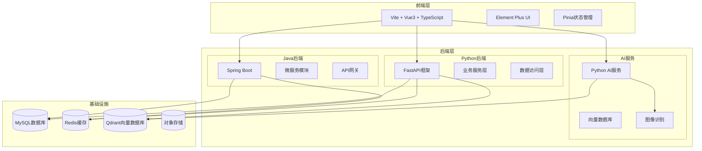
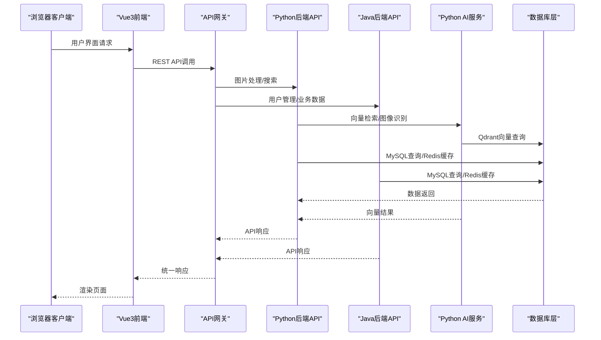
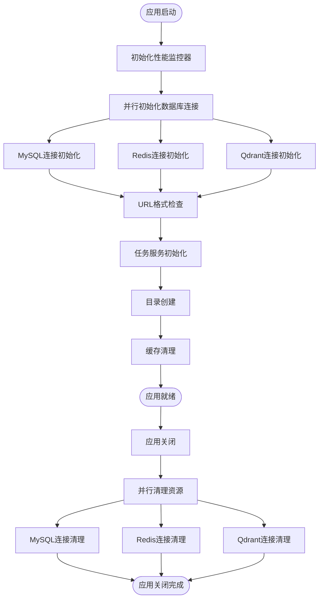
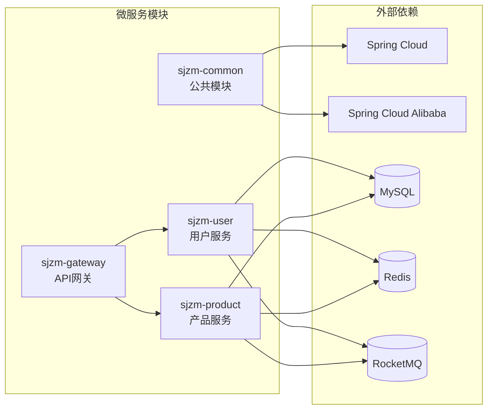
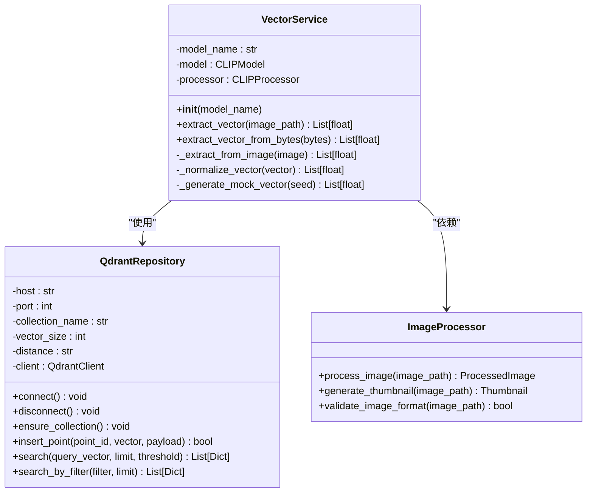
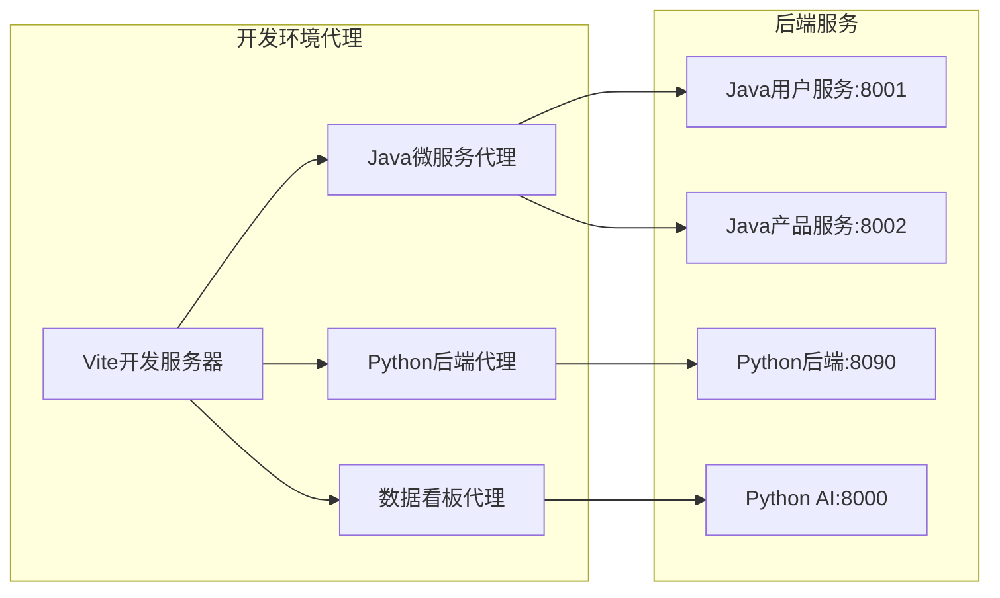
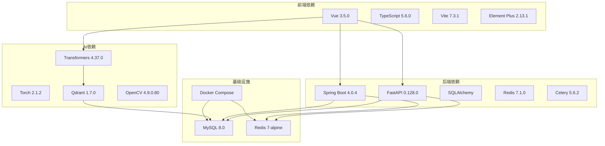
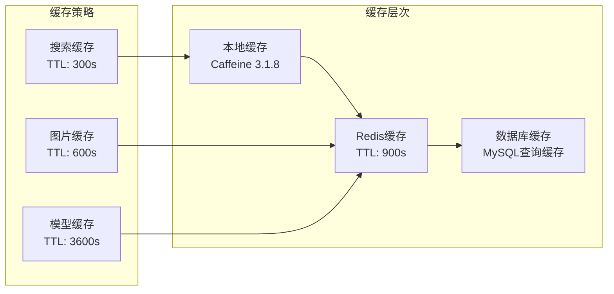

# 技术栈概览

<cite>
**本文档引用的文件**
- [backend/requirements.txt](file://backend/requirements.txt)
- [frontend/package.json](file://frontend/package.json)
- [java-backend/pom.xml](file://java-backend/pom.xml)
- [python-ai/requirements.txt](file://python-ai/requirements.txt)
- [docker-compose.yml](file://docker-compose.yml)
- [backend/app/main.py](file://backend/app/main.py)
- [backend/app/config.py](file://backend/app/config.py)
- [backend/app/repositories/qdrant_repo.py](file://backend/app/repositories/qdrant_repo.py)
- [java-backend/src/main/resources/application.yml](file://java-backend/src/main/resources/application.yml)
- [python-ai/app/main.py](file://python-ai/app/main.py)
- [python-ai/app/services/vector_service.py](file://python-ai/app/services/vector_service.py)
- [frontend/vite.config.js](file://frontend/vite.config.js)
</cite>

## 目录
1. [引言](#引言)
2. [项目结构](#项目结构)
3. [核心组件](#核心组件)
4. [架构概览](#架构概览)
5. [详细组件分析](#详细组件分析)
6. [依赖关系分析](#依赖关系分析)
7. [性能考虑](#性能考虑)
8. [故障排除指南](#故障排除指南)
9. [结论](#结论)

## 引言

思觉智贸系统是一个现代化的跨境电商选品管理系统，采用前后端分离的微服务架构。本技术栈概览文档详细介绍了项目采用的完整技术栈，包括后端技术（FastAPI、Java Spring Boot）、前端技术（Vue3、TypeScript）、数据库（MySQL、Redis、Qdrant）、AI服务（向量数据库、图像识别）等核心技术组件。

该系统旨在为用户提供高效的产品选品、数据分析和智能推荐功能，支持大规模图片处理和向量检索需求。

## 项目结构

系统采用模块化架构设计，主要分为以下几个核心模块：

**图表来源**
- [backend/app/main.py:314-475](file://backend/app/main.py#L314-L475)
- [java-backend/pom.xml:14-22](file://java-backend/pom.xml#L14-L22)
- [python-ai/app/main.py:11-51](file://python-ai/app/main.py#L11-L51)

**章节来源**
- [backend/app/main.py:1-475](file://backend/app/main.py#L1-L475)
- [java-backend/pom.xml:1-263](file://java-backend/pom.xml#L1-L263)
- [python-ai/app/main.py:1-51](file://python-ai/app/main.py#L1-L51)

## 核心组件

### 后端技术栈

#### Python FastAPI后端
- **框架**: FastAPI 0.128.0 + Uvicorn 0.40.0
- **ORM**: SQLAlchemy + PyMySQL 0.3.2
- **缓存**: Redis 7.1.0 (asyncio)
- **异步任务**: Celery 5.6.2 + Redis Broker
- **数据处理**: Pandas 2.3.3 + Polars 1.7.0 + NumPy 2.4.1
- **文件处理**: Pillow 12.1.0 + OpenPyXL 3.1.5
- **安全**: PyJWT 2.8.0 + Bcrypt 5.0.0

#### Java Spring Boot后端
- **框架**: Spring Boot 4.0.4 + Spring Cloud 2025.1.1
- **微服务**: Spring Cloud Alibaba 2025.1.0.0
- **数据库**: MyBatis-Plus 3.5.15 + HikariCP
- **缓存**: Redisson 4.0.0 + Caffeine 3.1.8
- **熔断限流**: Resilience4j 2.2.0
- **消息队列**: RocketMQ 2.2.3
- **安全**: JWT (JJWT 0.12.5)

### 前端技术栈

#### Vue3 + TypeScript前端
- **框架**: Vue 3.5.0 + Vue Router 4.4.0 + Pinia 3.0.4
- **UI库**: Element Plus 2.13.1 + @element-plus/icons-vue 2.3.1
- **构建工具**: Vite 7.3.1 + TypeScript 5.6.0
- **开发工具**: ESLint 9.39.2 + Prettier 3.3.0
- **可视化**: ECharts 6.0.0 + XLSX 0.18.5
- **网络请求**: Axios 1.7.0 + @types/jest 30.0.0

### 数据库和缓存

#### 数据存储
- **关系型数据库**: MySQL 8.0 (utf8mb4字符集)
- **缓存系统**: Redis 7-alpine (持久化支持)
- **向量数据库**: Qdrant (可选，暂停使用)

#### 对象存储
- **腾讯云COS**: 支持图片、缩略图、文件备份存储
- **本地存储**: Docker卷持久化

### AI服务组件

#### Python AI服务
- **框架**: FastAPI 0.109.0 + Uvicorn 0.27.0
- **向量检索**: Qdrant Client 1.7.0
- **大模型**: OpenAI 1.10.0 + DashScope 1.14.0
- **图像处理**: Pillow 10.2.0 + OpenCV 4.9.0.80
- **深度学习**: Torch 2.1.2 + Transformers 4.37.0

**章节来源**
- [backend/requirements.txt:1-35](file://backend/requirements.txt#L1-L35)
- [java-backend/pom.xml:56-207](file://java-backend/pom.xml#L56-L207)
- [frontend/package.json:35-81](file://frontend/package.json#L35-L81)
- [python-ai/requirements.txt:1-19](file://python-ai/requirements.txt#L1-L19)

## 架构概览

系统采用分层架构设计，实现了前后端分离和微服务化：

**图表来源**
- [frontend/vite.config.js:48-145](file://frontend/vite.config.js#L48-L145)
- [backend/app/main.py:449-462](file://backend/app/main.py#L449-L462)
- [java-backend/src/main/resources/application.yml:162-175](file://java-backend/src/main/resources/application.yml#L162-L175)

**章节来源**
- [frontend/vite.config.js:1-240](file://frontend/vite.config.js#L1-L240)
- [backend/app/main.py:314-475](file://backend/app/main.py#L314-L475)
- [java-backend/src/main/resources/application.yml:1-258](file://java-backend/src/main/resources/application.yml#L1-L258)

## 详细组件分析

### FastAPI后端架构

#### 应用生命周期管理
系统实现了高效的异步启动流程，支持并行初始化多个数据库连接：

**图表来源**
- [backend/app/main.py:44-312](file://backend/app/main.py#L44-L312)

#### 中间件体系
系统实现了多层次的中间件架构：

| 中间件类型 | 功能描述 | 配置参数 |
|------------|----------|----------|
| CORS中间件 | 跨域资源共享控制 | 允许源、方法、头部配置 |
| 日志中间件 | 请求/响应日志记录 | 可配置跳过路径 |
| 超时中间件 | 请求超时控制 | 路径级超时配置 |
| 慢请求中间件 | 性能监控 | 阈值和日志级别 |
| 请求大小中间件 | 文件上传限制 | 路径级大小限制 |

**章节来源**
- [backend/app/main.py:326-372](file://backend/app/main.py#L326-L372)
- [backend/app/config.py:23-258](file://backend/app/config.py#L23-L258)

### Java微服务架构

#### 微服务模块设计
系统采用Spring Cloud微服务架构，包含以下核心模块：

**图表来源**
- [java-backend/pom.xml:14-22](file://java-backend/pom.xml#L14-L22)

#### 配置管理
Java后端采用多环境配置管理：

| 配置类别 | 主要组件 | 功能特性 |
|----------|----------|----------|
| 数据源配置 | HikariCP连接池 | 最小空闲、最大池大小、连接超时 |
| 缓存配置 | Redisson + Caffeine | 分布式锁、本地缓存 |
| 安全配置 | JWT + Resilience4j | 熔断器、限流器 |
| MQ配置 | RocketMQ | 生产者/消费者组配置 |
| 监控配置 | Actuator + Micrometer | 指标收集、健康检查 |

**章节来源**
- [java-backend/pom.xml:56-207](file://java-backend/pom.xml#L56-L207)
- [java-backend/src/main/resources/application.yml:25-258](file://java-backend/src/main/resources/application.yml#L25-L258)

### Python AI服务架构

#### 向量处理服务
AI服务专注于图像向量提取和相似性搜索：

**图表来源**
- [python-ai/app/services/vector_service.py:10-96](file://python-ai/app/services/vector_service.py#L10-L96)
- [backend/app/repositories/qdrant_repo.py:14-503](file://backend/app/repositories/qdrant_repo.py#L14-L503)

#### 模型管理
AI服务支持多种预训练模型：

| 模型类型 | 模型名称 | 维度大小 | 用途场景 |
|----------|----------|----------|----------|
| 视觉模型 | CLIP-ViT-B/32 | 512维 | 图像特征提取 |
| 视觉模型 | CLIP-ViT-B/16 | 768维 | 高精度图像识别 |
| 中文模型 | OFA-Sys/chinese-clip | 512维 | 中文图像理解 |
| 模拟向量 | Mock Vector | 512维 | 降级模式支持 |

**章节来源**
- [python-ai/app/services/vector_service.py:1-96](file://python-ai/app/services/vector_service.py#L1-L96)
- [backend/app/repositories/qdrant_repo.py:1-503](file://backend/app/repositories/qdrant_repo.py#L1-L503)

### 前端架构设计

#### 开发代理配置
前端采用灵活的开发代理机制，支持多种后端服务：

**图表来源**
- [frontend/vite.config.js:48-145](file://frontend/vite.config.js#L48-L145)

#### 构建优化策略
前端采用多层次的构建优化：

| 优化策略 | 实现方式 | 效果 |
|----------|----------|------|
| 代码分割 | Vite自动分割 | 减少首屏加载时间 |
| 资源压缩 | Terser压缩 | 减小包体积 |
| 缓存策略 | CDN友好的文件名 | 提升缓存命中率 |
| 懒加载 | Vue组件懒加载 | 优化用户体验 |
| Tree Shaking | ES模块导入 | 移除未使用代码 |

**章节来源**
- [frontend/vite.config.js:173-240](file://frontend/vite.config.js#L173-L240)
- [frontend/package.json:1-81](file://frontend/package.json#L1-L81)

## 依赖关系分析

### 技术栈依赖矩阵

**图表来源**
- [backend/requirements.txt:1-35](file://backend/requirements.txt#L1-L35)
- [java-backend/pom.xml:56-207](file://java-backend/pom.xml#L56-L207)
- [python-ai/requirements.txt:1-19](file://python-ai/requirements.txt#L1-L19)
- [docker-compose.yml:7-36](file://docker-compose.yml#L7-L36)

### 版本兼容性分析

| 组件 | 当前版本 | 推荐版本 | 兼容性 | 升级建议 |
|------|----------|----------|--------|----------|
| Python | 3.9+ | 3.9-3.11 | ✅ 良好 | 保持当前版本 |
| FastAPI | 0.128.0 | 0.130.x | ✅ 兼容 | 小版本升级 |
| Vue3 | 3.5.0 | 3.5.x | ✅ 兼容 | 小版本升级 |
| Spring Boot | 4.0.4 | 4.0.x | ✅ 兼容 | 小版本升级 |
| MySQL | 8.0 | 8.0.x | ✅ 兼容 | 小版本升级 |
| Redis | 7-alpine | 7.x | ✅ 兼容 | 小版本升级 |
| Qdrant | 1.7.0 | 1.7.x | ⚠️ 暂停使用 | 等待稳定版 |

**章节来源**
- [backend/requirements.txt:1-35](file://backend/requirements.txt#L1-L35)
- [frontend/package.json:76-81](file://frontend/package.json#L76-L81)
- [java-backend/pom.xml:24-54](file://java-backend/pom.xml#L24-L54)
- [python-ai/requirements.txt:1-19](file://python-ai/requirements.txt#L1-L19)

## 性能考虑

### 性能优化策略

#### 数据库性能
- **连接池优化**: HikariCP最小空闲10，最大30，连接超时30秒
- **索引策略**: 产品表建立复合索引，支持常用查询条件
- **查询优化**: 使用分页查询，限制单次查询结果数量
- **缓存策略**: Redis缓存热点数据，TTL设置合理范围

#### 缓存架构
系统实现多层缓存策略：

#### 异步处理
- **Celery任务队列**: 图片处理、数据同步等耗时操作
- **并发控制**: 最大并发15，任务超时600秒
- **重试机制**: 失败自动重试，最多3次
- **监控告警**: 任务执行状态监控

**章节来源**
- [backend/app/config.py:158-212](file://backend/app/config.py#L158-L212)
- [java-backend/src/main/resources/application.yml:62-80](file://java-backend/src/main/resources/application.yml#L62-L80)

## 故障排除指南

### 常见问题诊断

#### 启动问题
| 问题类型 | 症状 | 解决方案 |
|----------|------|----------|
| 数据库连接失败 | 应用启动报错，连接MySQL失败 | 检查docker-compose配置，确认MySQL服务可用 |
| Redis连接异常 | 缓存功能不可用，警告日志 | 验证Redis容器状态，检查网络连接 |
| Qdrant连接失败 | 向量搜索功能异常 | 确认Qdrant服务运行，检查向量维度配置 |

#### 性能问题
| 问题类型 | 症状 | 解决方案 |
|----------|------|----------|
| 响应缓慢 | API响应时间过长 | 检查慢查询日志，优化数据库索引 |
| 内存泄漏 | 进程内存持续增长 | 检查对象引用，清理临时文件 |
| 并发冲突 | 请求处理阻塞 | 调整连接池大小，优化异步任务 |

#### 配置问题
- **环境变量缺失**: 检查.env文件配置，确保所有必需参数设置
- **端口冲突**: 修改docker-compose端口映射，避免端口占用
- **路径权限**: 确认Docker卷权限，检查文件系统访问权限

**章节来源**
- [backend/app/main.py:25-41](file://backend/app/main.py#L25-L41)
- [backend/app/config.py:224-258](file://backend/app/config.py#L224-L258)

### 监控和日志

#### 日志配置
系统实现分级日志记录：

| 日志级别 | 用途 | 配置示例 |
|----------|------|----------|
| DEBUG | 开发调试 | 开发环境启用 |
| INFO | 正常运行 | 生产环境默认 |
| WARNING | 警告信息 | 配置错误提示 |
| ERROR | 错误异常 | 异常堆栈记录 |

#### 性能监控
- **指标收集**: Prometheus Exporter集成
- **APM监控**: Sentry前端错误监控
- **链路追踪**: Spring Cloud Sleuth
- **健康检查**: Actuator端点监控

**章节来源**
- [backend/app/main.py:25-41](file://backend/app/main.py#L25-L41)
- [java-backend/src/main/resources/application.yml:176-203](file://java-backend/src/main/resources/application.yml#L176-L203)

## 结论

思觉智贸系统采用的技术栈体现了现代Web应用的最佳实践，具有以下特点：

### 技术优势
- **高性能**: 多层缓存架构，异步处理机制
- **可扩展**: 微服务架构，模块化设计
- **稳定性**: 完善的错误处理和监控体系
- **可维护性**: 清晰的代码结构和文档

### 架构特色
- **前后端分离**: 独立开发和部署
- **多语言协作**: Python + Java混合架构
- **AI集成**: 向量检索和图像识别能力
- **容器化部署**: Docker Compose统一管理

### 发展建议
1. **逐步启用Qdrant**: 完善向量搜索功能
2. **增强AI能力**: 扩展图像识别和推荐算法
3. **优化微服务**: 细化服务边界，提升独立性
4. **完善监控**: 增强A/B测试和性能分析能力

该技术栈为思觉智贸系统的长期发展奠定了坚实基础，能够满足当前业务需求并支持未来的功能扩展。