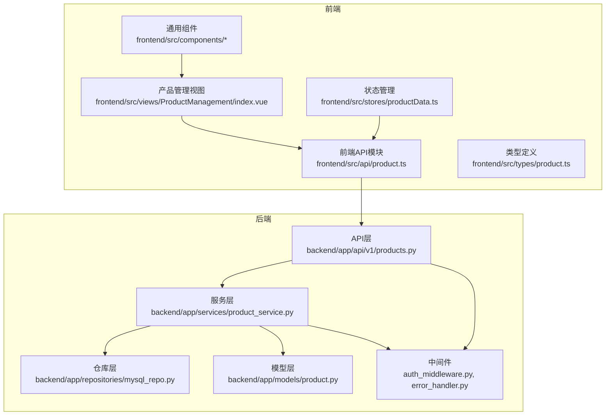
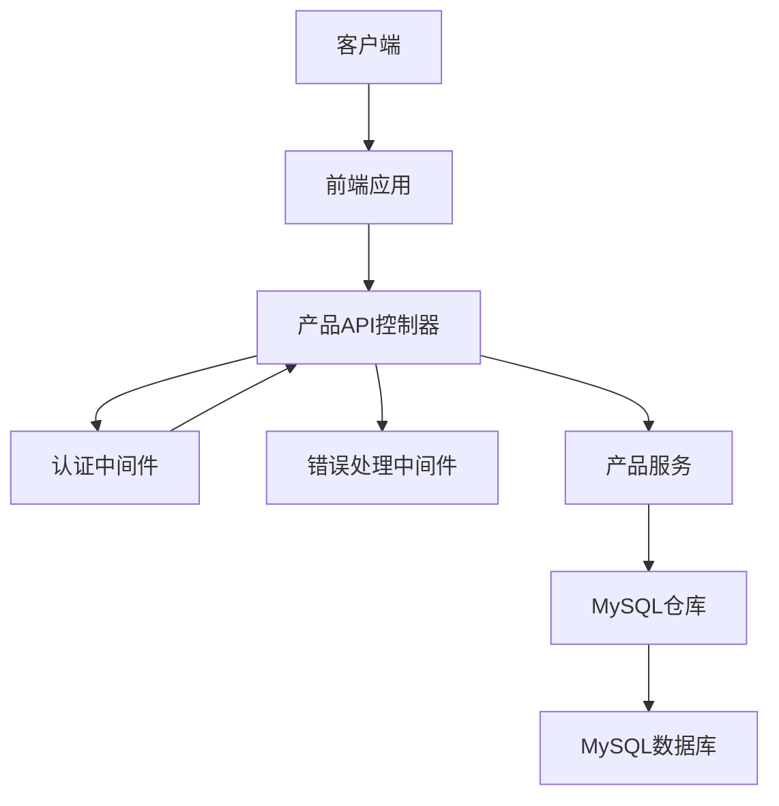
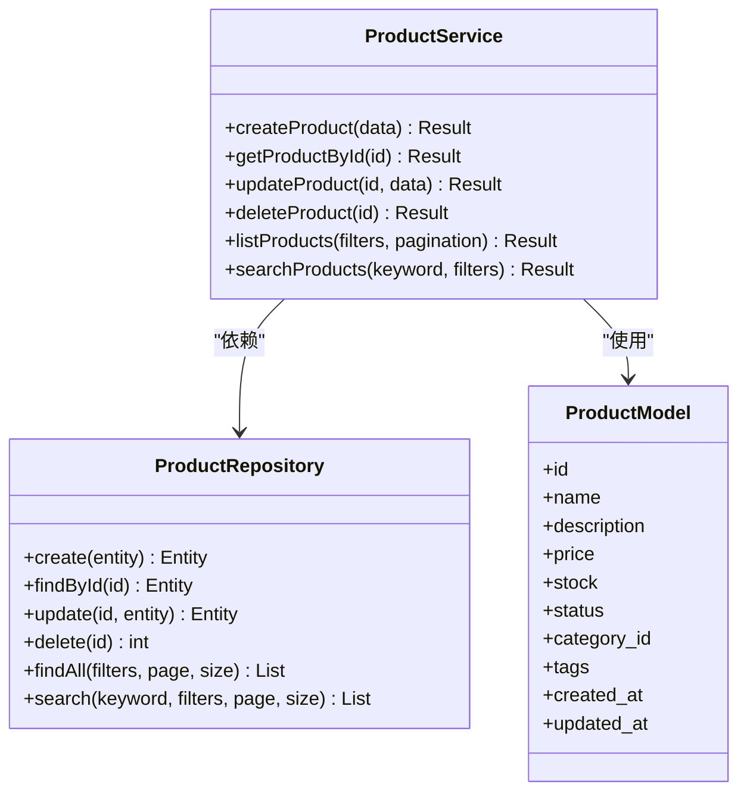
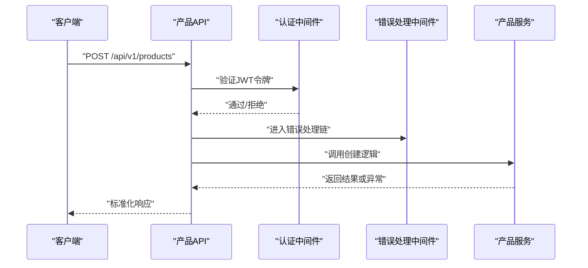
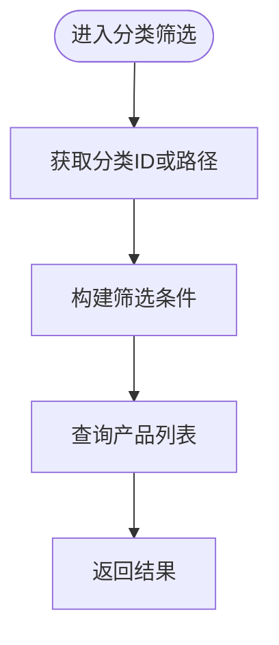
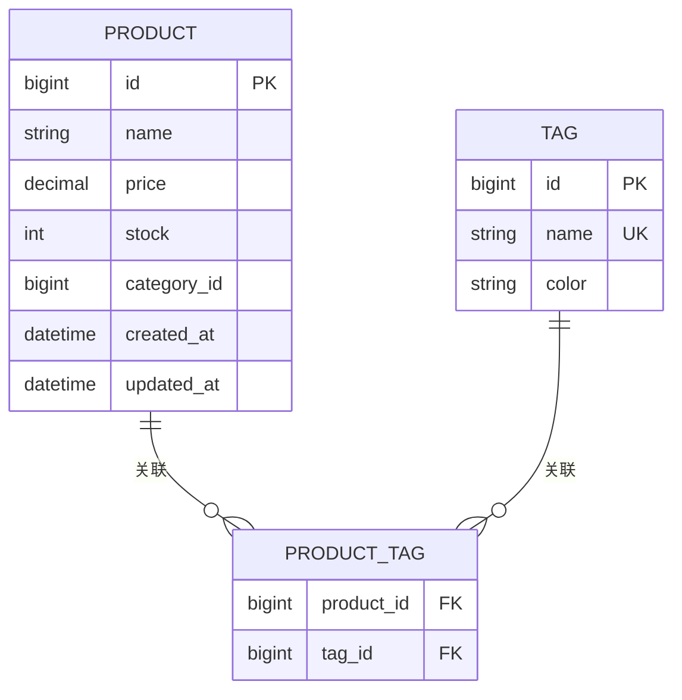
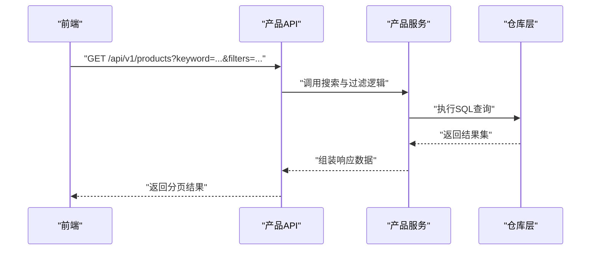
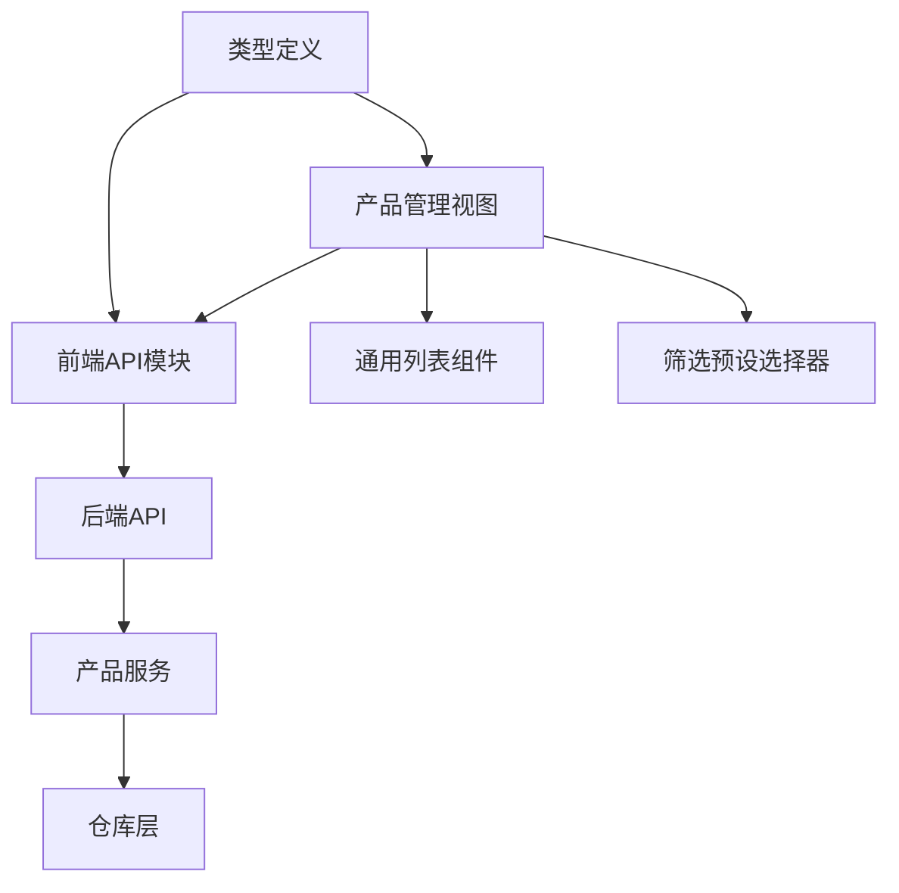
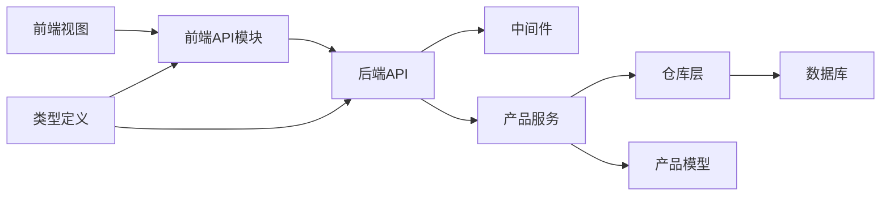

# 产品管理

<cite>
**本文引用的文件**
- [backend/app/api/v1/products.py](file://backend/app/api/v1/products.py)
- [backend/app/models/product.py](file://backend/app/models/product.py)
- [backend/app/services/product_service.py](file://backend/app/services/product_service.py)
- [backend/app/repositories/mysql_repo.py](file://backend/app/repositories/mysql_repo.py)
- [backend/app/api/v1/categories.py](file://backend/app/api/v1/categories.py)
- [backend/app/api/v1/tags.py](file://backend/app/api/v1/tags.py)
- [backend/app/api/v1/product_data.py](file://backend/app/api/v1/product_data.py)
- [backend/app/schemas/product_data.py](file://backend/app/schemas/product_data.py)
- [backend/app/middleware/auth_middleware.py](file://backend/app/middleware/auth_middleware.py)
- [backend/app/middleware/error_handler.py](file://backend/app/middleware/error_handler.py)
- [backend/app/utils/jwt_utils.py](file://backend/app/utils/jwt_utils.py)
- [frontend/src/api/product.ts](file://frontend/src/api/product.ts)
- [frontend/src/views/ProductManagement/index.vue](file://frontend/src/views/ProductManagement/index.vue)
- [frontend/src/types/product.ts](file://frontend/src/types/product.ts)
- [frontend/src/stores/productData.ts](file://frontend/src/stores/productData.ts)
- [frontend/src/components/UniversalList/index.vue](file://frontend/src/components/UniversalList/index.vue)
- [frontend/src/components/FilterPresetSelector/index.vue](file://frontend/src/components/FilterPresetSelector/index.vue)
</cite>

## 目录
1. [简介](#简介)
2. [项目结构](#项目结构)
3. [核心组件](#核心组件)
4. [架构概览](#架构概览)
5. [详细组件分析](#详细组件分析)
6. [依赖分析](#依赖分析)
7. [性能考虑](#性能考虑)
8. [故障排除指南](#故障排除指南)
9. [结论](#结论)
10. [附录](#附录)

## 简介
本技术文档围绕产品管理功能模块进行深入解析，涵盖产品数据的CRUD操作实现、产品模型的数据结构与业务规则、产品分类管理、标签系统、搜索过滤功能，以及前后端交互接口、数据验证规则和权限控制机制。文档旨在帮助开发者快速理解并扩展产品管理功能。

## 项目结构
产品管理功能在后端采用分层架构：API层负责请求处理与响应封装，Service层承载业务逻辑，Repository层负责数据持久化，Model层定义数据模型；前端通过API模块与后端交互，使用类型定义确保数据一致性，并通过组件化方式实现列表展示与筛选。

**图表来源**
- [backend/app/api/v1/products.py](file://backend/app/api/v1/products.py)
- [backend/app/services/product_service.py](file://backend/app/services/product_service.py)
- [backend/app/repositories/mysql_repo.py](file://backend/app/repositories/mysql_repo.py)
- [backend/app/models/product.py](file://backend/app/models/product.py)
- [backend/app/middleware/auth_middleware.py](file://backend/app/middleware/auth_middleware.py)
- [backend/app/middleware/error_handler.py](file://backend/app/middleware/error_handler.py)
- [frontend/src/api/product.ts](file://frontend/src/api/product.ts)
- [frontend/src/views/ProductManagement/index.vue](file://frontend/src/views/ProductManagement/index.vue)
- [frontend/src/types/product.ts](file://frontend/src/types/product.ts)
- [frontend/src/stores/productData.ts](file://frontend/src/stores/productData.ts)

**章节来源**
- [backend/app/api/v1/products.py](file://backend/app/api/v1/products.py)
- [backend/app/services/product_service.py](file://backend/app/services/product_service.py)
- [backend/app/repositories/mysql_repo.py](file://backend/app/repositories/mysql_repo.py)
- [backend/app/models/product.py](file://backend/app/models/product.py)
- [frontend/src/api/product.ts](file://frontend/src/api/product.ts)
- [frontend/src/views/ProductManagement/index.vue](file://frontend/src/views/ProductManagement/index.vue)

## 核心组件
- 产品模型（Model）：定义产品实体的数据结构、字段约束与业务规则，支撑CRUD操作。
- 产品服务（Service）：封装业务逻辑，协调仓库层与模型层，处理数据校验、事务与异常。
- 产品API（API）：暴露REST接口，接收请求参数，返回标准化响应，集成权限与错误处理中间件。
- 产品仓库（Repository）：抽象数据库访问，提供增删改查等基础操作。
- 前端API模块：封装HTTP请求，统一错误处理与响应格式。
- 前端视图与组件：提供产品列表展示、筛选、分页与详情查看能力。

**章节来源**
- [backend/app/models/product.py](file://backend/app/models/product.py)
- [backend/app/services/product_service.py](file://backend/app/services/product_service.py)
- [backend/app/api/v1/products.py](file://backend/app/api/v1/products.py)
- [backend/app/repositories/mysql_repo.py](file://backend/app/repositories/mysql_repo.py)
- [frontend/src/api/product.ts](file://frontend/src/api/product.ts)
- [frontend/src/views/ProductManagement/index.vue](file://frontend/src/views/ProductManagement/index.vue)

## 架构概览
产品管理采用典型的三层架构：表现层（前端）、应用层（后端API与服务）、基础设施层（数据库与中间件）。权限控制通过JWT中间件实现，错误处理统一由错误处理器中间件处理，保证系统稳定性与一致性。

**图表来源**
- [backend/app/api/v1/products.py](file://backend/app/api/v1/products.py)
- [backend/app/middleware/auth_middleware.py](file://backend/app/middleware/auth_middleware.py)
- [backend/app/middleware/error_handler.py](file://backend/app/middleware/error_handler.py)
- [backend/app/services/product_service.py](file://backend/app/services/product_service.py)
- [backend/app/repositories/mysql_repo.py](file://backend/app/repositories/mysql_repo.py)

## 详细组件分析

### 产品模型（Model）
产品模型定义了产品实体的核心字段与约束，包括但不限于标识符、名称、描述、价格、库存、分类、标签、状态、创建与更新时间等。模型层还包含业务规则校验，如必填字段、数值范围、唯一性约束等，确保数据完整性。

- 字段定义与约束
  - 标识符：主键，自增或UUID
  - 名称：必填，长度限制
  - 描述：可选文本
  - 价格：数值型，非负
  - 库存：整数型，非负
  - 分类ID：外键关联分类表
  - 标签集合：多对多关联标签表
  - 状态：枚举值（启用/禁用/下架等）
  - 时间戳：创建时间、更新时间
- 业务规则
  - 创建时自动填充创建时间与默认状态
  - 更新时仅允许部分字段变更
  - 删除采用软删除策略（逻辑删除）

**章节来源**
- [backend/app/models/product.py](file://backend/app/models/product.py)

### 产品服务（Service）
产品服务封装完整的业务逻辑，包括：
- 数据校验：基于模型约束与业务规则进行参数校验
- 事务管理：在复杂操作中保证数据一致性
- 权限检查：确认操作者具备相应权限
- 错误处理：捕获异常并转换为标准错误响应
- 调用仓库层执行数据库操作

**图表来源**
- [backend/app/services/product_service.py](file://backend/app/services/product_service.py)
- [backend/app/repositories/mysql_repo.py](file://backend/app/repositories/mysql_repo.py)
- [backend/app/models/product.py](file://backend/app/models/product.py)

**章节来源**
- [backend/app/services/product_service.py](file://backend/app/services/product_service.py)
- [backend/app/repositories/mysql_repo.py](file://backend/app/repositories/mysql_repo.py)

### 产品API（API）
产品API提供REST接口，支持以下操作：
- 创建产品：POST /api/v1/products
- 读取产品：GET /api/v1/products/{id}
- 更新产品：PUT /api/v1/products/{id}
- 删除产品：DELETE /api/v1/products/{id}
- 列出产品：GET /api/v1/products
- 搜索产品：GET /api/v1/products/search

接口特性：
- 参数校验：请求体与查询参数均进行严格校验
- 权限控制：通过认证中间件拦截未授权请求
- 错误处理：统一错误响应格式，便于前端处理
- 响应封装：返回标准化JSON结构，包含数据与元信息

**图表来源**
- [backend/app/api/v1/products.py](file://backend/app/api/v1/products.py)
- [backend/app/middleware/auth_middleware.py](file://backend/app/middleware/auth_middleware.py)
- [backend/app/middleware/error_handler.py](file://backend/app/middleware/error_handler.py)
- [backend/app/services/product_service.py](file://backend/app/services/product_service.py)

**章节来源**
- [backend/app/api/v1/products.py](file://backend/app/api/v1/products.py)
- [backend/app/middleware/auth_middleware.py](file://backend/app/middleware/auth_middleware.py)
- [backend/app/middleware/error_handler.py](file://backend/app/middleware/error_handler.py)

### 产品分类管理
产品分类管理通过独立的分类API与产品模型中的分类字段关联，支持：
- 分类树形结构：父子关系维护
- 分类筛选：按分类ID或分类路径筛选产品
- 分类统计：统计各分类下的产品数量

**图表来源**
- [backend/app/api/v1/categories.py](file://backend/app/api/v1/categories.py)
- [backend/app/models/product.py](file://backend/app/models/product.py)

**章节来源**
- [backend/app/api/v1/categories.py](file://backend/app/api/v1/categories.py)
- [backend/app/models/product.py](file://backend/app/models/product.py)

### 标签系统
标签系统支持产品打标与多标签筛选：
- 标签创建与管理：独立的标签API
- 多对多关联：产品与标签的关联表
- 标签筛选：按标签ID集合筛选产品
- 标签统计：统计标签使用频率

**图表来源**
- [backend/app/api/v1/tags.py](file://backend/app/api/v1/tags.py)
- [backend/app/models/product.py](file://backend/app/models/product.py)

**章节来源**
- [backend/app/api/v1/tags.py](file://backend/app/api/v1/tags.py)
- [backend/app/models/product.py](file://backend/app/models/product.py)

### 搜索与过滤
搜索与过滤功能支持关键词搜索与多维条件过滤：
- 关键词搜索：全文检索或模糊匹配
- 条件过滤：价格区间、分类、标签、状态等
- 排序与分页：支持多种排序字段与分页参数
- 预设筛选：保存常用筛选条件，便于复用

**图表来源**
- [backend/app/api/v1/products.py](file://backend/app/api/v1/products.py)
- [backend/app/services/product_service.py](file://backend/app/services/product_service.py)
- [backend/app/repositories/mysql_repo.py](file://backend/app/repositories/mysql_repo.py)

**章节来源**
- [backend/app/api/v1/products.py](file://backend/app/api/v1/products.py)
- [backend/app/services/product_service.py](file://backend/app/services/product_service.py)
- [backend/app/repositories/mysql_repo.py](file://backend/app/repositories/mysql_repo.py)

### 前后端交互与前端组件
- 前端API模块：封装HTTP请求，统一错误处理与响应格式
- 产品管理视图：展示产品列表、详情、新增/编辑弹窗
- 通用组件：通用列表组件、虚拟列表、懒加载图片、缩略图查看器
- 筛选组件：筛选预设选择器、筛选配置面板
- 类型定义：确保前后端数据结构一致

**图表来源**
- [frontend/src/api/product.ts](file://frontend/src/api/product.ts)
- [frontend/src/views/ProductManagement/index.vue](file://frontend/src/views/ProductManagement/index.vue)
- [frontend/src/components/UniversalList/index.vue](file://frontend/src/components/UniversalList/index.vue)
- [frontend/src/components/FilterPresetSelector/index.vue](file://frontend/src/components/FilterPresetSelector/index.vue)
- [frontend/src/types/product.ts](file://frontend/src/types/product.ts)
- [backend/app/api/v1/products.py](file://backend/app/api/v1/products.py)
- [backend/app/services/product_service.py](file://backend/app/services/product_service.py)
- [backend/app/repositories/mysql_repo.py](file://backend/app/repositories/mysql_repo.py)

**章节来源**
- [frontend/src/api/product.ts](file://frontend/src/api/product.ts)
- [frontend/src/views/ProductManagement/index.vue](file://frontend/src/views/ProductManagement/index.vue)
- [frontend/src/components/UniversalList/index.vue](file://frontend/src/components/UniversalList/index.vue)
- [frontend/src/components/FilterPresetSelector/index.vue](file://frontend/src/components/FilterPresetSelector/index.vue)
- [frontend/src/types/product.ts](file://frontend/src/types/product.ts)

## 依赖分析
产品管理模块的依赖关系清晰，层次分明：
- API层依赖认证与错误处理中间件
- 服务层依赖仓库层与模型层
- 仓库层依赖数据库连接与SQL执行
- 前端依赖API模块与类型定义

**图表来源**
- [frontend/src/api/product.ts](file://frontend/src/api/product.ts)
- [frontend/src/views/ProductManagement/index.vue](file://frontend/src/views/ProductManagement/index.vue)
- [frontend/src/types/product.ts](file://frontend/src/types/product.ts)
- [backend/app/api/v1/products.py](file://backend/app/api/v1/products.py)
- [backend/app/middleware/auth_middleware.py](file://backend/app/middleware/auth_middleware.py)
- [backend/app/middleware/error_handler.py](file://backend/app/middleware/error_handler.py)
- [backend/app/services/product_service.py](file://backend/app/services/product_service.py)
- [backend/app/repositories/mysql_repo.py](file://backend/app/repositories/mysql_repo.py)
- [backend/app/models/product.py](file://backend/app/models/product.py)

**章节来源**
- [frontend/src/api/product.ts](file://frontend/src/api/product.ts)
- [frontend/src/views/ProductManagement/index.vue](file://frontend/src/views/ProductManagement/index.vue)
- [frontend/src/types/product.ts](file://frontend/src/types/product.ts)
- [backend/app/api/v1/products.py](file://backend/app/api/v1/products.py)
- [backend/app/middleware/auth_middleware.py](file://backend/app/middleware/auth_middleware.py)
- [backend/app/middleware/error_handler.py](file://backend/app/middleware/error_handler.py)
- [backend/app/services/product_service.py](file://backend/app/services/product_service.py)
- [backend/app/repositories/mysql_repo.py](file://backend/app/repositories/mysql_repo.py)
- [backend/app/models/product.py](file://backend/app/models/product.py)

## 性能考虑
- 数据库索引：为常用查询字段（如名称、分类ID、标签ID、状态、时间戳）建立索引，提升查询性能
- 分页与排序：默认分页大小限制，避免一次性返回大量数据；排序字段限定在索引列上
- 缓存策略：热点数据（如热门分类、常用筛选条件）可引入缓存，降低数据库压力
- 批量操作：批量删除、批量更新采用事务与批处理，减少网络往返
- 异步任务：耗时操作（如大数据导出、批量导入）异步执行，避免阻塞主线程

## 故障排除指南
- 认证失败：检查JWT令牌是否有效、过期或签名错误
- 权限不足：确认用户角色与资源权限映射，检查RBAC配置
- 参数校验错误：核对请求参数类型、长度与范围，遵循API文档规范
- 数据库异常：查看SQL执行日志，确认索引与事务配置
- 前端错误处理：统一捕获API错误，提示用户并记录日志

**章节来源**
- [backend/app/middleware/auth_middleware.py](file://backend/app/middleware/auth_middleware.py)
- [backend/app/middleware/error_handler.py](file://backend/app/middleware/error_handler.py)
- [backend/app/utils/jwt_utils.py](file://backend/app/utils/jwt_utils.py)

## 结论
产品管理模块通过清晰的分层架构、严格的模型约束与中间件保障，实现了稳定可靠的CRUD操作与丰富的搜索过滤能力。配合前端组件化与类型定义，提升了开发效率与系统一致性。建议持续优化数据库索引与缓存策略，以进一步提升性能与用户体验。

## 附录
- API调用示例（路径参考）
  - 创建产品：POST /api/v1/products
  - 读取产品：GET /api/v1/products/{id}
  - 更新产品：PUT /api/v1/products/{id}
  - 删除产品：DELETE /api/v1/products/{id}
  - 列出产品：GET /api/v1/products
  - 搜索产品：GET /api/v1/products/search
- 前端组件使用方法
  - 产品管理视图：用于展示与操作产品列表
  - 通用列表组件：支持虚拟滚动与懒加载
  - 筛选预设选择器：快速应用常用筛选条件
- 数据验证规则
  - 必填字段：名称、价格、库存、分类ID
  - 数值范围：价格与库存非负
  - 唯一性：名称在分类内唯一
- 权限控制机制
  - JWT认证：所有受保护接口需携带有效令牌
  - RBAC：基于角色的权限控制，细粒度到资源与操作

**章节来源**
- [backend/app/api/v1/products.py](file://backend/app/api/v1/products.py)
- [frontend/src/views/ProductManagement/index.vue](file://frontend/src/views/ProductManagement/index.vue)
- [frontend/src/components/UniversalList/index.vue](file://frontend/src/components/UniversalList/index.vue)
- [frontend/src/components/FilterPresetSelector/index.vue](file://frontend/src/components/FilterPresetSelector/index.vue)
- [backend/app/middleware/auth_middleware.py](file://backend/app/middleware/auth_middleware.py)
- [backend/app/utils/jwt_utils.py](file://backend/app/utils/jwt_utils.py)