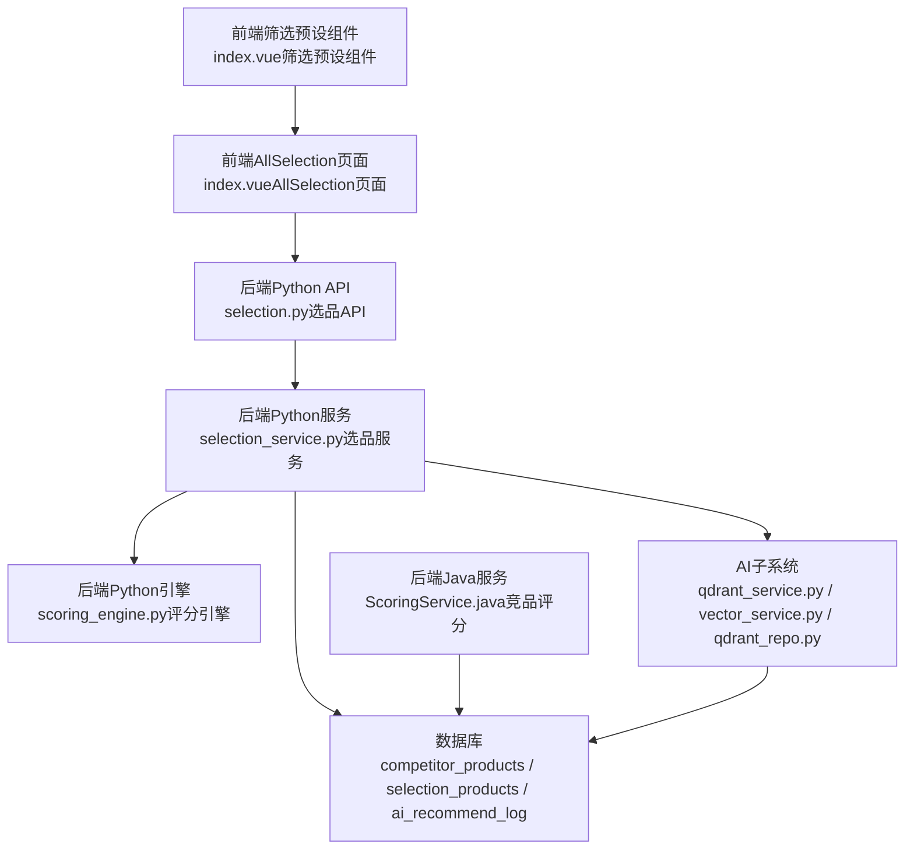
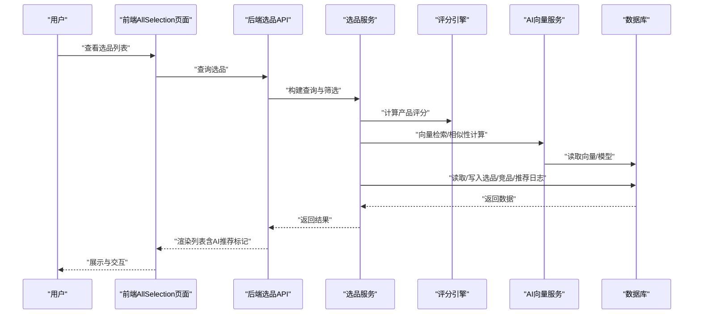
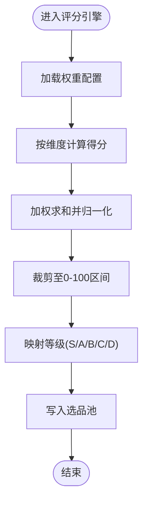
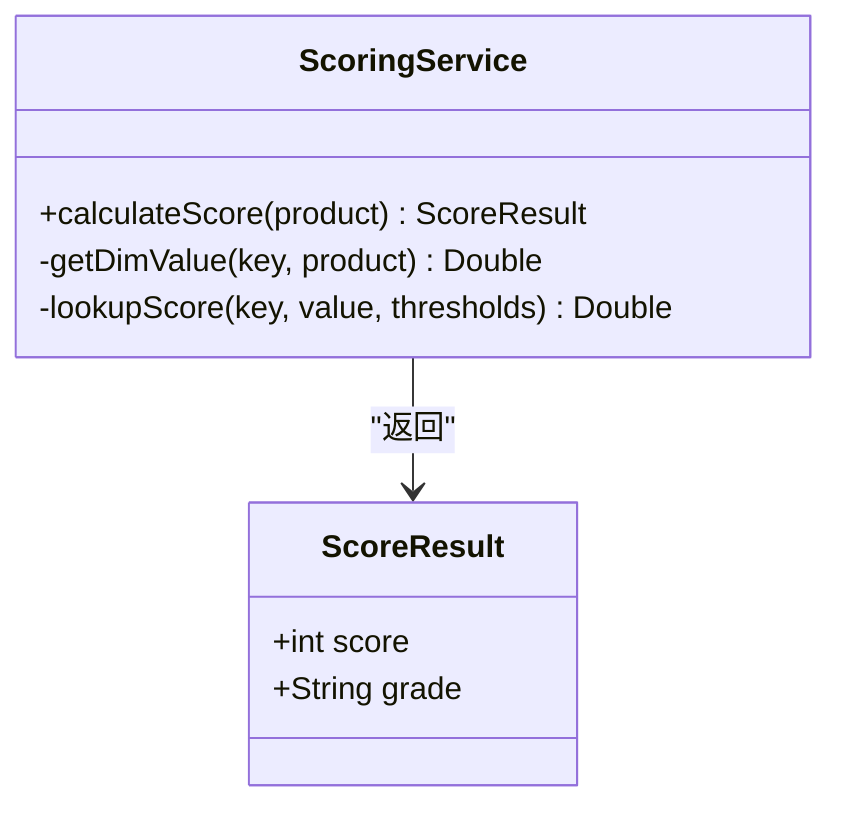
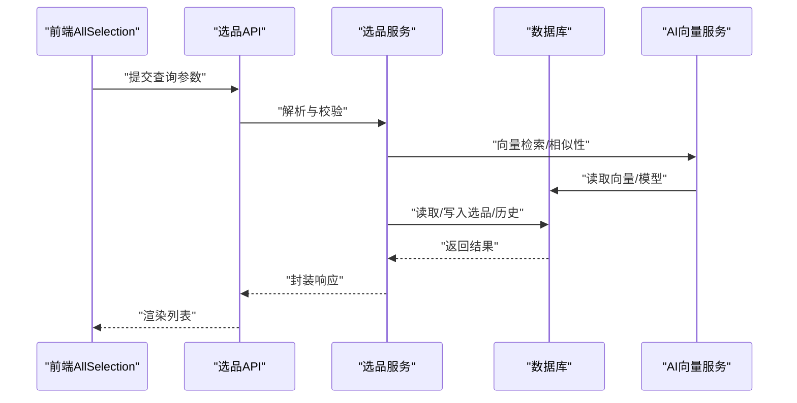
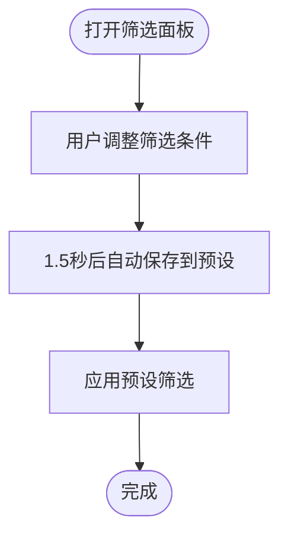
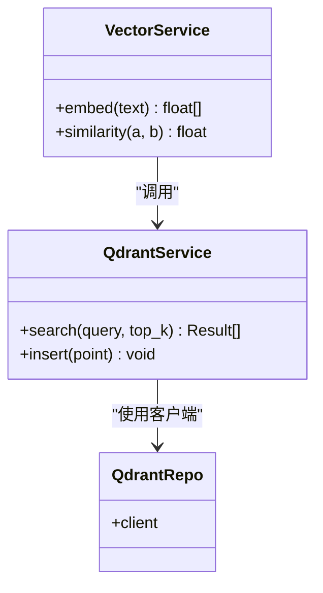
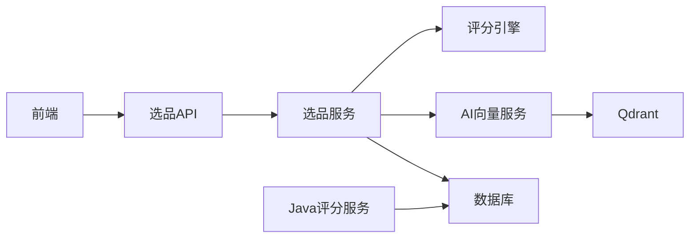

# 智能选品

<cite>
**本文引用的文件**
- [AI选品×系统深度结合方案.md](file://docs/ai结合分析/02-系统结合/AI选品×系统深度结合方案.md)
- [ScoringService.java](file://java-backend/sjzm-product/src/main/java/com/sjzm/product/service/ScoringService.java)
- [add_scoring_to_competitor_products.sql](file://java-backend/sql/add_scoring_to_competitor_products.sql)
- [index.vue（筛选预设组件）](file://frontend/src/components/FilterPresetSelector/index.vue)
- [index.vue（AllSelection页面）](file://frontend/src/views/AllSelection/index.vue)
- [scoring.py（评分API）](file://backend/app/api/v1/scoring.py)
- [scoring.py（评分模型）](file://backend/app/models/scoring.py)
- [scoring_engine.py（评分引擎）](file://backend/app/services/scoring_engine.py)
- [selection.py（选品API）](file://backend/app/api/v1/selection.py)
- [selection.py（选品模型）](file://backend/app/models/selection.py)
- [selection_service.py（选品服务）](file://backend/app/services/selection_service.py)
- [qdrant_repo.py（向量仓库）](file://python-ai/app/repositories/qdrant_repo.py)
- [qdrant_service.py（向量服务）](file://python-ai/app/services/qdrant_service.py)
- [vector_service.py（向量服务）](file://python-ai/app/services/vector_service.py)
- [ai_vector_processor.py（AI向量处理）](file://backend/app/services/ai_vector_processing/ai_vector_processor.py)
- [check_model_cache.py（模型缓存检查）](file://backend/app/services/ai_vector_processing/check_model_cache.py)
- [download_model.py（模型下载）](file://backend/app/services/ai_vector_processing/download_model.py)
</cite>

## 目录
1. [引言](#引言)
2. [项目结构](#项目结构)
3. [核心组件](#核心组件)
4. [架构总览](#架构总览)
5. [详细组件分析](#详细组件分析)
6. [依赖关系分析](#依赖关系分析)
7. [性能考虑](#性能考虑)
8. [故障排查指南](#故障排查指南)
9. [结论](#结论)
10. [附录](#附录)

## 引言
本技术文档围绕“智能选品”功能模块，系统阐述AI选品算法的设计原理与实现机制，涵盖评分引擎工作流、选品规则配置、竞品分析、数据处理流程、相似性计算与权重分配策略，并补充选品历史管理、选品报告生成、选品预设配置等实现细节。同时提供算法参数调优指南、性能优化建议与实际应用场景示例，帮助开发者深入理解该模块的技术架构与业务逻辑。

## 项目结构
智能选品涉及前后端与AI子系统的协同：
- 前端：筛选预设、选品列表、AI推荐标记展示
- 后端Python：选品API、选品服务、评分引擎、向量处理
- 后端Java：竞品评分服务、数据库表结构扩展
- AI子系统：向量检索、Qdrant存储、向量服务

图表来源
- [index.vue（筛选预设组件）:1-220](file://frontend/src/components/FilterPresetSelector/index.vue#L1-L220)
- [index.vue（AllSelection页面）:500-536](file://frontend/src/views/AllSelection/index.vue#L500-L536)
- [selection.py（选品API）](file://backend/app/api/v1/selection.py)
- [selection_service.py（选品服务）](file://backend/app/services/selection_service.py)
- [scoring_engine.py（评分引擎）](file://backend/app/services/scoring_engine.py)
- [ScoringService.java（竞品评分）:228-258](file://java-backend/sjzm-product/src/main/java/com/sjzm/product/service/ScoringService.java#L228-L258)
- [qdrant_service.py（向量服务）](file://python-ai/app/services/qdrant_service.py)
- [vector_service.py（向量服务）](file://python-ai/app/services/vector_service.py)
- [qdrant_repo.py（向量仓库）](file://python-ai/app/repositories/qdrant_repo.py)

章节来源
- [AI选品×系统深度结合方案.md:36-63](file://docs/ai结合分析/02-系统结合/AI选品×系统深度结合方案.md#L36-L63)
- [AI选品×系统深度结合方案.md:65-73](file://docs/ai结合分析/02-系统结合/AI选品×系统深度结合方案.md#L65-L73)
- [AI选品×系统深度结合方案.md:305-333](file://docs/ai结合分析/02-系统结合/AI选品×系统深度结合方案.md#L305-L333)
- [AI选品×系统深度结合方案.md:504-520](file://docs/ai结合分析/02-系统结合/AI选品×系统深度结合方案.md#L504-L520)

## 核心组件
- 评分引擎（Python）：对选品池进行多维评分与等级划分，支持权重配置与周标记
- 竞品评分服务（Java）：对竞品池执行相同评分逻辑，支持一键重新评分
- 选品服务与API：提供选品查询、采纳、历史与回收站管理
- 筛选预设：前端提供筛选条件的保存、更新、删除与默认预设管理
- AI向量处理与Qdrant：向量化、模型缓存与下载、向量检索与存储
- 数据表扩展：为竞品池增加评分字段与周标记字段

章节来源
- [scoring_engine.py（评分引擎）](file://backend/app/services/scoring_engine.py)
- [ScoringService.java（竞品评分）:228-258](file://java-backend/sjzm-product/src/main/java/com/sjzm/product/service/ScoringService.java#L228-L258)
- [selection_service.py（选品服务）](file://backend/app/services/selection_service.py)
- [selection.py（选品API）](file://backend/app/api/v1/selection.py)
- [index.vue（筛选预设组件）:1-220](file://frontend/src/components/FilterPresetSelector/index.vue#L1-L220)
- [add_scoring_to_competitor_products.sql（评分字段迁移）:1-6](file://java-backend/sql/add_scoring_to_competitor_products.sql#L1-L6)

## 架构总览
智能选品采用“前端交互 + 后端服务 + AI向量检索”的分层架构。前端负责筛选与展示，后端负责数据处理与评分，AI子系统负责向量化与相似性检索。数据流从ASIN导入开始，经竞品池、选品池、终稿池流转，AI推荐通过日志表与品类评分增强排序。

图表来源
- [index.vue（AllSelection页面）:500-536](file://frontend/src/views/AllSelection/index.vue#L500-L536)
- [selection.py（选品API）](file://backend/app/api/v1/selection.py)
- [selection_service.py（选品服务）](file://backend/app/services/selection_service.py)
- [scoring_engine.py（评分引擎）](file://backend/app/services/scoring_engine.py)
- [qdrant_service.py（向量服务）](file://python-ai/app/services/qdrant_service.py)
- [vector_service.py（向量服务）](file://python-ai/app/services/vector_service.py)

## 详细组件分析

### 评分引擎（Python）
- 输入维度：上架天数、销量、BSR排名、价格
- 权重配置：来自配置表，支持动态调整
- 特殊规则：FBA直接S级；等级划分S/A/B/C/D
- 周标记：按ISO周标记本周数据，便于滚动统计
- 输出：分数与等级，写入选品池

图表来源
- [scoring_engine.py（评分引擎）](file://backend/app/services/scoring_engine.py)
- [scoring.py（评分模型）](file://backend/app/models/scoring.py)
- [scoring.py（评分API）](file://backend/app/api/v1/scoring.py)

章节来源
- [AI选品×系统深度结合方案.md:65-73](file://docs/ai结合分析/02-系统结合/AI选品×系统深度结合方案.md#L65-L73)
- [AI选品×系统深度结合方案.md:588-601](file://docs/ai结合分析/02-系统结合/AI选品×系统深度结合方案.md#L588-L601)

### 竞品评分服务（Java）
- 维度与权重逻辑与Python一致
- 支持“一键重新评分”，便于修正或刷新
- 扩展字段：评分、等级、周标记、是否本周数据

图表来源
- [ScoringService.java（竞品评分）:228-258](file://java-backend/sjzm-product/src/main/java/com/sjzm/product/service/ScoringService.java#L228-L258)

章节来源
- [AI选品×系统深度结合方案.md:74-76](file://docs/ai结合分析/02-系统结合/AI选品×系统深度结合方案.md#L74-L76)
- [add_scoring_to_competitor_products.sql（评分字段迁移）:1-6](file://java-backend/sql/add_scoring_to_competitor_products.sql#L1-L6)

### 选品服务与API
- 查询与筛选：支持按品类、国家、过滤模式等条件
- 采纳流程：将AI推荐或筛选结果写入选品池
- 历史与回收站：记录选品历史与回收操作
- 与AI集成：通过向量服务与Qdrant检索相似产品

图表来源
- [selection.py（选品API）](file://backend/app/api/v1/selection.py)
- [selection_service.py（选品服务）](file://backend/app/services/selection_service.py)
- [selection.py（选品模型）](file://backend/app/models/selection.py)
- [qdrant_service.py（向量服务）](file://python-ai/app/services/qdrant_service.py)

章节来源
- [AI选品×系统深度结合方案.md:305-333](file://docs/ai结合分析/02-系统结合/AI选品×系统深度结合方案.md#L305-L333)
- [AI选品×系统深度结合方案.md:335-341](file://docs/ai结合分析/02-系统结合/AI选品×系统深度结合方案.md#L335-L341)

### 筛选预设配置
- 功能：保存/更新/删除/设为默认筛选条件
- 自动同步：筛选条件变更后自动更新对应预设
- 展示：前端以标签形式展示，支持槽位覆盖

图表来源
- [index.vue（筛选预设组件）:1-220](file://frontend/src/components/FilterPresetSelector/index.vue#L1-L220)

章节来源
- [index.vue（筛选预设组件）:103-125](file://frontend/src/components/FilterPresetSelector/index.vue#L103-L125)
- [index.vue（筛选预设组件）:190-200](file://frontend/src/components/FilterPresetSelector/index.vue#L190-L200)

### AI向量处理与Qdrant
- 模型缓存与下载：确保向量模型可用
- 向量服务：提供向量化与相似性计算接口
- Qdrant服务：负责向量检索与持久化

图表来源
- [vector_service.py（向量服务）](file://python-ai/app/services/vector_service.py)
- [qdrant_service.py（向量服务）](file://python-ai/app/services/qdrant_service.py)
- [qdrant_repo.py（向量仓库）](file://python-ai/app/repositories/qdrant_repo.py)

章节来源
- [ai_vector_processor.py（AI向量处理）](file://backend/app/services/ai_vector_processing/ai_vector_processor.py)
- [check_model_cache.py（模型缓存检查）](file://backend/app/services/ai_vector_processing/check_model_cache.py)
- [download_model.py（模型下载）](file://backend/app/services/ai_vector_processing/download_model.py)

### 选品历史管理与报告生成
- 历史记录：记录采纳、筛选、推荐等关键动作
- 报告生成：基于历史与评分数据生成选品报告
- 回收站：支持恢复与彻底删除

章节来源
- [AI选品×系统深度结合方案.md:305-333](file://docs/ai结合分析/02-系统结合/AI选品×系统深度结合方案.md#L305-L333)
- [AI选品×系统深度结合方案.md:335-341](file://docs/ai结合分析/02-系统结合/AI选品×系统深度结合方案.md#L335-L341)

## 依赖关系分析
- 前端依赖后端API与AI服务，通过HTTP请求与WebSocket事件交互
- 后端服务依赖数据库与AI子系统，保证数据一致性与向量检索能力
- 竞品评分与选品评分共享同一套维度与权重配置，确保一致性

图表来源
- [selection.py（选品API）](file://backend/app/api/v1/selection.py)
- [selection_service.py（选品服务）](file://backend/app/services/selection_service.py)
- [scoring_engine.py（评分引擎）](file://backend/app/services/scoring_engine.py)
- [qdrant_service.py（向量服务）](file://python-ai/app/services/qdrant_service.py)
- [ScoringService.java（竞品评分）:228-258](file://java-backend/sjzm-product/src/main/java/com/sjzm/product/service/ScoringService.java#L228-L258)

## 性能考虑
- 向量检索优化：合理设置top_k与批量查询，避免超大结果集
- 缓存策略：模型与中间结果缓存，减少重复下载与计算
- 分页与索引：数据库对常用查询字段建立索引，提升查询效率
- 并发控制：限流与队列，防止AI服务过载
- 周标记与滚动窗口：按周聚合评分，降低全量扫描成本

## 故障排查指南
- 评分异常：检查权重配置与阈值表，确认维度值非空且合法
- AI检索失败：检查模型缓存与下载任务，确认Qdrant连接正常
- 前端筛选无效：确认筛选预设已正确保存并应用
- 数据不一致：核对竞品池与选品池字段同步情况，关注周标记与is_current字段

章节来源
- [AI选品×系统深度结合方案.md:65-73](file://docs/ai结合分析/02-系统结合/AI选品×系统深度结合方案.md#L65-L73)
- [AI选品×系统深度结合方案.md:588-601](file://docs/ai结合分析/02-系统结合/AI选品×系统深度结合方案.md#L588-L601)

## 结论
智能选品模块通过“产品级评分 + 品类级评分 + AI向量检索”的多维融合，实现了高效、可配置、可追溯的选品决策流程。前端筛选预设与后端评分引擎、AI向量服务形成闭环，既满足日常运营需求，也为后续的个性化推荐与风险审查提供了扩展空间。

## 附录
- 算法参数调优建议
  - 权重分配：根据业务目标调整维度权重，观察采纳率与ROI
  - 特殊规则：谨慎使用FBA直给S级等规则，定期审计
  - 周标记：启用滚动窗口统计，避免短期波动影响判断
- 实际应用场景示例
  - 快速起量：针对新上架、低BSR商品优先推荐
  - 低配高卖：在低评价、低视频场景下寻找性价比机会
  - FBM可行：优先选择适合FBA的商品
  - 高溢价：在价格偏高但销量稳定的商品中寻找机会
  - 评分洼地：低评分但销量可观的商品作为潜力股
  - 无品牌：无品牌商品在特定市场可能具备机会

章节来源
- [AI选品×系统深度结合方案.md:313-329](file://docs/ai结合分析/02-系统结合/AI选品×系统深度结合方案.md#L313-L329)