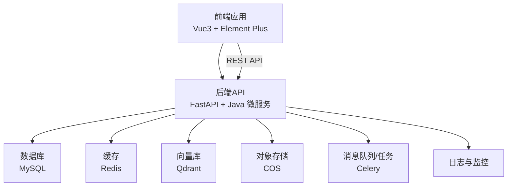
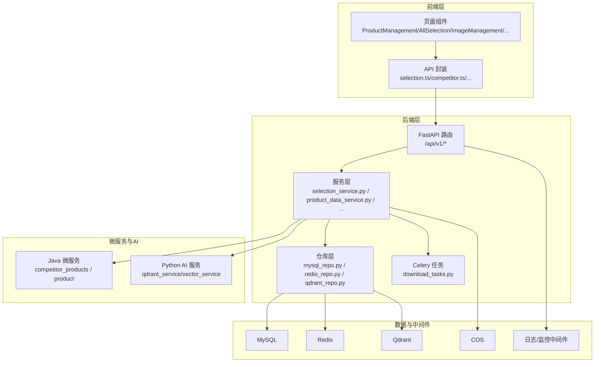
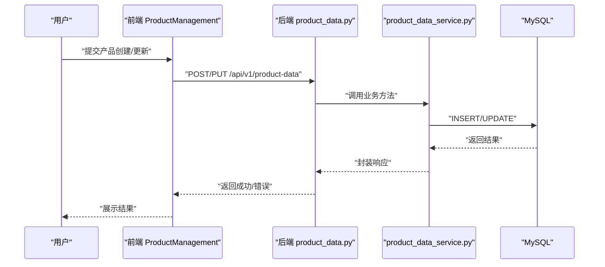
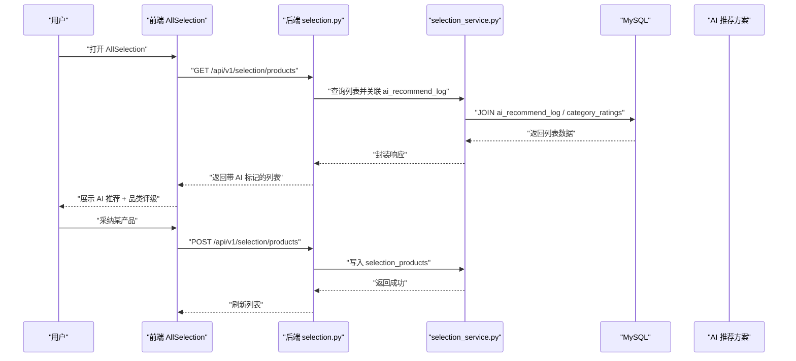
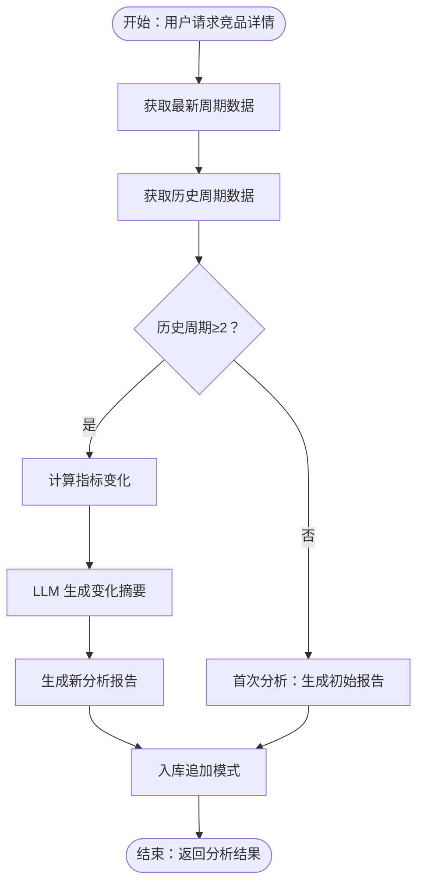
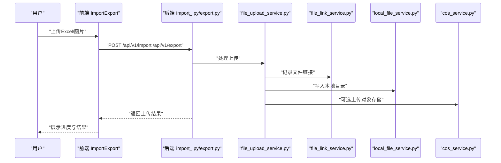
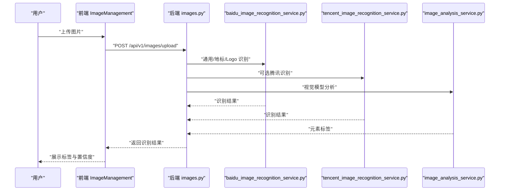
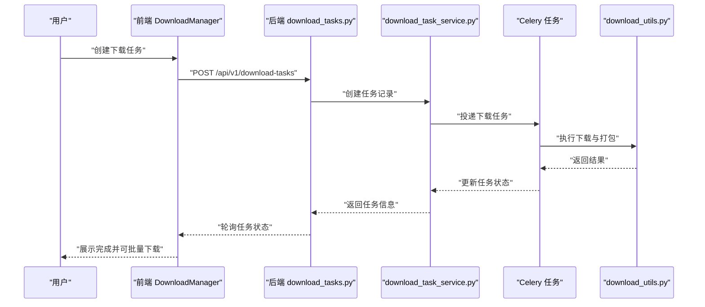
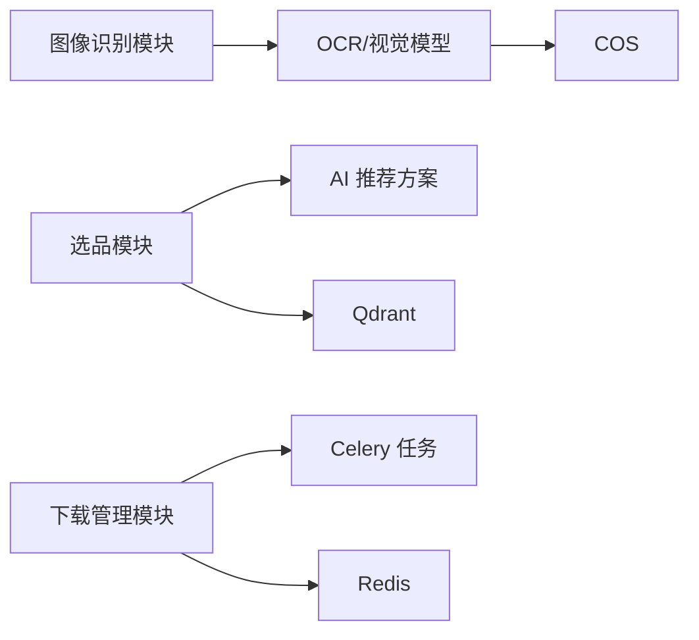

# 核心功能特性

<cite>
**本文引用的文件**
- [backend/app/api/v1/system_config.py](file://backend/app/api/v1/system_config.py)
- [backend/app/api/v1/selection.py](file://backend/app/api/v1/selection.py)
- [backend/app/models/selection.py](file://backend/app/models/selection.py)
- [backend/app/services/selection_service.py](file://backend/app/services/selection_service.py)
- [backend/app/api/v1/images.py](file://backend/app/api/v1/images.py)
- [backend/app/services/image_analysis_service.py](file://backend/app/services/image_analysis_service.py)
- [backend/app/services/baidu_image_recognition_service.py](file://backend/app/services/baidu_image_recognition_service.py)
- [backend/app/api/v1/download_tasks.py](file://backend/app/api/v1/download_tasks.py)
- [backend/app/tasks/download_tasks.py](file://backend/app/tasks/download_tasks.py)
- [backend/app/api/v1/material_library.py](file://backend/app/api/v1/material_library.py)
- [backend/app/models/material_library.py](file://backend/app/models/material_library.py)
- [backend/app/api/v1/file_links.py](file://backend/app/api/v1/file_links.py)
- [backend/app/services/file_link_service.py](file://backend/app/services/file_link_service.py)
- [backend/app/api/v1/product_data.py](file://backend/app/api/v1/product_data.py)
- [backend/app/services/product_data_service.py](file://backend/app/services/product_data_service.py)
- [backend/app/api/v1/statistics.py](file://backend/app/api/v1/statistics.py)
- [backend/app/api/v1/reports.py](file://backend/app/api/v1/reports.py)
- [backend/app/api/v1/import_.py](file://backend/app/api/v1/import_.py)
- [backend/app/api/v1/export.py](file://backend/app/api/v1/export.py)
- [backend/app/api/v1/carrier_library.py](file://backend/app/api/v1/carrier_library.py)
- [backend/app/models/carrier_library.py](file://backend/app/models/carrier_library.py)
- [backend/app/api/v1/final_drafts.py](file://backend/app/api/v1/final_drafts.py)
- [backend/app/models/final_draft.py](file://backend/app/models/final_draft.py)
- [backend/app/api/v1/recycle_bin.py](file://backend/app/api/v1/recycle_bin.py)
- [backend/app/api/v1/product_recycle.py](file://backend/app/api/v1/product_recycle.py)
- [backend/app/api/v1/tags.py](file://backend/app/api/v1/tags.py)
- [backend/app/api/v1/users.py](file://backend/app/api/v1/users.py)
- [backend/app/api/v1/logs.py](file://backend/app/api/v1/logs.py)
- [backend/app/api/v1/scoring.py](file://backend/app/api/v1/scoring.py)
- [backend/app/services/scoring_engine.py](file://backend/app/services/scoring_engine.py)
- [backend/app/api/v1/competitor.py](file://backend/app/api/v1/competitor.py)
- [backend/app/api/v1/selection_recycle.py](file://backend/app/api/v1/selection_recycle.py)
- [backend/app/api/v1/announcement.py](file://backend/app/api/v1/announcement.py)
- [backend/app/api/v1/health.py](file://backend/app/api/v1/health.py)
- [backend/app/api/v1/image_proxy.py](file://backend/app/api/v1/image_proxy.py)
- [backend/app/utils/image_processor.py](file://backend/app/utils/image_processor.py)
- [backend/app/utils/image_loader.py](file://backend/app/utils/image_loader.py)
- [backend/app/utils/download_utils.py](file://backend/app/utils/download_utils.py)
- [backend/app/services/download_task_service.py](file://backend/app/services/download_task_service.py)
- [backend/app/services/file_upload_service.py](file://backend/app/services/file_upload_service.py)
- [backend/app/services/local_file_service.py](file://backend/app/services/local_file_service.py)
- [backend/app/services/cos_service.py](file://backend/app/services/cos_service.py)
- [backend/app/services/library_image_service.py](file://backend/app/services/library_image_service.py)
- [backend/app/services/tencent_image_recognition_service.py](file://backend/app/services/tencent_image_recognition_service.py)
- [backend/app/services/tencent_image_search_service.py](file://backend/app/services/tencent_image_search_service.py)
- [backend/app/services/tencent_llm_vision_service.py](file://backend/app/services/tencent_llm_vision_service.py)
- [backend/app/services/ai_vector_processing/ai_vector_processor.py](file://backend/app/services/ai_vector_processing/ai_vector_processor.py)
- [backend/app/services/ai_vector_processing/check_model_cache.py](file://backend/app/services/ai_vector_processing/check_model_cache.py)
- [backend/app/services/ai_vector_processing/download_model.py](file://backend/app/services/ai_vector_processing/download_model.py)
- [backend/app/repositories/qdrant_repo.py](file://backend/app/repositories/qdrant_repo.py)
- [backend/app/repositories/redis_repo.py](file://backend/app/repositories/redis_repo.py)
- [backend/app/repositories/mysql_repo.py](file://backend/app/repositories/mysql_repo.py)
- [backend/app/middleware/auth_middleware.py](file://backend/app/middleware/auth_middleware.py)
- [backend/app/middleware/error_handler.py](file://backend/app/middleware/error_handler.py)
- [backend/app/middleware/error_middleware.py](file://backend/app/middleware/error_middleware.py)
- [backend/app/middleware/logging.py](file://backend/app/middleware/logging.py)
- [backend/app/middleware/timeout.py](file://backend/app/middleware/timeout.py)
- [backend/app/main.py](file://backend/app/main.py)
- [backend/app/config.py](file://backend/app/config.py)
- [frontend/src/views/ProductManagement/index.vue](file://frontend/src/views/ProductManagement/index.vue)
- [frontend/src/views/AllSelection/index.vue](file://frontend/src/views/AllSelection/index.vue)
- [frontend/src/views/SelectionDetail/index.vue](file://frontend/src/views/SelectionDetail/index.vue)
- [frontend/src/views/ImageManagement/index.vue](file://frontend/src/views/ImageManagement/index.vue)
- [frontend/src/views/DownloadManager/index.vue](file://frontend/src/views/DownloadManager/index.vue)
- [frontend/src/views/FileLinkManagement/index.vue](file://frontend/src/views/FileLinkManagement/index.vue)
- [frontend/src/views/MaterialLibrary/index.vue](file://frontend/src/views/MaterialLibrary/index.vue)
- [frontend/src/views/CarrierLibrary/index.vue](file://frontend/src/views/CarrierLibrary/index.vue)
- [frontend/src/views/FinalDraft/index.vue](file://frontend/src/views/FinalDraft/index.vue)
- [frontend/src/views/Statistics/index.vue](file://frontend/src/views/Statistics/index.vue)
- [frontend/src/views/ReportViewer/index.vue](file://frontend/src/views/ReportViewer/index.vue)
- [frontend/src/views/Settings/index.vue](file://frontend/src/views/Settings/index.vue)
- [frontend/src/views/Lingxing/Import/index.vue](file://frontend/src/views/Lingxing/Import/index.vue)
- [frontend/src/views/ImportExport/index.vue](file://frontend/src/views/ImportExport/index.vue)
- [frontend/src/api/selection.ts](file://frontend/src/api/selection.ts)
- [frontend/src/api/competitor.ts](file://frontend/src/api/competitor.ts)
- [frontend/src/api/downloadTask.ts](file://frontend/src/api/downloadTask.ts)
- [frontend/src/api/fileLink.ts](file://frontend/src/api/fileLink.ts)
- [frontend/src/api/image.ts](file://frontend/src/api/image.ts)
- [frontend/src/api/import_export.ts](file://frontend/src/api/import_export.ts)
- [frontend/src/api/materialLibrary.ts](file://frontend/src/api/materialLibrary.ts)
- [frontend/src/api/carrierLibrary.ts](file://frontend/src/api/carrierLibrary.ts)
- [frontend/src/api/finalDraft.ts](file://frontend/src/api/finalDraft.ts)
- [frontend/src/api/systemConfig.ts](file://frontend/src/api/systemConfig.ts)
- [frontend/src/api/productData.ts](file://frontend/src/api/productData.ts)
- [frontend/src/api/statistics.ts](file://frontend/src/api/statistics.ts)
- [frontend/src/api/report.ts](file://frontend/src/api/report.ts)
- [frontend/src/api/user.ts](file://frontend/src/api/user.ts)
- [frontend/src/api/tag.ts](file://frontend/src/api/tag.ts)
- [frontend/src/api/log.ts](file://frontend/src/api/log.ts)
- [frontend/src/api/scoring.ts](file://frontend/src/api/scoring.ts)
- [frontend/src/api/competitor.ts](file://frontend/src/api/competitor.ts)
- [frontend/src/api/selectionRecycle.ts](file://frontend/src/api/selectionRecycle.ts)
- [frontend/src/api/announcement.ts](file://frontend/src/api/announcement.ts)
- [frontend/src/api/health.ts](file://frontend/src/api/health.ts)
- [frontend/src/api/imageProxy.ts](file://frontend/src/api/imageProxy.ts)
- [frontend/src/components/SelectionQueryForm/index.vue](file://frontend/src/components/SelectionQueryForm/index.vue)
- [frontend/src/components/FilterPresetSelector/index.vue](file://frontend/src/components/FilterPresetSelector/index.vue)
- [frontend/src/components/FilterConfigPanel/index.vue](file://frontend/src/components/FilterConfigPanel/index.vue)
- [frontend/src/components/UniversalCard/index.vue](file://frontend/src/components/UniversalCard/index.vue)
- [frontend/src/components/UniversalList/index.vue](file://frontend/src/components/UniversalList/index.vue)
- [frontend/src/components/VirtualList/index.vue](file://frontend/src/components/VirtualList/index.vue)
- [frontend/src/components/LazyImage/index.vue](file://frontend/src/components/LazyImage/index.vue)
- [frontend/src/components/ProductDetailDialog/index.vue](file://frontend/src/components/ProductDetailDialog/index.vue)
- [frontend/src/components/ThumbnailViewer/index.vue](file://frontend/src/components/ThumbnailViewer/index.vue)
- [frontend/src/components/RecycleBinPage/index.vue](file://frontend/src/components/RecycleBinPage/index.vue)
- [frontend/src/router/index.ts](file://frontend/src/router/index.ts)
- [frontend/src/stores/user.ts](file://frontend/src/stores/user.ts)
- [frontend/src/stores/app.ts](file://frontend/src/stores/app.ts)
- [frontend/src/stores/productData.ts](file://frontend/src/stores/productData.ts)
- [frontend/src/stores/settings.ts](file://frontend/src/stores/settings.ts)
- [frontend/src/stores/systemLog.ts](file://frontend/src/stores/systemLog.ts)
- [frontend/src/stores/finalDraft.ts](file://frontend/src/stores/finalDraft.ts)
- [frontend/src/utils/request.ts](file://frontend/src/utils/request.ts)
- [frontend/src/utils/cacheManager.ts](file://frontend/src/utils/cacheManager.ts)
- [frontend/src/utils/imageCache.ts](file://frontend/src/utils/imageCache.ts)
- [frontend/src/utils/imageOfflineCache.ts](file://frontend/src/utils/imageOfflineCache.ts)
- [frontend/src/utils/imageCacheOptimizer.ts](file://frontend/src/utils/imageCacheOptimizer.ts)
- [frontend/src/utils/debounce.ts](file://frontend/src/utils/debounce.ts)
- [frontend/src/utils/emitter.ts](file://frontend/src/utils/emitter.ts)
- [frontend/src/utils/storage.ts](file://frontend/src/utils/storage.ts)
- [frontend/src/utils/environment.js](file://frontend/src/utils/environment.js)
- [frontend/src/utils/download.ts](file://frontend/src/utils/download.ts)
- [frontend/src/utils/requestMerge.ts](file://frontend/src/utils/requestMerge.ts)
- [frontend/src/utils/memoryMonitor.ts](file://frontend/src/utils/memoryMonitor.ts)
- [frontend/src/modules/zheng-shop-analysis/index.vue](file://frontend/src/modules/zheng-shop-analysis/index.vue)
- [frontend/src/modules/zheng-shop-analysis/manifest.ts](file://frontend/src/modules/zheng-shop-analysis/manifest.ts)
- [frontend/src/types/index.ts](file://frontend/src/types/index.ts)
- [frontend/src/types/common.ts](file://frontend/src/types/common.ts)
- [frontend/src/types/product.ts](file://frontend/src/types/product.ts)
- [frontend/src/types/api.ts](file://frontend/src/types/api.ts)
- [frontend/src/types/productData.ts](file://frontend/src/types/productData.ts)
- [frontend/src/types/resourceCollection.ts](file://frontend/src/types/resourceCollection.ts)
- [frontend/src/types/utils.ts](file://frontend/src/types/utils.ts)
- [frontend/src/types/axios.d.ts](file://frontend/src/types/axios.d.ts)
- [frontend/src/layouts/Layout/index.vue](file://frontend/src/layouts/Layout/index.vue)
- [frontend/src/layouts/MainLayout.bak/index.vue](file://frontend/src/layouts/MainLayout.bak/index.vue)
- [frontend/test/home-vibrant-v2.html](file://frontend/test/home-vibrant-v2.html)
- [frontend/test/sleek-preview.html](file://frontend/test/sleek-preview.html)
- [docs/ai结合分析/02-系统结合/AI选品×系统深度结合方案.md](file://docs/ai结合分析/02-系统结合/AI选品×系统深度结合方案.md)
- [docs/简历/agentic rag/04-迭代层-时间序列对比与知识演化.md](file://docs/简历/agentic rag/04-迭代层-时间序列对比与知识演化.md)
- [java-backend/sql/add_scoring_to_competitor_products.sql](file://java-backend/sql/add_scoring_to_competitor_products.sql)
- [python-ai/app/services/qdrant_service.py](file://python-ai/app/services/qdrant_service.py)
- [python-ai/app/services/vector_service.py](file://python-ai/app/services/vector_service.py)
- [python-ai/app/repositories/qdrant_repo.py](file://python-ai/app/repositories/qdrant_repo.py)
- [scripts/database/create_aggregation_tables.py](file://scripts/database/create_aggregation_tables.py)
- [scripts/database/add_performance_indexes.py](file://scripts/database/add_performance_indexes.py)
- [scripts/startup/start_prod_multiprocess.py](file://scripts/startup/start_prod_multiprocess.py)
- [scripts/monitoring/performance_monitor.py](file://scripts/monitoring/performance_monitor.py)
- [scripts/scheduler/update_aggregation_tables.py](file://scripts/scheduler/update_aggregation_tables.py)
- [scripts/env_consistency/alert_system.py](file://scripts/env_consistency/alert_system.py)
- [scripts/env_consistency/core_validator.py](file://scripts/env_consistency/core_validator.py)
- [scripts/env_consistency/data_sync.py](file://scripts/env_consistency/data_sync.py)
- [scripts/env_consistency/validate_env_consistency.py](file://scripts/env_consistency/validate_env_consistency.py)
- [scripts/git_sync/auto_sync.py](file://scripts/git_sync/auto_sync.py)
- [scripts/git_sync/conflict_manager.py](file://scripts/git_sync/conflict_manager.py)
- [scripts/git_sync/git_manager.py](file://scripts/git_sync/git_manager.py)
- [scripts/git_sync/git_sync_config.json](file://scripts/git_sync/git_sync_config.json)
- [scripts/git_sync/hook_manager.py](file://scripts/git_sync/hook_manager.py)
- [scripts/migrations/add_original_zip_fields.py](file://scripts/migrations/add_original_zip_fields.py)
- [scripts/migrations/add_listing_date_field.py](file://scripts/migrations/add_listing_date_field.py)
- [scripts/migrations/add_main_category_fields.py](file://scripts/migrations/add_main_category_fields.py)
- [scripts/migrations/add_original_zip_fields.py](file://scripts/migrations/add_original_zip_fields.py)
- [scripts/test_marketplace_only.json](file://scripts/test_marketplace_only.json)
- [scripts/test_marketplace_variation_N.json](file://scripts/test_marketplace_variation_N.json)
- [scripts/test_marketplace_variation_Y.json](file://scripts/test_marketplace_variation_Y.json)
- [backend/.dockerignore](file://backend/.dockerignore)
- [backend/Dockerfile](file://backend/Dockerfile)
- [backend/start_celery.py](file://backend/start_celery.py)
- [backend/start_java_dev.py](file://backend/start_java_dev.py)
- [backend/start_vite_dev.py](file://backend/start_vite_dev.py)
- [frontend/Dockerfile](file://frontend/Dockerfile)
- [frontend/nginx.conf](file://frontend/nginx.conf)
- [frontend/run-npm-install.ps1](file://frontend/run-npm-install.ps1)
- [k8s/backend-deployment.yaml](file://k8s/backend-deployment.yaml)
- [docker-compose.yml](file://docker-compose.yml)
- [docker-compose.prod.yml](file://docker-compose.prod.yml)
- [docker-compose.dev.yml](file://docker-compose.dev.yml)
- [mysql/init/01-init.sql](file://mysql/init/01-init.sql)
- [prometheus/prometheus.yml](file://prometheus/prometheus.yml)
- [docs/架构/ARCHITECTURE.md](file://docs/架构/ARCHITECTURE.md)
- [docs/development/standards.md](file://docs/development/standards.md)
- [docs/项目逻辑/RBAC设计.md](file://docs/项目逻辑/RBAC设计.md)
- [docs/项目逻辑/系统设置/备份功能.md](file://docs/项目逻辑/系统设置/备份功能.md)
- [docs/项目逻辑/选品/获取asin数据流程.md](file://docs/项目逻辑/选品/获取asin数据流程.md)
- [docs/项目逻辑/选品/竞品数据.md](file://docs/项目逻辑/选品/竞品数据.md)
- [docs/docker使用经验/README.md](file://docs/docker使用经验/README.md)
- [docs/docker使用经验/dockers命令经验.md](file://docs/docker使用经验/dockers命令经验.md)
- [docs/docker使用经验/MySQL跨环境数据复制.md](file://docs/docker使用经验/MySQL跨环境数据复制.md)
- [docs/卖家精灵api/查询获取asin.md](file://docs/卖家精灵api/查询获取asin.md)
- [docs/卖家精灵api/表 1.6 选产品和查竞品排序字段.md](file://docs/卖家精灵api/表 1.6 选产品和查竞品排序字段.md)
- [docs/卖家精灵api/api_response.md](file://docs/卖家精灵api/api_response.md)
- [docs/卖家精灵api/api_response_asins.md](file://docs/卖家精灵api/api_response_asins.md)
- [docs/卖家精灵api/查竞品.md](file://docs/卖家精灵api/查竞品.md)
- [docs/卖家精灵api/查店铺内容.md](file://docs/卖家精灵api/查店铺内容.md)
- [docs/卖家精灵api/AuraHome-uk_api_raw.json](file://docs/卖家精灵api/AuraHome-uk_api_raw.json)
- [docs/卖家精灵api/api_response_raw.json](file://docs/卖家精灵api/api_response_raw.json)
- [docs/卖家精灵api/api_response_asins.json](file://docs/卖家精灵api/api_response_asins.json)
- [docs/项目自检清单.md](file://docs/项目自检清单.md)
- [docs/生产部署检查清单.md](file://docs/production/生产部署检查清单.md)
- [docs/Java后端API测试清单.md](file://docs/Java后端API测试清单.md)
- [docs/OpenSpec官方使用流程.md](file://docs/OpenSpec官方使用流程.md)
- [docs/Python-AI服务创建计划.md](file://docs/Python-AI服务创建计划.md)
- [docs/1.md](file://docs/1.md)
- [docs/AI 选品 Agent — 实施方案.md](file://docs/AI 选品 Agent — 实施方案.md)
- [docs/Java后端API测试清单.md](file://docs/Java后端API测试清单.md)
- [docs/Python-AI服务创建计划.md](file://docs/Python-AI服务创建计划.md)
- [docs/任务记录/task2.md](file://docs/任务记录/task2.md)
- [docs/问题记录/模块化开发踩坑记录.md](file://docs/问题记录/模块化开发踩坑记录.md)
- [docs/问题记录/生产数据库误删事故.md](file://docs/问题记录/生产数据库误删事故.md)
- [docs/问题记录/生产环境图片加载失败-COS_BUCKET配置错误.md](file://docs/问题记录/生产环境图片加载失败-COS_BUCKET配置错误.md)
- [docs/问题记录/生产环境登录失败-数据库密码hash不一致.md](file://docs/问题记录/生产环境登录失败-数据库密码hash不一致.md)
- [docs/问题记录/nginx路由规则问题记录.md](file://docs/问题记录/nginx路由规则问题记录.md)
- [docs/架构设计文档-微服务分离方案.md](file://docs/架构设计文档-微服务分离方案.md)
- [docs/架构/网关.md](file://docs/架构/网关.md)
- [docs/架构/端口.md](file://docs/架构/端口.md)
- [docs/架构/简历可写.md](file://docs/架构/简历可写.md)
- [docs/架构/架构分析与优化.md](file://docs/架构/架构分析与优化.md)
- [docs/架构/Docker生产环境独立部署方案.md](file://docs/架构/Docker生产环境独立部署方案.md)
- [docs/架构/后续优化.md](file://docs/架构/后续优化.md)
- [docs/架构/架构设计文档-微服务分离方案.md](file://docs/架构/架构设计文档-微服务分离方案.md)
- [docs/架构/网关.md](file://docs/架构/网关.md)
- [docs/架构/端口.md](file://docs/架构/端口.md)
- [docs/架构/简历可写.md](file://docs/架构/简历可写.md)
- [docs/架构/架构分析与优化.md](file://docs/架构/架构分析与优化.md)
- [docs/架构/Docker生产环境独立部署方案.md](file://docs/架构/Docker生产环境独立部署方案.md)
- [docs/架构/后续优化.md](file://docs/架构/后续优化.md)
</cite>

## 目录
1. [引言](#引言)
2. [项目结构](#项目结构)
3. [核心组件](#核心组件)
4. [架构总览](#架构总览)
5. [详细组件分析](#详细组件分析)
6. [依赖分析](#依赖分析)
7. [性能考虑](#性能考虑)
8. [故障排查指南](#故障排查指南)
9. [结论](#结论)
10. [附录](#附录)

## 引言
本文件面向“思觉智贸系统”的使用者与协作开发者，系统性梳理并阐述系统的五大核心功能特性：产品管理、智能选品、竞品分析、文件处理、图像识别、下载管理、系统配置。文档不仅解释每个模块的业务价值与技术实现，还提供典型使用场景与模块间交互关系，帮助读者快速理解系统如何协同工作以提升运营效率与决策质量。

## 项目结构
系统采用前后端分离架构，后端由 Python FastAPI 与 Java 微服务共同组成，前端基于 Vue3 + Element Plus，配合 Celery 异步任务与容器化部署。核心模块分布如下：
- 前端模块：产品管理、智能选品、竞品分析、图片管理、下载管理、文件链接、素材库、载体库、定稿管理、统计与报表、系统设置等页面与 API 封装。
- 后端模块：FastAPI 路由与服务层负责数据访问、业务编排；Java 微服务提供高性能数据与计算能力；Python AI 服务负责向量化与检索；Celery 负责异步任务调度。
- 数据与中间件：MySQL、Redis、Qdrant、对象存储（COS）、日志与监控中间件贯穿全链路。

图表来源
- [backend/app/main.py](file://backend/app/main.py)
- [backend/app/config.py](file://backend/app/config.py)
- [backend/app/middleware/logging.py](file://backend/app/middleware/logging.py)
- [backend/app/middleware/error_handler.py](file://backend/app/middleware/error_handler.py)
- [backend/app/middleware/error_middleware.py](file://backend/app/middleware/error_middleware.py)
- [backend/app/middleware/auth_middleware.py](file://backend/app/middleware/auth_middleware.py)
- [backend/app/middleware/timeout.py](file://backend/app/middleware/timeout.py)

章节来源
- [backend/app/main.py](file://backend/app/main.py)
- [backend/app/config.py](file://backend/app/config.py)

## 核心组件
本节概述七大核心功能模块及其职责边界与典型使用场景。

- 产品管理
  - 业务价值：统一维护产品基础信息、分类、状态与生命周期，支撑选品与分析。
  - 技术实现：后端提供 REST API，前端提供管理界面与批量导入导出能力。
  - 使用场景：新增/编辑产品、批量导入、筛选与导出、回收站恢复。
  - 关键接口与页面：[ProductManagement 页面](file://frontend/src/views/ProductManagement/index.vue)，[产品数据 API](file://frontend/src/api/productData.ts)，[产品数据服务](file://backend/app/services/product_data_service.py)。

- 智能选品
  - 业务价值：基于品类分析与 AI 推荐，将海量产品压缩至可决策的候选集合。
  - 技术实现：后端聚合评分与等级，前端提供列表视图、品类视图与筛选预设。
  - 使用场景：从“看300个产品”到“看AI推荐的30个”，提升选品效率与命中率。
  - 关键接口与页面：[AllSelection 页面](file://frontend/src/views/AllSelection/index.vue)，[Selection API](file://frontend/src/api/selection.ts)，[Selection 服务](file://backend/app/services/selection_service.py)，[AI 推荐方案](file://docs/ai结合分析/02-系统结合/AI选品×系统深度结合方案.md)。

- 竞品分析
  - 业务价值：对竞品进行多维指标对比与趋势迭代，辅助定价与策略调整。
  - 技术实现：Java 微服务提供竞品详情与历史接口，后端脚本与向量库支撑检索与索引。
  - 使用场景：查看竞品详情、对比两周变化、生成迭代分析报告。
  - 关键接口与页面：[竞品 API](file://frontend/src/api/competitor.ts)，[竞品 SQL 扩展](file://java-backend/sql/add_scoring_to_competitor_products.sql)，[迭代分析流程](file://docs/简历/agentic rag/04-迭代层-时间序列对比与知识演化.md)。

- 文件处理
  - 业务价值：统一文件上传、链接管理与模板导出，保障数据一致性与可追溯性。
  - 技术实现：后端文件服务封装上传、统计与清理，前端提供导入导出与模板下载。
  - 使用场景：产品数据导入、图片模板下载、批量文件清理。
  - 关键接口与页面：[Import/Export 页面](file://frontend/src/views/ImportExport/index.vue)，[导入导出 API](file://frontend/src/api/import_export.ts)，[文件上传服务](file://backend/app/services/file_upload_service.py)。

- 图像识别
  - 业务价值：自动提取图片元素标签，支持以图搜图与智能分类。
  - 技术实现：集成百度与腾讯云识别能力，后端提供统一分析服务与代理。
  - 使用场景：图片上传识别、以图搜图、图片缓存与离线缓存优化。
  - 关键接口与页面：[ImageManagement 页面](file://frontend/src/views/ImageManagement/index.vue)，[图像识别服务](file://backend/app/services/baidu_image_recognition_service.py)，[图像分析服务](file://backend/app/services/image_analysis_service.py)，[图像代理 API](file://frontend/src/api/imageProxy.ts)。

- 下载管理
  - 业务价值：集中管理批量下载任务，支持重试、批量下载与过期清理。
  - 技术实现：Celery 异步任务 + 后端下载任务服务 + 前端任务面板。
  - 使用场景：批量导出定稿、批量下载任务文件、清理过期任务。
  - 关键接口与页面：[DownloadManager 页面](file://frontend/src/views/DownloadManager/index.vue)，[下载任务 API](file://frontend/src/api/downloadTask.ts)，[下载任务服务](file://backend/app/services/download_task_service.py)。

- 系统配置
  - 业务价值：集中管理系统参数、权限与日志，保障运维与合规。
  - 技术实现：后端提供配置项与日志接口，前端提供设置与审计入口。
  - 使用场景：系统参数调整、用户与角色管理、日志查询与告警。
  - 关键接口与页面：[Settings 页面](file://frontend/src/views/Settings/index.vue)，[System Config API](file://frontend/src/api/systemConfig.ts)，[日志 API](file://frontend/src/api/log.ts)。

章节来源
- [frontend/src/views/ProductManagement/index.vue](file://frontend/src/views/ProductManagement/index.vue)
- [frontend/src/views/AllSelection/index.vue](file://frontend/src/views/AllSelection/index.vue)
- [frontend/src/views/SelectionDetail/index.vue](file://frontend/src/views/SelectionDetail/index.vue)
- [frontend/src/views/ImageManagement/index.vue](file://frontend/src/views/ImageManagement/index.vue)
- [frontend/src/views/DownloadManager/index.vue](file://frontend/src/views/DownloadManager/index.vue)
- [frontend/src/views/FileLinkManagement/index.vue](file://frontend/src/views/FileLinkManagement/index.vue)
- [frontend/src/views/MaterialLibrary/index.vue](file://frontend/src/views/MaterialLibrary/index.vue)
- [frontend/src/views/CarrierLibrary/index.vue](file://frontend/src/views/CarrierLibrary/index.vue)
- [frontend/src/views/FinalDraft/index.vue](file://frontend/src/views/FinalDraft/index.vue)
- [frontend/src/views/Statistics/index.vue](file://frontend/src/views/Statistics/index.vue)
- [frontend/src/views/ReportViewer/index.vue](file://frontend/src/views/ReportViewer/index.vue)
- [frontend/src/views/Settings/index.vue](file://frontend/src/views/Settings/index.vue)
- [frontend/src/views/Lingxing/Import/index.vue](file://frontend/src/views/Lingxing/Import/index.vue)
- [frontend/src/views/ImportExport/index.vue](file://frontend/src/views/ImportExport/index.vue)
- [frontend/src/api/selection.ts](file://frontend/src/api/selection.ts)
- [frontend/src/api/competitor.ts](file://frontend/src/api/competitor.ts)
- [frontend/src/api/downloadTask.ts](file://frontend/src/api/downloadTask.ts)
- [frontend/src/api/fileLink.ts](file://frontend/src/api/fileLink.ts)
- [frontend/src/api/image.ts](file://frontend/src/api/image.ts)
- [frontend/src/api/import_export.ts](file://frontend/src/api/import_export.ts)
- [frontend/src/api/materialLibrary.ts](file://frontend/src/api/materialLibrary.ts)
- [frontend/src/api/carrierLibrary.ts](file://frontend/src/api/carrierLibrary.ts)
- [frontend/src/api/finalDraft.ts](file://frontend/src/api/finalDraft.ts)
- [frontend/src/api/systemConfig.ts](file://frontend/src/api/systemConfig.ts)
- [frontend/src/api/productData.ts](file://frontend/src/api/productData.ts)
- [frontend/src/api/statistics.ts](file://frontend/src/api/statistics.ts)
- [frontend/src/api/report.ts](file://frontend/src/api/report.ts)
- [frontend/src/api/user.ts](file://frontend/src/api/user.ts)
- [frontend/src/api/tag.ts](file://frontend/src/api/tag.ts)
- [frontend/src/api/log.ts](file://frontend/src/api/log.ts)
- [frontend/src/api/scoring.ts](file://frontend/src/api/scoring.ts)
- [frontend/src/api/competitor.ts](file://frontend/src/api/competitor.ts)
- [frontend/src/api/selectionRecycle.ts](file://frontend/src/api/selectionRecycle.ts)
- [frontend/src/api/announcement.ts](file://frontend/src/api/announcement.ts)
- [frontend/src/api/health.ts](file://frontend/src/api/health.ts)
- [frontend/src/api/imageProxy.ts](file://frontend/src/api/imageProxy.ts)

## 架构总览
系统采用“前端页面 + 后端 API + 微服务 + AI 服务 + 存储与中间件”的分层架构。前端通过 REST API 与后端交互，后端通过服务层编排业务，数据持久化于 MySQL，缓存于 Redis，向量检索于 Qdrant，对象存储于 COS，异步任务由 Celery 承载。

图表来源
- [backend/app/api/v1/selection.py](file://backend/app/api/v1/selection.py)
- [backend/app/services/selection_service.py](file://backend/app/services/selection_service.py)
- [backend/app/repositories/mysql_repo.py](file://backend/app/repositories/mysql_repo.py)
- [backend/app/repositories/redis_repo.py](file://backend/app/repositories/redis_repo.py)
- [backend/app/repositories/qdrant_repo.py](file://backend/app/repositories/qdrant_repo.py)
- [backend/app/tasks/download_tasks.py](file://backend/app/tasks/download_tasks.py)
- [backend/app/services/cos_service.py](file://backend/app/services/cos_service.py)
- [backend/app/services/tencent_image_recognition_service.py](file://backend/app/services/tencent_image_recognition_service.py)
- [python-ai/app/services/qdrant_service.py](file://python-ai/app/services/qdrant_service.py)
- [python-ai/app/services/vector_service.py](file://python-ai/app/services/vector_service.py)

## 详细组件分析

### 产品管理
- 功能要点
  - 基础 CRUD：创建、更新、删除、查询与分页。
  - 批量导入导出：支持 Excel 模板下载与批量导入。
  - 回收站：软删除与恢复，支持筛选国家与过滤模式。
  - 标签与分类：支持标签管理与多级分类。
- 技术实现
  - 后端路由与服务：[产品数据 API](file://backend/app/api/v1/product_data.py)，[产品数据服务](file://backend/app/services/product_data_service.py)。
  - 前端页面与 API：[ProductManagement 页面](file://frontend/src/views/ProductManagement/index.vue)，[productData API](file://frontend/src/api/productData.ts)。
- 使用场景
  - 新建产品并打标签，批量导入历史数据，筛选特定国家或模式的产品，从回收站恢复误删产品。

图表来源
- [backend/app/api/v1/product_data.py](file://backend/app/api/v1/product_data.py)
- [backend/app/services/product_data_service.py](file://backend/app/services/product_data_service.py)
- [frontend/src/views/ProductManagement/index.vue](file://frontend/src/views/ProductManagement/index.vue)
- [frontend/src/api/productData.ts](file://frontend/src/api/productData.ts)

章节来源
- [backend/app/api/v1/product_data.py](file://backend/app/api/v1/product_data.py)
- [backend/app/services/product_data_service.py](file://backend/app/services/product_data_service.py)
- [frontend/src/views/ProductManagement/index.vue](file://frontend/src/views/ProductManagement/index.vue)
- [frontend/src/api/productData.ts](file://frontend/src/api/productData.ts)

### 智能选品
- 功能要点
  - AI 推荐：基于品类分析与机会模式，输出 Top30 候选并标注 AI 推荐。
  - 列表与品类视图：支持按产品或按品类维度浏览，展示评分、等级与品类评级。
  - 筛选与预设：支持筛选器预设与点击行为追踪。
- 技术实现
  - 后端：[selection.py](file://backend/app/api/v1/selection.py)，[selection_service.py](file://backend/app/services/selection_service.py)，[selection 模型](file://backend/app/models/selection.py)。
  - 前端：[AllSelection 页面](file://frontend/src/views/AllSelection/index.vue)，[Selection API](file://frontend/src/api/selection.ts)，[SelectionQueryForm 组件](file://frontend/src/components/SelectionQueryForm/index.vue)。
  - AI 结合方案：[AI 选品×系统深度结合方案](file://docs/ai结合分析/02-系统结合/AI选品×系统深度结合方案.md)。
- 使用场景
  - 用户在 AllSelection 页面查看 AI 推荐产品，按品类视图聚焦目标品类，采纳后加入选品池。

图表来源
- [backend/app/api/v1/selection.py](file://backend/app/api/v1/selection.py)
- [backend/app/services/selection_service.py](file://backend/app/services/selection_service.py)
- [backend/app/models/selection.py](file://backend/app/models/selection.py)
- [frontend/src/views/AllSelection/index.vue](file://frontend/src/views/AllSelection/index.vue)
- [frontend/src/api/selection.ts](file://frontend/src/api/selection.ts)
- [docs/ai结合分析/02-系统结合/AI选品×系统深度结合方案.md](file://docs/ai结合分析/02-系统结合/AI选品×系统深度结合方案.md)

章节来源
- [backend/app/api/v1/selection.py](file://backend/app/api/v1/selection.py)
- [backend/app/services/selection_service.py](file://backend/app/services/selection_service.py)
- [backend/app/models/selection.py](file://backend/app/models/selection.py)
- [frontend/src/views/AllSelection/index.vue](file://frontend/src/views/AllSelection/index.vue)
- [frontend/src/api/selection.ts](file://frontend/src/api/selection.ts)
- [docs/ai结合分析/02-系统结合/AI选品×系统深度结合方案.md](file://docs/ai结合分析/02-系统结合/AI选品×系统深度结合方案.md)

### 竞品分析
- 功能要点
  - 竞品详情与历史：获取竞品详情与历史周期数据，支持对比两周变化。
  - 迭代分析：基于时间序列对比生成变化摘要与版本演进。
  - 评分与等级：Java 微服务扩展字段，支持评分与等级展示。
- 技术实现
  - 后端：[竞品 API](file://backend/app/api/v1/competitor.py)（Java 微服务），[迭代分析流程](file://docs/简历/agentic rag/04-迭代层-时间序列对比与知识演化.md)。
  - 前端：[竞品 API 封装](file://frontend/src/api/competitor.ts)，[SelectionDetail 页面](file://frontend/src/views/SelectionDetail/index.vue)。
  - 数据扩展：[SQL 扩展字段](file://java-backend/sql/add_scoring_to_competitor_products.sql)。
- 使用场景
  - 查看竞品详情，对比两周销量/评分变化，生成迭代分析报告。

图表来源
- [docs/简历/agentic rag/04-迭代层-时间序列对比与知识演化.md](file://docs/简历/agentic rag/04-迭代层-时间序列对比与知识演化.md)
- [frontend/src/api/competitor.ts](file://frontend/src/api/competitor.ts)
- [frontend/src/views/SelectionDetail/index.vue](file://frontend/src/views/SelectionDetail/index.vue)
- [java-backend/sql/add_scoring_to_competitor_products.sql](file://java-backend/sql/add_scoring_to_competitor_products.sql)

章节来源
- [frontend/src/api/competitor.ts](file://frontend/src/api/competitor.ts)
- [frontend/src/views/SelectionDetail/index.vue](file://frontend/src/views/SelectionDetail/index.vue)
- [docs/简历/agentic rag/04-迭代层-时间序列对比与知识演化.md](file://docs/简历/agentic rag/04-迭代层-时间序列对比与知识演化.md)
- [java-backend/sql/add_scoring_to_competitor_products.sql](file://java-backend/sql/add_scoring_to_competitor_products.sql)

### 文件处理
- 功能要点
  - 文件上传：支持本地目录与对象存储，提供上传统计与清理。
  - 模板导出：提供产品与图片模板下载。
  - 文件链接：统一管理文件链接与元数据。
- 技术实现
  - 后端：[file_links.py](file://backend/app/api/v1/file_links.py)，[file_link_service.py](file://backend/app/services/file_link_service.py)，[file_upload_service.py](file://backend/app/services/file_upload_service.py)。
  - 前端：[FileLinkManagement 页面](file://frontend/src/views/FileLinkManagement/index.vue)，[fileLink API](file://frontend/src/api/fileLink.ts)，[ImportExport 页面](file://frontend/src/views/ImportExport/index.vue)，[import_export API](file://frontend/src/api/import_export.ts)。
- 使用场景
  - 导入产品数据、下载图片模板、管理文件链接、清理过期文件。

图表来源
- [backend/app/api/v1/import_.py](file://backend/app/api/v1/import_.py)
- [backend/app/api/v1/export.py](file://backend/app/api/v1/export.py)
- [backend/app/services/file_upload_service.py](file://backend/app/services/file_upload_service.py)
- [backend/app/services/file_link_service.py](file://backend/app/services/file_link_service.py)
- [backend/app/services/local_file_service.py](file://backend/app/services/local_file_service.py)
- [backend/app/services/cos_service.py](file://backend/app/services/cos_service.py)
- [frontend/src/views/ImportExport/index.vue](file://frontend/src/views/ImportExport/index.vue)
- [frontend/src/api/import_export.ts](file://frontend/src/api/import_export.ts)
- [frontend/src/views/FileLinkManagement/index.vue](file://frontend/src/views/FileLinkManagement/index.vue)
- [frontend/src/api/fileLink.ts](file://frontend/src/api/fileLink.ts)

章节来源
- [backend/app/api/v1/import_.py](file://backend/app/api/v1/import_.py)
- [backend/app/api/v1/export.py](file://backend/app/api/v1/export.py)
- [backend/app/services/file_upload_service.py](file://backend/app/services/file_upload_service.py)
- [backend/app/services/file_link_service.py](file://backend/app/services/file_link_service.py)
- [backend/app/services/local_file_service.py](file://backend/app/services/local_file_service.py)
- [backend/app/services/cos_service.py](file://backend/app/services/cos_service.py)
- [frontend/src/views/ImportExport/index.vue](file://frontend/src/views/ImportExport/index.vue)
- [frontend/src/api/import_export.ts](file://frontend/src/api/import_export.ts)
- [frontend/src/views/FileLinkManagement/index.vue](file://frontend/src/views/FileLinkManagement/index.vue)
- [frontend/src/api/fileLink.ts](file://frontend/src/api/fileLink.ts)

### 图像识别
- 功能要点
  - 多能力识别：通用物体、地标、Logo 识别，支持综合分析。
  - 图像分析：基于视觉模型输出元素标签与置信度。
  - 代理与缓存：图像代理与缓存优化，支持离线缓存。
- 技术实现
  - 后端：[baidu_image_recognition_service.py](file://backend/app/services/baidu_image_recognition_service.py)，[image_analysis_service.py](file://backend/app/services/image_analysis_service.py)，[image_proxy.py](file://backend/app/api/v1/image_proxy.py)，[image_processor.py](file://backend/app/utils/image_processor.py)，[image_loader.py](file://backend/app/utils/image_loader.py)。
  - 前端：[ImageManagement 页面](file://frontend/src/views/ImageManagement/index.vue)，[image API](file://frontend/src/api/image.ts)，[imageCache 与离线缓存](file://frontend/src/utils/imageCache.ts)。
- 使用场景
  - 上传图片进行识别，查看识别标签，使用以图搜图功能。

图表来源
- [backend/app/api/v1/images.py](file://backend/app/api/v1/images.py)
- [backend/app/services/baidu_image_recognition_service.py](file://backend/app/services/baidu_image_recognition_service.py)
- [backend/app/services/tencent_image_recognition_service.py](file://backend/app/services/tencent_image_recognition_service.py)
- [backend/app/services/image_analysis_service.py](file://backend/app/services/image_analysis_service.py)
- [backend/app/utils/image_processor.py](file://backend/app/utils/image_processor.py)
- [backend/app/utils/image_loader.py](file://backend/app/utils/image_loader.py)
- [frontend/src/views/ImageManagement/index.vue](file://frontend/src/views/ImageManagement/index.vue)
- [frontend/src/api/image.ts](file://frontend/src/api/image.ts)

章节来源
- [backend/app/api/v1/images.py](file://backend/app/api/v1/images.py)
- [backend/app/services/baidu_image_recognition_service.py](file://backend/app/services/baidu_image_recognition_service.py)
- [backend/app/services/tencent_image_recognition_service.py](file://backend/app/services/tencent_image_recognition_service.py)
- [backend/app/services/image_analysis_service.py](file://backend/app/services/image_analysis_service.py)
- [backend/app/utils/image_processor.py](file://backend/app/utils/image_processor.py)
- [backend/app/utils/image_loader.py](file://backend/app/utils/image_loader.py)
- [frontend/src/views/ImageManagement/index.vue](file://frontend/src/views/ImageManagement/index.vue)
- [frontend/src/api/image.ts](file://frontend/src/api/image.ts)

### 下载管理
- 功能要点
  - 任务管理：创建、查询、重试、删除、批量下载、清理过期任务。
  - 异步执行：Celery 任务队列处理下载与打包。
- 技术实现
  - 后端：[download_tasks.py](file://backend/app/api/v1/download_tasks.py)，[download_tasks.py](file://backend/app/tasks/download_tasks.py)，[download_task_service.py](file://backend/app/services/download_task_service.py)，[download_utils.py](file://backend/app/utils/download_utils.py)。
  - 前端：[DownloadManager 页面](file://frontend/src/views/DownloadManager/index.vue)，[downloadTask API](file://frontend/src/api/downloadTask.ts)。
- 使用场景
  - 创建定稿下载任务，批量下载已完成任务文件，清理过期任务。

图表来源
- [backend/app/api/v1/download_tasks.py](file://backend/app/api/v1/download_tasks.py)
- [backend/app/tasks/download_tasks.py](file://backend/app/tasks/download_tasks.py)
- [backend/app/services/download_task_service.py](file://backend/app/services/download_task_service.py)
- [backend/app/utils/download_utils.py](file://backend/app/utils/download_utils.py)
- [frontend/src/views/DownloadManager/index.vue](file://frontend/src/views/DownloadManager/index.vue)
- [frontend/src/api/downloadTask.ts](file://frontend/src/api/downloadTask.ts)

章节来源
- [backend/app/api/v1/download_tasks.py](file://backend/app/api/v1/download_tasks.py)
- [backend/app/tasks/download_tasks.py](file://backend/app/tasks/download_tasks.py)
- [backend/app/services/download_task_service.py](file://backend/app/services/download_task_service.py)
- [backend/app/utils/download_utils.py](file://backend/app/utils/download_utils.py)
- [frontend/src/views/DownloadManager/index.vue](file://frontend/src/views/DownloadManager/index.vue)
- [frontend/src/api/downloadTask.ts](file://frontend/src/api/downloadTask.ts)

### 系统配置
- 功能要点
  - 系统参数：统一管理配置项，支持动态更新。
  - 权限与日志：RBAC 设计与系统日志审计。
  - 告警与监控：环境一致性校验与性能监控。
- 技术实现
  - 后端：[system_config.py](file://backend/app/api/v1/system_config.py)，[users.py](file://backend/app/api/v1/users.py)，[logs.py](file://backend/app/api/v1/logs.py)，[RBAC 设计](file://docs/项目逻辑/RBAC设计.md)。
  - 前端：[Settings 页面](file://frontend/src/views/Settings/index.vue)，[systemConfig API](file://frontend/src/api/systemConfig.ts)，[log API](file://frontend/src/api/log.ts)。
- 使用场景
  - 调整系统参数、管理用户与角色、查看系统日志与告警。

章节来源
- [backend/app/api/v1/system_config.py](file://backend/app/api/v1/system_config.py)
- [backend/app/api/v1/users.py](file://backend/app/api/v1/users.py)
- [backend/app/api/v1/logs.py](file://backend/app/api/v1/logs.py)
- [frontend/src/views/Settings/index.vue](file://frontend/src/views/Settings/index.vue)
- [frontend/src/api/systemConfig.ts](file://frontend/src/api/systemConfig.ts)
- [frontend/src/api/log.ts](file://frontend/src/api/log.ts)
- [docs/项目逻辑/RBAC设计.md](file://docs/项目逻辑/RBAC设计.md)

## 依赖分析
- 组件耦合
  - 选品模块与 AI 推荐模块强耦合，通过后端 JOIN ai_recommend_log 实现无侵入展示。
  - 图像识别模块依赖第三方 SDK 与本地/对象存储，前端依赖缓存与离线缓存。
  - 下载管理模块依赖 Celery 任务队列与对象存储，保证异步与可靠性。
- 外部依赖
  - 第三方图像识别：百度、腾讯云。
  - 向量检索：Qdrant。
  - 对象存储：COS。
  - 缓存：Redis。
- 潜在风险
  - 第三方服务可用性与限流。
  - Celery 任务堆积与失败重试策略。
  - 数据一致性与事务边界。

图表来源
- [docs/ai结合分析/02-系统结合/AI选品×系统深度结合方案.md](file://docs/ai结合分析/02-系统结合/AI选品×系统深度结合方案.md)
- [backend/app/services/baidu_image_recognition_service.py](file://backend/app/services/baidu_image_recognition_service.py)
- [backend/app/services/image_analysis_service.py](file://backend/app/services/image_analysis_service.py)
- [backend/app/tasks/download_tasks.py](file://backend/app/tasks/download_tasks.py)
- [backend/app/repositories/qdrant_repo.py](file://backend/app/repositories/qdrant_repo.py)
- [backend/app/services/cos_service.py](file://backend/app/services/cos_service.py)
- [backend/app/repositories/redis_repo.py](file://backend/app/repositories/redis_repo.py)

章节来源
- [docs/ai结合分析/02-系统结合/AI选品×系统深度结合方案.md](file://docs/ai结合分析/02-系统结合/AI选品×系统深度结合方案.md)
- [backend/app/services/baidu_image_recognition_service.py](file://backend/app/services/baidu_image_recognition_service.py)
- [backend/app/services/image_analysis_service.py](file://backend/app/services/image_analysis_service.py)
- [backend/app/tasks/download_tasks.py](file://backend/app/tasks/download_tasks.py)
- [backend/app/repositories/qdrant_repo.py](file://backend/app/repositories/qdrant_repo.py)
- [backend/app/services/cos_service.py](file://backend/app/services/cos_service.py)
- [backend/app/repositories/redis_repo.py](file://backend/app/repositories/redis_repo.py)

## 性能考虑
- 缓存策略
  - Redis 缓存热点数据与会话信息，降低数据库压力。
  - 图片离线缓存与缓存优化器减少重复加载与网络开销。
- 异步化
  - 下载与文件处理通过 Celery 异步执行，避免阻塞主线程。
- 索引与聚合
  - 数据库性能索引与聚合表定期更新，提升查询效率。
- 监控与告警
  - 性能监控脚本与 Prometheus 配置，持续观测系统健康度。

章节来源
- [frontend/src/utils/imageCache.ts](file://frontend/src/utils/imageCache.ts)
- [frontend/src/utils/imageCacheOptimizer.ts](file://frontend/src/utils/imageCacheOptimizer.ts)
- [scripts/database/add_performance_indexes.py](file://scripts/database/add_performance_indexes.py)
- [scripts/scheduler/update_aggregation_tables.py](file://scripts/scheduler/update_aggregation_tables.py)
- [scripts/monitoring/performance_monitor.py](file://scripts/monitoring/performance_monitor.py)
- [prometheus/prometheus.yml](file://prometheus/prometheus.yml)

## 故障排查指南
- 登录失败
  - 检查数据库密码 hash 是否一致，确认认证中间件配置。
- 图片加载失败
  - 检查 COS_BUCKET 配置，确保对象存储访问正常。
- 数据库误删
  - 使用备份功能与回滚脚本恢复数据。
- Nginx 路由问题
  - 核对路由规则与反向代理配置。
- 模块化开发问题
  - 按模块化开发踩坑记录逐项排查依赖与构建问题。

章节来源
- [docs/问题记录/生产环境登录失败-数据库密码hash不一致.md](file://docs/问题记录/生产环境登录失败-数据库密码hash不一致.md)
- [docs/问题记录/生产环境图片加载失败-COS_BUCKET配置错误.md](file://docs/问题记录/生产环境图片加载失败-COS_BUCKET配置错误.md)
- [docs/项目逻辑/系统设置/备份功能.md](file://docs/项目逻辑/系统设置/备份功能.md)
- [docs/问题记录/nginx路由规则问题记录.md](file://docs/问题记录/nginx路由规则问题记录.md)
- [docs/问题记录/模块化开发踩坑记录.md](file://docs/问题记录/模块化开发踩坑记录.md)

## 结论
思觉智贸系统通过“产品管理、智能选品、竞品分析、文件处理、图像识别、下载管理、系统配置”七大核心模块，形成从数据采集、智能分析到任务执行与系统治理的闭环。模块间通过 API、中间件与异步任务协同，既满足当前业务需求，又为未来扩展与优化预留空间。建议在日常使用中关注缓存与异步任务的健康度，配合监控与告警体系，确保系统稳定高效运行。

## 附录
- 前端页面与 API 映射
  - 产品管理：[ProductManagement 页面](file://frontend/src/views/ProductManagement/index.vue) ↔ [productData API](file://frontend/src/api/productData.ts)
  - 智能选品：[AllSelection 页面](file://frontend/src/views/AllSelection/index.vue) ↔ [selection API](file://frontend/src/api/selection.ts)
  - 竞品分析：[SelectionDetail 页面](file://frontend/src/views/SelectionDetail/index.vue) ↔ [competitor API](file://frontend/src/api/competitor.ts)
  - 图片管理：[ImageManagement 页面](file://frontend/src/views/ImageManagement/index.vue) ↔ [image API](file://frontend/src/api/image.ts)
  - 下载管理：[DownloadManager 页面](file://frontend/src/views/DownloadManager/index.vue) ↔ [downloadTask API](file://frontend/src/api/downloadTask.ts)
  - 文件链接：[FileLinkManagement 页面](file://frontend/src/views/FileLinkManagement/index.vue) ↔ [fileLink API](file://frontend/src/api/fileLink.ts)
  - 素材库/载体库/定稿管理：[MaterialLibrary/CarrierLibrary/FinalDraft 页面](file://frontend/src/views/MaterialLibrary/index.vue) ↔ [materialLibrary API](file://frontend/src/api/materialLibrary.ts)，[carrierLibrary API](file://frontend/src/api/carrierLibrary.ts)，[finalDraft API](file://frontend/src/api/finalDraft.ts)
  - 统计与报表：[Statistics/ReportViewer 页面](file://frontend/src/views/Statistics/index.vue) ↔ [statistics API](file://frontend/src/api/statistics.ts)，[report API](file://frontend/src/api/report.ts)
  - 系统设置：[Settings 页面](file://frontend/src/views/Settings/index.vue) ↔ [systemConfig API](file://frontend/src/api/systemConfig.ts)，[log API](file://frontend/src/api/log.ts)

章节来源
- [frontend/src/views/ProductManagement/index.vue](file://frontend/src/views/ProductManagement/index.vue)
- [frontend/src/views/AllSelection/index.vue](file://frontend/src/views/AllSelection/index.vue)
- [frontend/src/views/SelectionDetail/index.vue](file://frontend/src/views/SelectionDetail/index.vue)
- [frontend/src/views/ImageManagement/index.vue](file://frontend/src/views/ImageManagement/index.vue)
- [frontend/src/views/DownloadManager/index.vue](file://frontend/src/views/DownloadManager/index.vue)
- [frontend/src/views/FileLinkManagement/index.vue](file://frontend/src/views/FileLinkManagement/index.vue)
- [frontend/src/views/MaterialLibrary/index.vue](file://frontend/src/views/MaterialLibrary/index.vue)
- [frontend/src/views/CarrierLibrary/index.vue](file://frontend/src/views/CarrierLibrary/index.vue)
- [frontend/src/views/FinalDraft/index.vue](file://frontend/src/views/FinalDraft/index.vue)
- [frontend/src/views/Statistics/index.vue](file://frontend/src/views/Statistics/index.vue)
- [frontend/src/views/ReportViewer/index.vue](file://frontend/src/views/ReportViewer/index.vue)
- [frontend/src/views/Settings/index.vue](file://frontend/src/views/Settings/index.vue)
- [frontend/src/api/productData.ts](file://frontend/src/api/productData.ts)
- [frontend/src/api/selection.ts](file://frontend/src/api/selection.ts)
- [frontend/src/api/competitor.ts](file://frontend/src/api/competitor.ts)
- [frontend/src/api/image.ts](file://frontend/src/api/image.ts)
- [frontend/src/api/downloadTask.ts](file://frontend/src/api/downloadTask.ts)
- [frontend/src/api/fileLink.ts](file://frontend/src/api/fileLink.ts)
- [frontend/src/api/materialLibrary.ts](file://frontend/src/api/materialLibrary.ts)
- [frontend/src/api/carrierLibrary.ts](file://frontend/src/api/carrierLibrary.ts)
- [frontend/src/api/finalDraft.ts](file://frontend/src/api/finalDraft.ts)
- [frontend/src/api/statistics.ts](file://frontend/src/api/statistics.ts)
- [frontend/src/api/report.ts](file://frontend/src/api/report.ts)
- [frontend/src/api/systemConfig.ts](file://frontend/src/api/systemConfig.ts)
- [frontend/src/api/log.ts](file://frontend/src/api/log.ts)