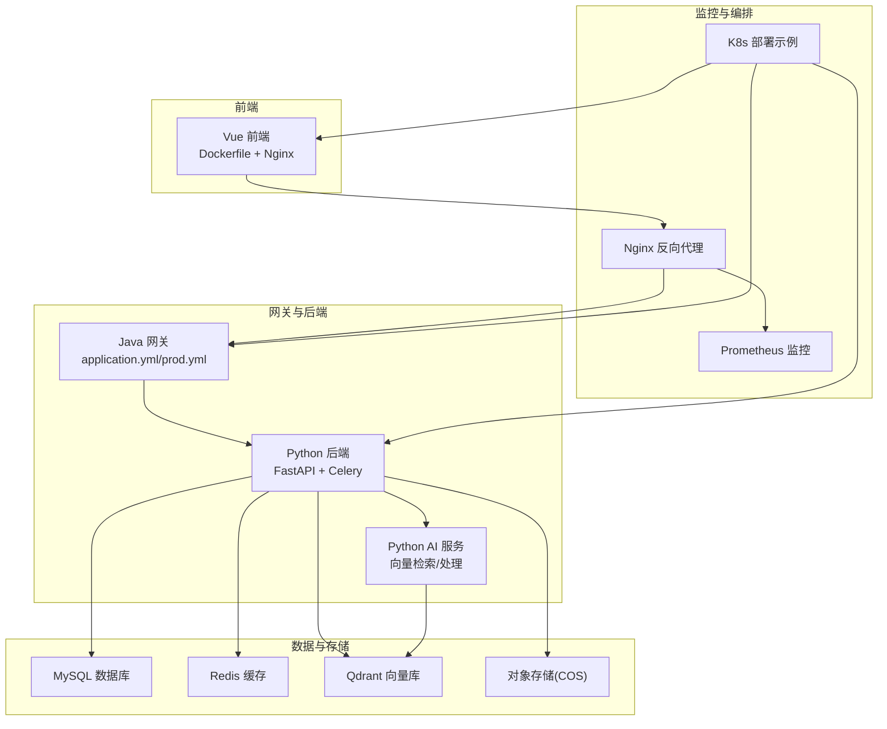
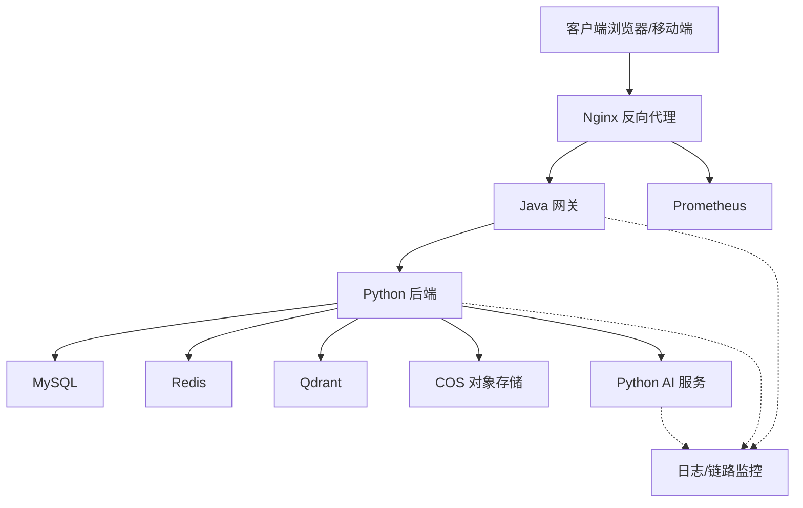
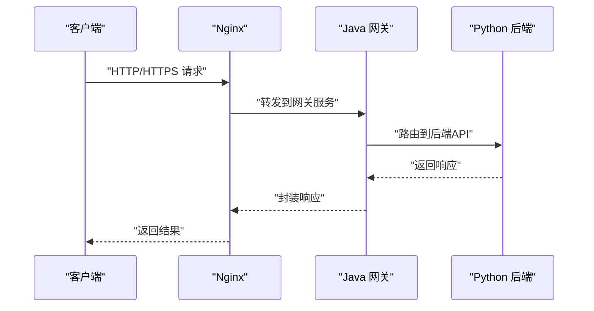
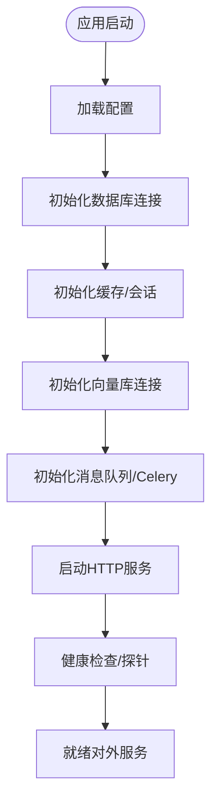
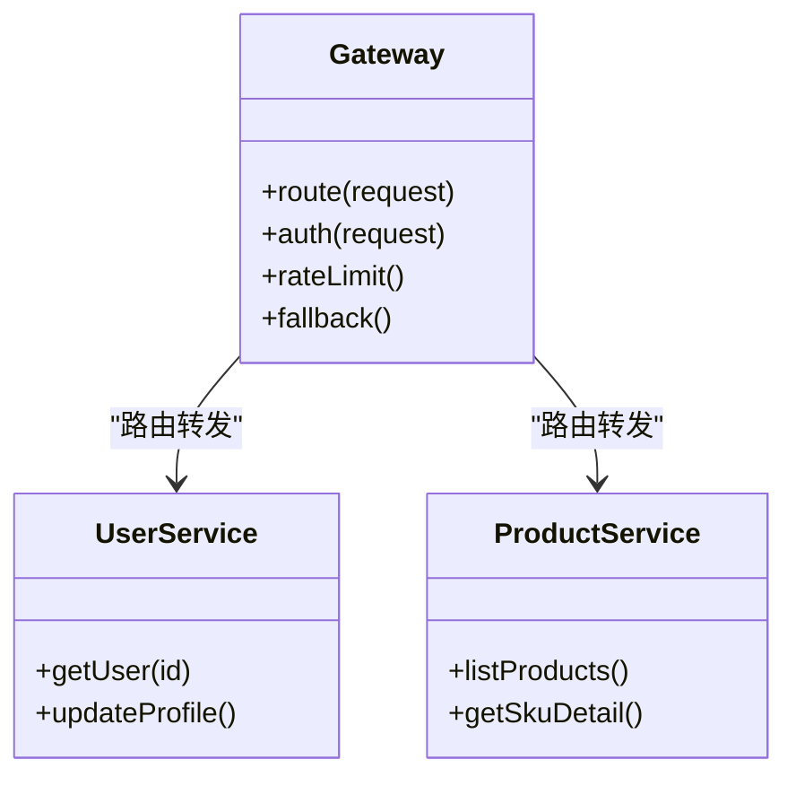
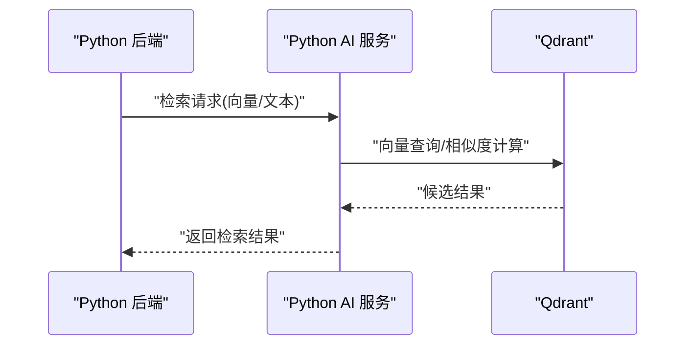
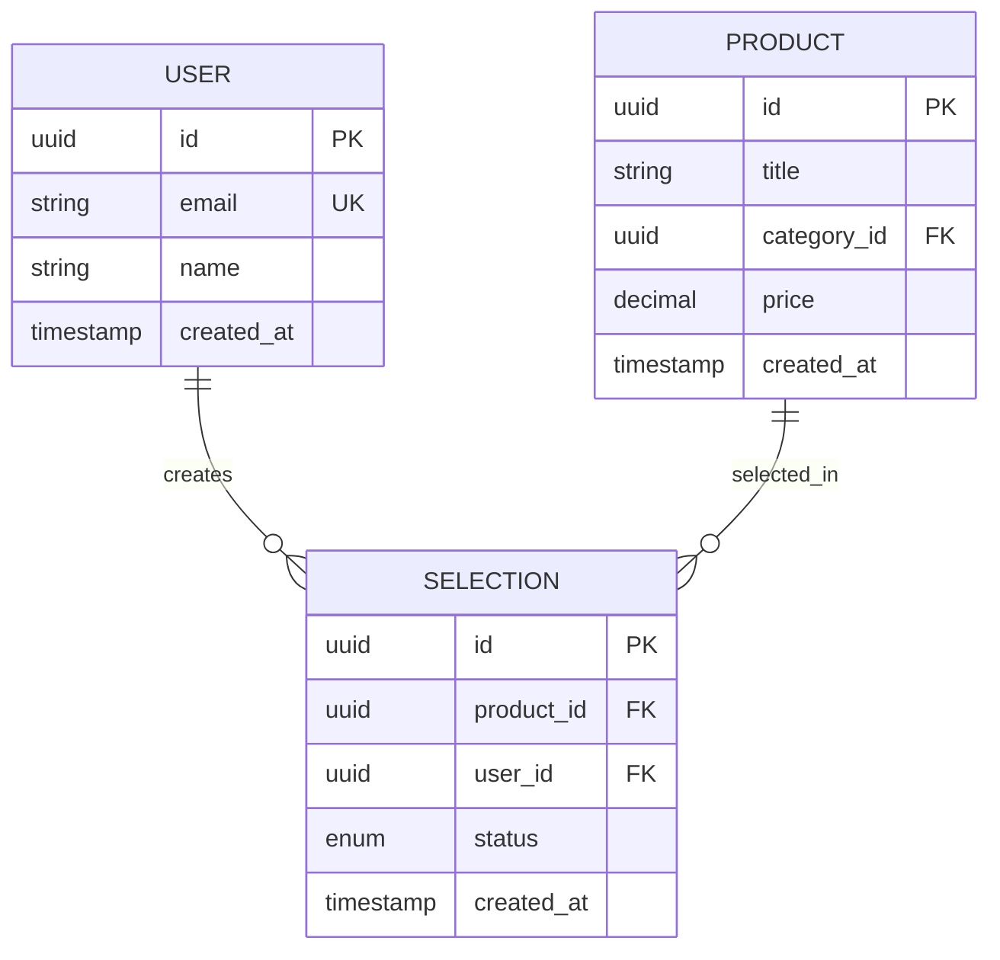
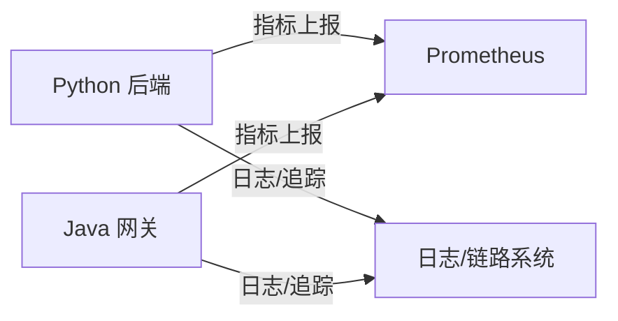
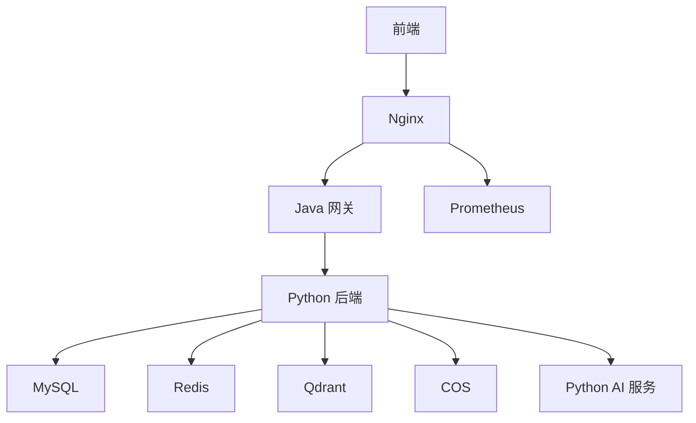

# 部署架构说明

<cite>
**本文档引用的文件**
- [docker-compose.yml](file://docker-compose.yml)
- [docker-compose.base.yml](file://docker-compose.base.yml)
- [docker-compose.dev.yml](file://docker-compose.dev.yml)
- [docker-compose.prod.yml](file://docker-compose.prod.yml)
- [docker-compose.prod-simple.yml](file://docker-compose.prod-simple.yml)
- [Dockerfile](file://backend/Dockerfile)
- [Dockerfile.base](file://backend/Dockerfile.base)
- [Dockerfile.dev](file://backend/Dockerfile.dev)
- [nginx.conf](file://nginx.conf)
- [nginx.prod.conf](file://nginx.prod.conf)
- [backend/main.py](file://backend/main.py)
- [backend/config.py](file://backend/config.py)
- [java-backend/src/main/resources/application.yml](file://java-backend/src/main/resources/application.yml)
- [java-backend/src/main/resources/application-prod.yml](file://java-backend/src/main/resources/application-prod.yml)
- [k8s/backend-deployment.yaml](file://k8s/backend-deployment.yaml)
- [prometheus/prometheus.yml](file://prometheus/prometheus.yml)
- [mysql/init/01-init.sql](file://mysql/init/01-init.sql)
- [python-ai/main.py](file://python-ai/main.py)
- [python-ai/config.py](file://python-ai/config.py)
</cite>

## 目录
1. [引言](#引言)
2. [项目结构](#项目结构)
3. [核心组件](#核心组件)
4. [架构总览](#架构总览)
5. [详细组件分析](#详细组件分析)
6. [依赖关系分析](#依赖关系分析)
7. [性能考虑](#性能考虑)
8. [故障排查指南](#故障排查指南)
9. [结论](#结论)
10. [附录](#附录)

## 引言
本文件面向运维与平台工程团队，系统化阐述“思觉智贸系统”的部署架构与实施要点，覆盖容器化部署、微服务架构、数据流架构、生产与开发环境差异、高可用与容灾设计等主题。文档以仓库中的编排与配置文件为依据，结合后端、前端、Java网关与AI服务的部署特征，给出可操作的部署建议与架构图示。

## 项目结构
系统采用多语言混合架构：Python后端（FastAPI）、Vue前端、Java网关与微服务、Python AI服务，配合Nginx反向代理与MySQL数据库。部署通过Docker Compose进行本地/测试环境编排，并提供Kubernetes部署示例与Prometheus监控配置。

图表来源
- [docker-compose.yml](file://docker-compose.yml)
- [docker-compose.prod.yml](file://docker-compose.prod.yml)
- [nginx.conf](file://nginx.conf)
- [backend/main.py](file://backend/main.py)
- [java-backend/src/main/resources/application.yml](file://java-backend/src/main/resources/application.yml)
- [python-ai/main.py](file://python-ai/main.py)

章节来源
- [docker-compose.yml](file://docker-compose.yml)
- [docker-compose.prod.yml](file://docker-compose.prod.yml)
- [nginx.conf](file://nginx.conf)

## 核心组件
- 反向代理与入口网关
  - Nginx负责静态资源分发、HTTPS终止、上游服务路由与健康检查。
  - 提供开发与生产两套配置，生产配置包含安全加固与压缩策略。
- Java网关与微服务
  - 网关统一接入，后端按领域拆分为用户、商品等微服务，通过配置中心与注册发现协同。
  - 生产环境配置独立于开发配置，便于差异化部署。
- Python后端（FastAPI）
  - 提供REST API、定时任务与消息队列处理；集成缓存、向量库与对象存储。
- Python AI服务
  - 负责向量化检索与模型处理，与后端通过HTTP或共享存储交互。
- 数据与存储
  - MySQL用于业务主数据；Redis提供缓存与会话；Qdrant承载向量索引；COS用于图片与文件存储。
- 监控与可观测性
  - Prometheus采集指标，K8s部署示例展示容器化与副本策略。

章节来源
- [nginx.conf](file://nginx.conf)
- [nginx.prod.conf](file://nginx.prod.conf)
- [java-backend/src/main/resources/application.yml](file://java-backend/src/main/resources/application.yml)
- [java-backend/src/main/resources/application-prod.yml](file://java-backend/src/main/resources/application-prod.yml)
- [backend/main.py](file://backend/main.py)
- [python-ai/main.py](file://python-ai/main.py)
- [prometheus/prometheus.yml](file://prometheus/prometheus.yml)
- [k8s/backend-deployment.yaml](file://k8s/backend-deployment.yaml)

## 架构总览
下图展示生产环境典型拓扑：Nginx作为统一入口，后端由Java网关与Python后端组成，AI服务独立部署，数据层包含MySQL、Redis、Qdrant与COS。

图表来源
- [docker-compose.prod.yml](file://docker-compose.prod.yml)
- [backend/main.py](file://backend/main.py)
- [python-ai/main.py](file://python-ai/main.py)
- [prometheus/prometheus.yml](file://prometheus/prometheus.yml)

## 详细组件分析

### 反向代理与入口网关
- Nginx配置
  - 开发与生产配置分离，生产配置启用Gzip、安全头与超时参数，适配高并发与CDN缓存。
  - 支持静态资源直出与后端服务反代，具备基础健康检查与限流策略。
- Java网关
  - 通过application.yml与application-prod.yml区分环境，支持注册中心与配置中心集成。
  - 网关负责路由、鉴权前置校验与请求转发至下游微服务。

图表来源
- [nginx.conf](file://nginx.conf)
- [java-backend/src/main/resources/application.yml](file://java-backend/src/main/resources/application.yml)
- [backend/main.py](file://backend/main.py)

章节来源
- [nginx.conf](file://nginx.conf)
- [nginx.prod.conf](file://nginx.prod.conf)
- [java-backend/src/main/resources/application.yml](file://java-backend/src/main/resources/application.yml)
- [java-backend/src/main/resources/application-prod.yml](file://java-backend/src/main/resources/application-prod.yml)

### Python 后端（FastAPI）
- 容器化
  - 使用Dockerfile构建镜像，开发与基础镜像分离，便于增量构建与缓存复用。
- 功能边界
  - 提供REST API、定时任务与消息队列处理；集成Redis缓存、Qdrant向量检索、COS对象存储。
- 配置管理
  - 通过配置文件加载运行时参数，区分开发与生产环境变量。

图表来源
- [backend/main.py](file://backend/main.py)
- [backend/config.py](file://backend/config.py)
- [Dockerfile](file://backend/Dockerfile)
- [Dockerfile.base](file://backend/Dockerfile.base)
- [Dockerfile.dev](file://backend/Dockerfile.dev)

章节来源
- [backend/main.py](file://backend/main.py)
- [backend/config.py](file://backend/config.py)
- [Dockerfile](file://backend/Dockerfile)
- [Dockerfile.base](file://backend/Dockerfile.base)
- [Dockerfile.dev](file://backend/Dockerfile.dev)

### Java 网关与微服务
- 网关职责
  - 统一入口、路由、鉴权、限流与熔断；通过配置中心动态下发策略。
- 微服务拆分
  - 用户、商品等服务按领域划分，降低耦合并提升弹性扩展能力。
- 环境差异
  - application.yml用于通用配置，application-prod.yml覆盖生产敏感参数与连接池。

图表来源
- [java-backend/src/main/resources/application.yml](file://java-backend/src/main/resources/application.yml)
- [java-backend/src/main/resources/application-prod.yml](file://java-backend/src/main/resources/application-prod.yml)

章节来源
- [java-backend/src/main/resources/application.yml](file://java-backend/src/main/resources/application.yml)
- [java-backend/src/main/resources/application-prod.yml](file://java-backend/src/main/resources/application-prod.yml)

### Python AI 服务
- 职责边界
  - 向量化检索、模型推理与向量入库；与后端通过HTTP或共享存储交互。
- 部署建议
  - 与后端同VPC或内网互通，避免暴露公网；资源按需扩缩容。

图表来源
- [python-ai/main.py](file://python-ai/main.py)
- [python-ai/config.py](file://python-ai/config.py)

章节来源
- [python-ai/main.py](file://python-ai/main.py)
- [python-ai/config.py](file://python-ai/config.py)

### 数据与存储
- MySQL
  - 初始化脚本完成基础表结构与评分系统初始化，支持开发与生产双轨。
- Redis
  - 缓存热点数据、会话与分布式锁；建议开启持久化与主从复制。
- Qdrant
  - 向量检索与相似度计算；建议独立部署并配置副本与快照。
- COS
  - 图片与文件对象存储；生产需配置Bucket权限与CDN加速。

图表来源
- [mysql/init/01-init.sql](file://mysql/init/01-init.sql)

章节来源
- [mysql/init/01-init.sql](file://mysql/init/01-init.sql)

### 监控与可观测性
- Prometheus
  - 采集后端与网关指标，结合Grafana可视化；建议配置告警规则与SLA基线。
- 日志与链路
  - 统一日志格式与标签，实现跨服务链路追踪与慢调用定位。

图表来源
- [prometheus/prometheus.yml](file://prometheus/prometheus.yml)
- [backend/main.py](file://backend/main.py)
- [java-backend/src/main/resources/application.yml](file://java-backend/src/main/resources/application.yml)

章节来源
- [prometheus/prometheus.yml](file://prometheus/prometheus.yml)

## 依赖关系分析
- 组件耦合
  - 前端通过Nginx访问网关；网关再转发至Python后端；后端依赖数据库、缓存、向量库与对象存储。
- 外部依赖
  - Java网关依赖注册中心与配置中心；AI服务依赖向量库；Nginx依赖SSL证书与CDN。
- 编排与版本
  - Docker Compose定义服务间依赖与端口映射；K8s示例展示副本与滚动升级策略。

图表来源
- [docker-compose.yml](file://docker-compose.yml)
- [k8s/backend-deployment.yaml](file://k8s/backend-deployment.yaml)

章节来源
- [docker-compose.yml](file://docker-compose.yml)
- [k8s/backend-deployment.yaml](file://k8s/backend-deployment.yaml)

## 性能考虑
- 网络与入口
  - Nginx启用Gzip与HTTP/2，合理设置超时与缓冲区；CDN缓存静态资源。
- 应用层
  - Python后端使用连接池与异步任务；Redis开启持久化与内存淘汰策略；Qdrant优化向量维度与索引参数。
- 存储层
  - MySQL开启慢查询日志与分区策略；COS开启压缩与跨区域冗余。
- 监控与容量规划
  - 基于Prometheus指标设定阈值与扩容触发条件，定期压测与容量评估。

## 故障排查指南
- 常见问题定位
  - 登录失败：检查数据库密码哈希一致性与连接串；核对环境变量与密钥。
  - 图片加载失败：确认COS Bucket配置与访问权限。
  - 生产数据库误删：核查备份策略与恢复流程。
- 运维工具
  - 使用Docker Compose健康检查与日志聚合；结合Prometheus告警快速定位异常节点。
- 配置核对
  - 对比开发与生产配置文件，确保端口、URL、密钥与存储路径一致。

章节来源
- [scripts/deployment/sync_dev_to_prod.py](file://scripts/deployment/sync_dev_to_prod.py)
- [scripts/env_consistency/validate_env_consistency.py](file://scripts/env_consistency/validate_env_consistency.py)

## 结论
本部署架构以容器化为核心，结合Nginx网关、Java微服务与Python后端/AI服务，形成前后端分离、数据与存储解耦的弹性体系。通过差异化配置与监控告警，满足生产环境的高可用与可维护性要求。建议在上线前完成压测、演练与回滚预案，确保平滑过渡。

## 附录
- 环境差异清单
  - 开发环境：本地Docker Compose，最小化依赖；生产环境：Nginx+K8s+外部注册中心与配置中心。
- 端口与服务映射
  - 参考编排文件中的端口映射与服务名称，确保防火墙与安全组放行。
- 备份与恢复
  - 数据库与对象存储均需纳入自动化备份策略，定期验证恢复流程。

章节来源
- [docker-compose.dev.yml](file://docker-compose.dev.yml)
- [docker-compose.prod.yml](file://docker-compose.prod.yml)
- [k8s/backend-deployment.yaml](file://k8s/backend-deployment.yaml)