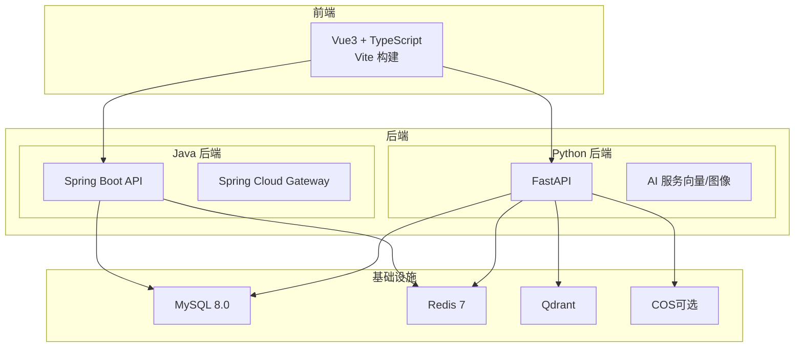
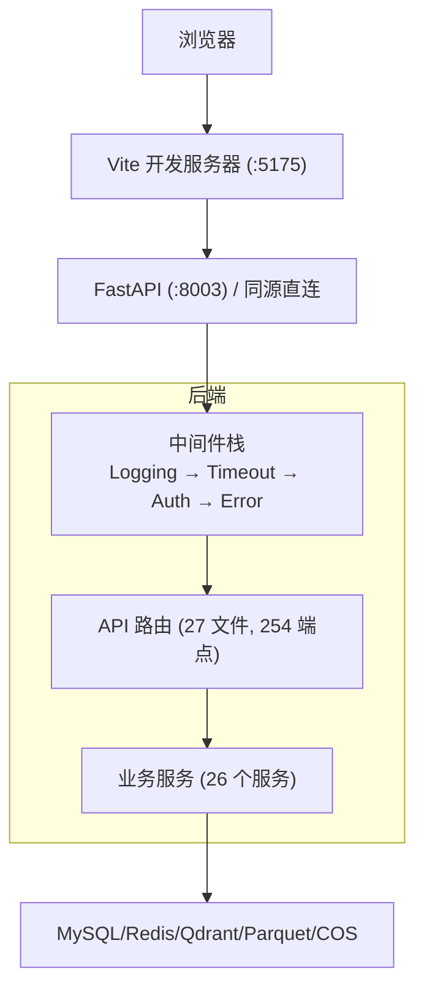
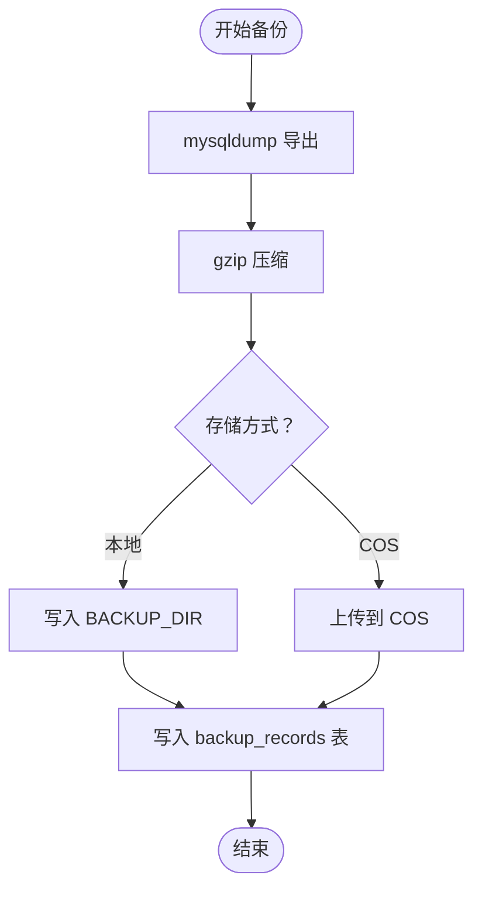
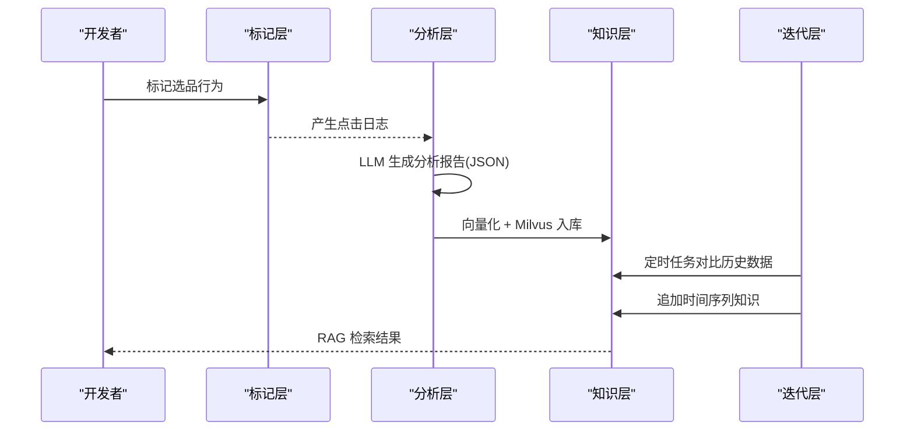
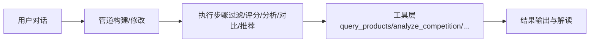
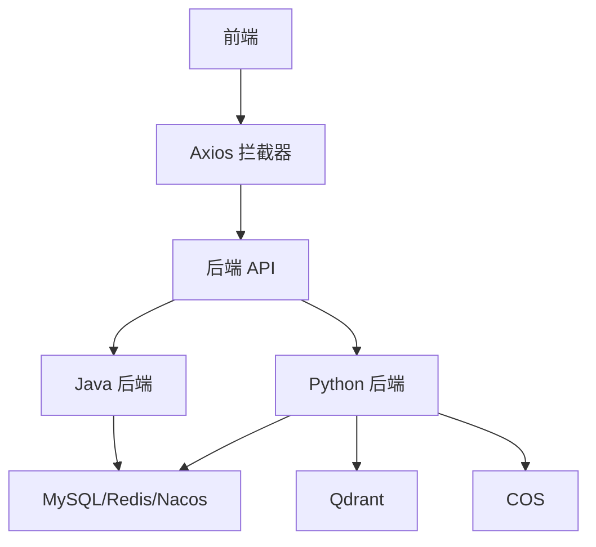

# 项目概述

<cite>
**本文引用的文件**
- [README.md](file://README.md)
- [ARCHITECTURE.md](file://docs/架构/ARCHITECTURE.md)
- [standards.md](file://docs/development/standards.md)
- [TEAM_WORKFLOW.md](file://TEAM_WORKFLOW.md)
- [docker-compose.yml](file://docker-compose.yml)
- [backup_service.py](file://backend/app/services/backup_service.py)
- [cos_service.py](file://backend/app/services/cos_service.py)
- [cleanup_service.py](file://backend/app/services/cleanup_service.py)
- [00-总览-知识飞轮架构设计.md](file://docs/简历/agentic rag/00-总览-知识飞轮架构设计.md)
- [AI 选品 Agent — 实施方案.md](file://docs/AI 选品 Agent — 实施方案.md)
- [README-参考代码.md](file://backend/README-参考代码.md)
- [AGENTS.md](file://AGENTS.md)
</cite>

## 目录
1. [简介](#简介)
2. [项目结构](#项目结构)
3. [核心组件](#核心组件)
4. [架构总览](#架构总览)
5. [详细组件分析](#详细组件分析)
6. [依赖分析](#依赖分析)
7. [性能考虑](#性能考虑)
8. [故障排查指南](#故障排查指南)
9. [结论](#结论)
10. [附录](#附录)

## 简介
思觉智贸跨境电商产品数据管理系统是一套面向跨境卖家与运营团队的数据驱动平台，围绕“产品数据洞察 + 选品与定稿管理 + AI知识飞轮”的核心目标，提供从数据采集、清洗、分析、检索到智能推荐的全链路能力。系统采用前后端分离与双后端并行架构：Java 后端聚焦高并发与数据密集型业务，Python 后端聚焦 AI 能力与向量检索；前端基于 Vue3 + TypeScript，提供高效、可维护的交互体验。

- 核心价值
  - 提升跨境选品效率：通过多维度筛选、竞品对比、趋势分析与评分体系，辅助快速决策。
  - 强化产品生命周期管理：覆盖产品 CRUD、定稿管理、回收站、下载任务与系统配置，形成闭环。
  - 构建可演化的知识飞轮：以“标记 → 分析 → 保存 → 迭代”循环，沉淀产品知识与方法论，持续提升选品质量。
  - 保障数据安全与可恢复：内置数据库全量备份与 COS 备份能力，支持本地与云端双重存储。

- 目标用户
  - 跨境电商运营与选品专员：用于日常选品、竞品分析与数据看板。
  - 产品与内容团队：用于素材与载体库管理、定稿与下载任务。
  - 系统管理员与开发者：用于系统配置、备份与运维。

- 主要功能特性
  - 产品与选品管理：产品 CRUD、选品管理（新品/竞品/郑总店铺）、回收站与下载任务。
  - 数据看板与统计：Parquet 数据分析、销量趋势、评分与等级体系。
  - AI 能力：图像识别与相似搜索、向量检索（Qdrant）、多模态视觉分析。
  - 系统配置与备份：备份策略（本地/COS）、系统设置、权限与日志。

**章节来源**
- [README.md:1-113](file://README.md#L1-L113)
- [ARCHITECTURE.md:7-375](file://docs/架构/ARCHITECTURE.md#L7-L375)

## 项目结构
项目采用模块化与分层架构组织，前后端与双后端协同，配合容器化与脚本化运维，便于开发、测试与生产部署。

**图表来源**
- [docker-compose.yml:7-36](file://docker-compose.yml#L7-L36)
- [ARCHITECTURE.md:52-140](file://docs/架构/ARCHITECTURE.md#L52-L140)

**章节来源**
- [docker-compose.yml:1-36](file://docker-compose.yml#L1-L36)
- [ARCHITECTURE.md:24-50](file://docs/架构/ARCHITECTURE.md#L24-L50)

## 核心组件
- 前端（Vue3 + TypeScript）
  - 技术栈：Vue 3 + Composition API、Vite 6、Element Plus、Pinia、Vue Router 4、ECharts。
  - 路由与权限：基于资源-动作权限模型，页面路由与权限标识一一映射。
  - HTTP 客户端：Axios 拦截器链，支持 Token 注入、去重、超时与错误分级处理。
  - 可复用组件：统一回收站、通用列表/卡片、虚拟滚动、懒加载图片、缩略图查看器等。
- 后端（Java + Python 双栈）
  - Java 后端：Spring Boot + MyBatis-Plus + Spring Cloud Gateway，承担核心业务与网关职责。
  - Python 后端：FastAPI + Celery + Qdrant，承担 AI 能力与向量检索。
  - 中间件与安全：日志、超时、鉴权、错误处理中间件；JWT 认证与权限模型。
- 存储与检索
  - MySQL（关系数据）、Redis（缓存/会话/队列）、Qdrant（向量检索）、COS（对象存储，可选）。
- AI 知识飞轮
  - 标记层：产品点击日志与行为追踪。
  - 分析层：Java 查询 + Python LLM 工具，生成结构化分析报告。
  - 知识层：向量化（BGE-M3 + BM25）+ Milvus 存储。
  - 迭代层：Celery 定时任务，跨周对比与时间序列知识链。

**章节来源**
- [ARCHITECTURE.md:143-231](file://docs/架构/ARCHITECTURE.md#L143-L231)
- [ARCHITECTURE.md:108-140](file://docs/架构/ARCHITECTURE.md#L108-L140)
- [00-总览-知识飞轮架构设计.md:1-166](file://docs/简历/agentic rag/00-总览-知识飞轮架构设计.md#L1-L166)

## 架构总览
系统采用“同源架构”设计，前端通过相对路径与后端通信，开发模式下由 Vite 代理转发，生产模式由后端服务静态资源并直连 API。双后端通过网关与路由分流，Java 负责数据密集型业务，Python 负责 AI 能力。

**图表来源**
- [ARCHITECTURE.md:320-375](file://docs/架构/ARCHITECTURE.md#L320-L375)
- [ARCHITECTURE.md:52-80](file://docs/架构/ARCHITECTURE.md#L52-L80)

**章节来源**
- [ARCHITECTURE.md:24-50](file://docs/架构/ARCHITECTURE.md#L24-L50)
- [README.md:37-46](file://README.md#L37-L46)

## 详细组件分析

### 备份系统
备份系统支持本地与 COS 两种存储方式，使用 mysqldump 导出 + gzip 压缩，并将记录写入 backup_records 表。当前存在同步阻塞、前端路径不一致等问题，建议后续引入异步任务与进度上报。

**图表来源**
- [backup_service.py:23-55](file://backend/app/services/backup_service.py#L23-L55)
- [cos_service.py:1-200](file://backend/app/services/cos_service.py#L1-L200)

**章节来源**
- [backup_service.py:19-78](file://backend/app/services/backup_service.py#L19-L78)
- [cos_service.py:1-200](file://backend/app/services/cos_service.py#L1-L200)
- [cleanup_service.py:1-200](file://backend/app/services/cleanup_service.py#L1-L200)

### AI 知识飞轮（Agentic RAG）
系统设计了“标记 → 分析 → 保存 → 迭代”的知识飞轮，结合 Java 的数据查询与 Python 的 LLM 分析，形成可检索的知识库，并通过 Celery 定时任务实现时间序列知识链的演化。

**图表来源**
- [00-总览-知识飞轮架构设计.md:35-107](file://docs/简历/agentic rag/00-总览-知识飞轮架构设计.md#L35-L107)

**章节来源**
- [00-总览-知识飞轮架构设计.md:1-166](file://docs/简历/agentic rag/00-总览-知识飞轮架构设计.md#L1-L166)

### AI 选品 Agent 实施方案
选品 Agent 将用户的“个人方法论”转化为可执行的管道，分为对话层、管道层与工具层，支持持久化、重跑与分享。

**图表来源**
- [AI 选品 Agent — 实施方案.md:18-43](file://docs/AI 选品 Agent — 实施方案.md#L18-L43)

**章节来源**
- [AI 选品 Agent — 实施方案.md:1-43](file://docs/AI 选品 Agent — 实施方案.md#L1-L43)

### Python 后端迁移与保留模块
根据参考文档，Python 后端的 API 与服务已迁移至 Java 后端，仅保留 AI 相关模块（向量处理、图像识别/搜索、图像服务等）至独立的 python-ai 服务，后续将按计划删除 Python 后端目录。

**章节来源**
- [README-参考代码.md:1-75](file://backend/README-参考代码.md#L1-L75)

## 依赖分析
- 前端依赖
  - Vue3、Element Plus、Pinia、Vue Router、Axios、ECharts、@hey-api/openapi-ts（类型生成）。
- 后端依赖
  - Java：Spring Boot、MyBatis-Plus、Spring Cloud Gateway、Nacos（配置中心/注册中心）。
  - Python：FastAPI、Celery、Qdrant、Pandas/Polars、Redis、腾讯云 SDK。
- 基础设施
  - Docker Compose 编排 MySQL、Redis、Nacos、JVM 服务等。

**图表来源**
- [ARCHITECTURE.md:108-140](file://docs/架构/ARCHITECTURE.md#L108-L140)
- [docker-compose.yml:7-36](file://docker-compose.yml#L7-L36)

**章节来源**
- [standards.md:19-91](file://docs/development/standards.md#L19-L91)
- [AGENTS.md:13-32](file://AGENTS.md#L13-L32)

## 性能考虑
- 同源架构降低网络开销，开发与生产模式统一路径，减少跨域与代理复杂度。
- 前端组件复用与虚拟滚动、懒加载等优化，降低渲染压力。
- 后端中间件栈（日志、超时、鉴权、错误处理）保证稳定性与可观测性。
- 备份采用 mysqldump + gzip，建议后续引入异步任务与进度上报，避免同步阻塞。
- 向量检索使用 Qdrant，建议结合索引优化与缓存策略提升查询性能。

[本节为通用性能建议，不直接分析具体文件]

## 故障排查指南
- 备份问题
  - 现象：COS 备份时报 AttributeError（未定义配置）、本地备份无法下载、同步备份超时。
  - 排查：确认 BACKUP_REMOVE_AFTER_COS_UPLOAD 配置是否存在；检查后端超时设置；验证 COS 凭据与存储桶权限。
- CORS 与鉴权
  - 现象：跨域失败或 401。
  - 排查：核对生产环境 CORS 配置与 JWT Token 生命周期；确认权限标识与用户权限列表。
- 前端热更新
  - 现象：修改 vite.config.js 后不生效。
  - 排查：重启前端容器或调整代理配置；确认 Vite 轮询模式在 WSL2 下的配置。
- 数据库与缓存
  - 现象：慢查询或连接池耗尽。
  - 排查：检查 MySQL/Redis 连接池配置与慢查询日志；优化查询与索引。

**章节来源**
- [backup_service.py:133-146](file://backend/app/services/backup_service.py#L133-L146)
- [ARCHITECTURE.md:66-80](file://docs/架构/ARCHITECTURE.md#L66-L80)
- [docs/开发流程.md:52-60](file://docs/开发流程.md#L52-L60)

## 结论
思觉智贸系统通过双后端架构与 AI 知识飞轮，实现了从数据到智能的闭环：Java 后端处理高并发与数据密集型业务，Python 后端承载 AI 能力与向量检索；前端提供高效易用的交互体验。系统具备完善的备份与运维能力，适合在跨境电商场景中持续演进与规模化应用。

[本节为总结性内容，不直接分析具体文件]

## 附录

### 快速开始
- 环境要求
  - Docker 与 Docker Compose（支持多环境覆盖）。
  - Node.js（前端构建）、JDK（Java 后端）、Python（AI 服务）。
- 安装步骤
  - 复制并编辑环境变量文件，配置数据库与密钥。
  - 启动开发或生产环境容器编排。
- 基本使用示例
  - 访问前端与后端服务，登录后进入产品数据看板与选品管理页面。
  - 通过系统设置进行备份配置与查看备份记录。

**章节来源**
- [README.md:7-34](file://README.md#L7-L34)
- [docs/开发流程.md:21-31](file://docs/开发流程.md#L21-L31)

### 团队协作与贡献指南
- 分支策略：master 受保护，功能/修复/重构分支命名规范，PR 合并采用 Squash。
- 提交规范：Conventional Commits，生成 CHANGELOG。
- 本地开发：Java 在宿主机编译，Docker 仅运行；前端 Vite 轮询热更；Python 后端 uvicorn --reload。
- 文档与索引：遵循开发规范与架构文档，AI Agent 相关入口见 AGENTS.md。

**章节来源**
- [TEAM_WORKFLOW.md:1-116](file://TEAM_WORKFLOW.md#L1-L116)
- [standards.md:39-91](file://docs/development/standards.md#L39-L91)
- [docs/开发流程.md:11-21](file://docs/开发流程.md#L11-L21)
- [AGENTS.md:1-32](file://AGENTS.md#L1-L32)