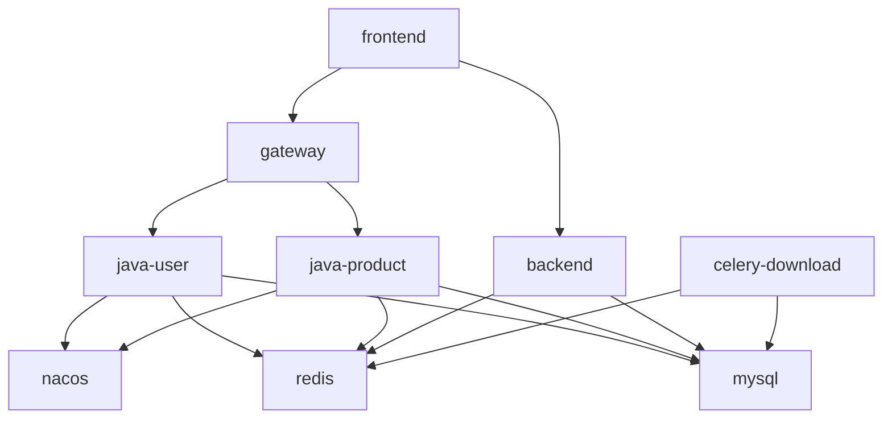

# Docker 生产部署流程

> **生产部署唯一权威文件。** 所有人员和 Agent 在生产构建、更新、回滚、清理前必须完整读取本文件。README、日志、问题记录、OpenSpec 实施记录和旧架构文档中的命令只代表历史上下文，不得直接执行。
> 配置文件: `docker-compose.prod.yml` + `config/public/prod.env` + `config/secrets/prod.env`
>
> ⚠️ **不要加 `-p sijuelishi-prod`**。现网容器属于默认项目名 `si-jue-zhi-mao-up`(= 目录名)。
> 加 `-p` 换了项目名会让 compose 找不到现有容器、却又要新建同名容器 → `Conflict. container name "/prod-xxx" is already in use`。
> 不带 `-p` 即用默认项目名,正确接管现有容器。

## 唯一生产发布入口

日常生产发布只允许从仓库根目录运行统一脚本：

```powershell
powershell -ExecutionPolicy Bypass -File scripts/deploy/deploy_prod.ps1 -Component java
powershell -ExecutionPolicy Bypass -File scripts/deploy/deploy_prod.ps1 -Component frontend
powershell -ExecutionPolicy Bypass -File scripts/deploy/deploy_prod.ps1 -Component backend
powershell -ExecutionPolicy Bypass -File scripts/deploy/deploy_prod.ps1 -Component ai-center
```

脚本强制执行：预检 -> 删除最老 `previous` -> `current` 转为 `previous` -> 单次缓存构建 ->
`--no-build` 重建受影响服务 -> 运行状态验证 -> Java 编译缓存保留最新两条 -> 清理 24 小时以上未使用的冷缓存。
任何步骤失败立即停止，不得跳到后续步骤。脚本不删除 volume，不执行 `docker system prune` 或无过滤条件的
BuildKit 全量清理。只有排障时才允许手工执行本文件后续分解命令，并必须记录原因和结果。

## Agent/模型测试与缓存构建协议

Agent 进行模型、Java、Python或前端验证时固定遵守：

1. 先运行受影响文件的静态检查和最小范围单测，不为无关模块做全量生产构建。
2. Java 优先复用 Maven/BuildKit 依赖层；前端复用 `node_modules`；Python 复用当前环境或镜像依赖层。
3. 只有验证 Dockerfile、打包结果或正式发布时才构建生产镜像；同一组件一次任务最多执行一次正常缓存构建。
4. 禁止为“干净测试”默认使用 `--no-cache`、临时无缓存 Maven 容器、删除 `node_modules`、清空 pip/Maven 缓存或连续重复 build。
5. 构建失败先读取第一次失败日志并修复根因。源码和构建输入未变时，禁止原命令盲目重跑。
6. 发布验证后，Java 精确保留最新两条源码编译记录；其他缓存只删除 24 小时以上未使用记录，Maven/pip/基础镜像热缓存继续保留。

“快速读取缓存构建”指复用依赖层和未变化的 COPY 层，不是永久保留全部历史源码编译结果。热依赖缓存保障下次构建速度，旧 Java `mvn clean package` 结果则按双版本规则及时删除。

## Docker 存储控制

Docker Desktop 不能在不影响生产写入的前提下，把整个 Docker 数据盘可靠地“硬封顶”在 50 GB。
达到硬上限后 MySQL、Redis 和容器日志都可能因 `no space left on device` 停止写入。生产环境应采用
“数据卷按业务增长 + 日志轮转 + 构建缓存保留上限 + 定期巡检”的软控制方式。

当前 Compose 已对所有容器启用 `json-file` 日志轮转：每个容器最多保留 3 个 20 MB 日志文件。
修改该配置后，需要在维护窗口重建容器才能生效：

```powershell
docker compose -f docker-compose.prod.yml up -d --force-recreate
```

生产成品镜像严格执行双版本轮换：`current` 是当前运行版，`previous` 是唯一回退版。
构建新版本时允许短暂出现第三版，但必须先删除最老版本，再把原 `current` 保存为
`previous`，最后构建新的 `current`。部署完成后不得保留第三个历史成品镜像。

BuildKit 缓存与成品镜像不是同一概念。Maven、pip、基础镜像等通用依赖缓存必须保留；
历史源码编译结果、旧 JAR 和旧应用 COPY 层按最后使用时间清理。日常部署成功后清理
24 小时以上未使用的缓存，空间紧急时才缩短到 6 小时：

```powershell
docker buildx prune --force --filter "until=24h"
# 紧急模式：docker buildx prune --force --filter "until=6h"
```

不要按 10–15 GB 强行压缩全部缓存，否则会误删 Maven/pip 热缓存并导致后续大量重复下载和构建。
不要在生产机执行 `docker system prune --volumes`，它可能删除未挂载但仍需保留的数据库卷。

双版本数量可以对 `prod-*:current/previous` 成品镜像严格执行；BuildKit 是跨版本共享的内容寻址依赖图，
不能准确标记为“当前版/上一版”。因此 BuildKit 保留近期命中的通用依赖层，只按时间删除历史源码
编译层，不能要求缓存列表本身也只显示两个版本。

Java 是额外的强制例外：`Dockerfile.prod` 的每次构建都会产生一条约 460 MB 的
`mvn clean package` 编译缓存。该类记录常态只允许保留最新 2 条，分别对应当前构建链和上一构建链；
新构建期间可短暂出现第 3 条，但发布验证完成后必须立即删除最旧记录，恢复为 2 条。

禁止人工执行无过滤条件的 `docker buildx prune --all`。统一运行专用脚本，脚本会冻结并预览完整缓存
ID 集合，只对描述匹配本项目 Java 编译命令的旧记录使用锚定 ID 正则，并强制保护最新两条：

```powershell
powershell -ExecutionPolicy Bypass -File scripts/deploy/prune_java_build_cache.ps1
```

脚本不会选择 Maven `dependency:go-offline`、pip、基础镜像、成品镜像、容器或数据卷。选择集合数量、
ID 或保留记录不一致时会直接停止，不执行清理。

容量巡检命令：

```powershell
docker buildx du
docker ps -a --size
docker system df
docker volume ls
```

卷名由 Compose 项目名派生。现网项目名是目录默认值 `si-jue-zhi-mao-up`，禁止临时添加 `-p`，
否则会生成第二套 `*_prod-mysql-data`、`*_prod-nacos-data` 等卷。发现重复卷时，必须先用
`docker inspect prod-mysql --format '{{json .Mounts}}'` 确认当前挂载，再备份、核对数据后删除旧卷。

清理缓存后，Docker Desktop 的 VHDX 文件通常不会立即变小。若 Windows 磁盘空间没有回收，需先退出
Docker Desktop，再使用 Docker Desktop 的磁盘回收功能；手工压缩 VHDX 前必须完成数据库备份。

---

## 🚨 避坑清单 (实战提取, 部署前必读)

### 0. 生产部署前必须跑预检门禁

每次生产部署前先执行：

```powershell
powershell -ExecutionPolicy Bypass -File scripts/deploy/prod_preflight_check.ps1
```

预检会检查两件硬门槛：

- Java `@TableName` 实体对应的生产表是否存在。
- Java product 的 `/api/v1/{resource}` Controller 是否已被 `frontend/nginx.conf` 转发到 Gateway。

任何一项失败都先补 SQL / nginx 路由，再 build 和重启。不要等页面点出 500/404 才查。

预检还会检查 Docker Desktop 数据盘剩余空间。剩余空间低于 **15 GB** 时禁止构建。
Docker 数据盘不一定是 C 盘，以 Docker Desktop 的 `CustomWslDistroDir` 实际配置为准。

Java product 还内置启动期 `SchemaGuard`，会扫描 `@TableName` 实体并核对 `information_schema` 表/列：

```yaml
schema-guard:
  enabled: ${SCHEMA_GUARD_ENABLED:true}
  fail-fast: ${SCHEMA_GUARD_FAIL_FAST:true}
  check-columns: ${SCHEMA_GUARD_CHECK_COLUMNS:true}
```

正常生产不允许关闭。只有一次性救急排障才可以临时设 `SCHEMA_GUARD_ENABLED=false`，排障完成必须恢复。

### 1. `docker compose restart` 不会重新读 env_file

改了 `config/*.env` 之后:
- ❌ `docker compose restart backend` — 不会重读 env_file, 容器还是旧值
- ❌ `docker restart prod-backend` — 同上
- ✅ `docker compose up -d --force-recreate backend` — 重建容器, 读最新 env_file

**自查方式**: `docker exec <容器名> printenv | grep <变量名>` 看实际生效的值。

### 2. `docker-compose.yml` 的 `environment: ${VAR}` 是从宿主机读

```yaml
environment:
  MYSQL_ROOT_PASSWORD: ${MYSQL_ROOT_PASSWORD}   # ← 从宿主 .env 读, 不是 env_file!
```

`${MYSQL_ROOT_PASSWORD}` 是 Compose **YAML 变量替换**, 优先读宿主机环境变量 + 项目根 `.env`, **不读 env_file**。

这会导致 `env_file` 给的 prod 值被宿主机 dev 值覆盖。

**解决**: 不要在 `environment:` 用 `${}` 引用 env_file 已经设的变量。把所有变量统一放 env_file, 用 env_file 注入。

### 3. 重建 backend 后 nginx 缓存了旧 IP

`docker compose up -d --force-recreate backend` 之后, backend 拿到新 IP, 但 nginx 上一次解析的旧 IP 还在缓存。

**症状**: 重建 backend 后所有 `/api/v1/*` (Python 兜底) 返回 502。

**解决**: `docker restart prod-frontend` 让 nginx 重新解析 DNS。

### 4. 配置变更后 rebuild 优先级

```
config/secrets/*.env / config/public/*.env  →  up -d --force-recreate
docker-compose.prod.yml                     →  up -d (变更影响范围内重建)
frontend/nginx.conf                         →  build frontend（COPY 层自动失效）+ up -d --no-deps frontend
java-backend/sjzm-*/application.yml         →  build java-* + up -d java-*
backend/app/**                              →  轮换 backend 镜像 + build backend + up -d --no-build backend/celery
frontend/src/**                             →  npm run build (宿主) + build frontend（复用 Docker 缓存）
```

### 5. Nginx 默认上传限制 1MB

不加 `client_max_body_size` 会导致**所有图片上传 413**。

`frontend/nginx.conf` 必须有:
```nginx
client_max_body_size 100m;
```

### 6. JWT 跨端口不共享

`localhost:5175` (dev) 和 `localhost:5173` (prod) 是**不同 localStorage 域**, 浏览器 token 互相看不见。生产域必须**重新登录**。

### 7. 真生产 COS 桶 vs Dev 桶

**严格分离, 不可混用**:
- 生产: `sijuelishi-1328246743`
- 开发: `sijuelishi-dev-1328246743`

数据库里图片 URL 必须和 `COS_BUCKET` 配置**指向同一个桶**, 否则 `image-proxy` 找不到文件返回 SVG 占位。

dev 数据库导入 prod 后, **不能**只改 `COS_BUCKET` 配置 — 数据库里的 URL 也得 `REPLACE(dev→prod)`, 并且**dev 桶的图片必须复制到 prod 桶**。

### 8. mysqldump 警告会污染 SQL 文件

```bash
docker exec mysql mysqldump ... > dump.sql 2>&1   # ❌ stderr 警告会混进 dump.sql
docker exec mysql mysqldump ... > dump.sql 2>/dev/null   # ✅ 正确
```

如果导入报 `ERROR 1064 (42000)` near `mysqldump: [Warning]...`, 把 dump 文件第一行删了再导。

### 9. Git Bash 中文路径 docker cp 会失败

Git Bash 把 Windows 中文路径误转换。1.1GB 备份文件如果在中文目录:

```bash
# ❌ 在 Git Bash 里
docker cp "产品数据/数据库备份/6.23/xxx.sql" prod-mysql:/tmp/

# ✅ 改用 cmd 或 PowerShell
docker cp "F:\项目\si-jue-zhi-mao-up\产品数据\数据库备份\6.23\xxx.sql" prod-mysql:/tmp/
```

### 10. 大文件导入沉默 1-2 分钟正常

1GB+ 的 SQL 导入没进度条, 看着像卡住但实际在跑。耐心等 2 分钟。需要进度可用 `pv`。

### 11. Docker Desktop 内置镜像源可能崩

报错 `image-mirror.r2.daocloud.vip ... EOF` 时, **手动 pull 一遍**:

```powershell
docker pull eclipse-temurin:21-jre-alpine
docker pull maven:3.9-eclipse-temurin-21
docker pull python:3.11-slim
docker pull nginx:alpine
docker pull mysql:8.0
docker pull redis:7-alpine
docker pull nacos/nacos-server:v2.3.1
```

拉完后 build 就走本地缓存了。

### 12. 9 个容器不是全部 healthy

只有 `mysql/redis/backend/celery/frontend` 配了 healthcheck。
`nacos/java-user/java-product/gateway` 状态显示 **`Up xxx`(无 healthy 标记)是正常的**, 不是有问题。

验证 Java 服务是否真起来: `docker logs prod-java-product --tail 30 | grep "Started.*Application"`。

### 13. 登录 admin 密码

dev/prod 数据库里的 admin 密码是 **`123456`**(不是 `admin` 或 `admin123`)。

---

## 生产部署要点

> ⚠️ 部署前先看这，避免翻车

### 1. 启动命令

```powershell
docker compose -f docker-compose.prod.yml up -d
```

### 2. 密钥管理 (config/ 集中化)

所有密钥/配置都在 `config/` 下，**不在 compose 文件里硬编码**：

```
config/
├── public/
│   ├── dev.env       ✅ 进 git (非敏感)
│   └── prod.env      ✅ 进 git (非敏感)
└── secrets/
    ├── dev.env.example   ✅ 进 git (模板)
    ├── prod.env.example  ✅ 进 git (模板)
    ├── dev.env           ⛔ 不进 git (真密钥)
    └── prod.env          ⛔ 不进 git (真密钥)
```

**首次部署需创建真密钥文件**：

```powershell
# 方式 1: 从开发机同步真密钥过来
scp dev-machine:/path/to/repo/config/secrets/prod.env config/secrets/prod.env

# 方式 2: 从 .example 复制后填值
cp config/secrets/prod.env.example config/secrets/prod.env
# 编辑填入真实值 (JWT_SECRET 必须 >= 32 字符)
```

### 3. 启动顺序

```
nacos → mysql/redis → java-user → java-product → gateway → backend/frontend
```

| 服务 | 先等谁 |
|------|--------|
| nacos | 无依赖，第一个启 |
| java-user / java-product | mysql(healthy) + redis(healthy) + nacos(started) |
| gateway | nacos + java-user + java-product 全部 started |
| backend | mysql(healthy) + redis(healthy) |
| frontend | gateway + backend |

> 🚨 **gateway 最晚启动**，因为它依赖 user 和 product 都就绪。

### 4. JWT 一致性 (关键!)

**`config/secrets/prod.env` 里的 JWT_SECRET 必须保持当前生产实际值**，否则改了之后所有用户 token 失效，需要重新登录。

核对生产实际值：
```powershell
docker exec prod-backend printenv | findstr JWT_SECRET
```

**gateway / java-user / java-product / backend 四者的 JWT_SECRET 必须完全相同且 >= 32 字符**，否则 HMAC-SHA256 校验失败。

### 5. 路由架构

```
浏览器
  ↓
Nginx(prod-frontend:80, 宿主 5173)
  ├─ /api/v1/(auth|users)/             ─→ Gateway:9000 ─→ java-user
  ├─ /api/v1/(competitor|product-performance|category-baseline|category-dislocation|
  │   element-discovery|seller|filter-config|asin-import|scoring|filter-presets|
  │   sellersprite-config|click-logs|deng-zong-shop|blue-ocean|clean-layer|
  │   subcategory-alias|modules)/      ─→ Gateway:9000 ─→ java-product
  ├─ /api/v1/product-line/(aggregated-data|analysis-results|guidance|tree)
  │                                    ─→ Gateway:9000 ─→ java-product
  └─ /api/* (其他 Python 独有)         ─→ Python:8090 (FastAPI)
```

### 6. Java 多阶段构建

所有 Java 服务共用 `java-backend/Dockerfile.prod`，通过 `SERVICE_MODULE` 环境变量区分 (gateway/user/product)。Maven 依赖使用阿里云镜像源加速。

日常代码修改必须优先使用现有 Docker BuildKit 构建缓存。`Dockerfile.prod` 已把 POM、
`dependency:go-offline` 和源码复制拆层；POM 未变化时会直接命中 Maven 依赖层，只重新编译源码。
禁止为了“先跑一次 Java 构建”另起未挂载 Maven 缓存的临时 `docker run maven:...` 容器，
否则会重复下载全部依赖，既慢又额外占用磁盘。

```powershell
# 带进度输出的构建
docker compose -f docker-compose.prod.yml build --progress=plain java-product

# 使用刚才显式构建的镜像重建；禁止再次隐式 build
docker compose -f docker-compose.prod.yml up -d --no-build java-user java-product gateway
```

Java 三个服务共用同一个成品镜像，当前 Dockerfile 在镜像构建阶段会编译 gateway/user/product
三个模块。一次 Java 发布只执行一次 build，但必须统一重建 `java-user/java-product/gateway`，
避免某个容器继续引用即将淘汰的最旧 Java 镜像。

### 7. 前端构建（宿主机构建）

```powershell
cd frontend
npm run build
cd ..
docker compose -f docker-compose.prod.yml build frontend
docker compose -f docker-compose.prod.yml up -d --no-deps --no-build frontend
```

Docker Desktop 里跑 Vite 会 OOM，必须在宿主机 Windows 上构建。
日常前端镜像构建保留 BuildKit 缓存；`nginx:alpine` 和未变化的 COPY 层会自动复用。
生产发布禁止默认使用 `--no-cache`；缓存异常时先停止发布并单独诊断。

### 8. 数据卷保护

| 卷名 | 丢数据的后果 |
|------|-------------|
| `prod-mysql-data` | ❌ **MySQL 全量数据丢失** |
| `prod-redis-data` | ❌ Redis 缓存丢失（可恢复） |
| `prod-nacos-logs / prod-nacos-data` | ⚠️ Nacos 配置丢失 |

**绝对禁止 `docker compose down -v`**（小写 `-v` 删卷），生产环境只用 `stop/start/restart`。

---

## 首次部署 (从零开始)

### 1. 拉代码

```powershell
git clone https://github.com/puletire9-leo/si-jue-zhi-mao-up.git
cd si-jue-zhi-mao-up
git checkout 生产测试    # 或者 master
```

### 2. 创建密钥文件 (必须!)

```powershell
# 用 example 当模板
cp config/secrets/prod.env.example config/secrets/prod.env

# 编辑填入真实密钥
notepad config/secrets/prod.env
```

**必填密钥**：

```
JWT_SECRET=sjzm-local-test-jwt-secret-2024-prod-min32chars
SECRET_KEY=sjzm-local-test-secret-key-2024-prod-min32chars
MYSQL_ROOT_PASSWORD=root123456
MYSQL_PASSWORD=sijue123456
COS_SECRET_ID=AKID...
COS_SECRET_KEY=...
SELLERSPRITE_SECRET_KEY=...
```

> ⚠️ JWT_SECRET 必须与现有生产值一致，否则用户登录失效。如果是全新项目，可用 `openssl rand -base64 32` 生成。

### 3. 前端 dist 构建 (宿主机)

```powershell
cd frontend
npm install        # 首次需要装依赖
npm run build      # 输出到 ../static/vue-dist/
cd ..
```

### 4. 构建所有镜像

```powershell
docker compose -f docker-compose.prod.yml build --progress=plain
```

> Java 服务使用多阶段构建 + 阿里云 Maven 源，首次约 3-5 分钟。

### 5. 启动

```powershell
docker compose -f docker-compose.prod.yml up -d
```

### 6. 验证

```powershell
# 看所有容器是否健康
docker ps --format "table {{.Names}}\t{{.Status}}"

# 应该看到 9 个容器全部 Up:
#   prod-mysql / prod-redis / prod-nacos
#   prod-backend / prod-celery-download
#   prod-java-user / prod-java-product / prod-gateway
#   prod-frontend

# 测试登录接口
curl http://localhost:5173/api/v1/auth/login -X POST -H "Content-Type: application/json" \
  -d '{"username":"admin","password":"xxx"}'
```

---

## 日常更新流程

### 生产镜像双版本规则

以下规则只适用于应用成品镜像，不适用于 MySQL、Redis、Nacos 数据卷：

| 组件 | 当前版 | 回退版 |
|------|--------|--------|
| Java（gateway/user/product 共用） | `prod-java:current` | `prod-java:previous` |
| Python API/Celery | `prod-backend:current` | `prod-backend:previous` |
| 前端 Nginx | `prod-frontend:current` | `prod-frontend:previous` |
| AI Center | `prod-ai-center:current` | `prod-ai-center:previous` |

任何组件常态最多保留两个成品版本。发布过程的固定状态变化：

```text
发布前：previous(N-1) + current(N)
清旧后：current(N)
转存后：previous(N)       # 原 current
构建中：previous(N) + current(N+1)
验证后：previous(N) + current(N+1)
```

禁止直接覆盖 `current` 而不先创建 `previous`，否则发布失败时没有可验证的镜像回退点。
禁止使用 `latest` 作为生产发布标签；禁止为了保险长期保留第三、第四个历史成品镜像。

#### 首次启用双版本标签

现网旧镜像若仍是 `latest`，只需执行一次初始化。按实际存在的组件执行，不存在的镜像跳过：

```powershell
docker image tag prod-java:latest prod-java:current
docker image tag prod-backend:latest prod-backend:current
docker image tag prod-frontend:latest prod-frontend:current
docker image tag prod-ai-center:latest prod-ai-center:current
```

初始化只新增标签，不重建容器、不删除镜像。确认 `current` 标签正确后，后续发布全部走双版本流程。

#### 构建前轮换函数

在当前 PowerShell 会话定义以下函数。它只删除指定组件的最老 `previous` 成品，不触碰数据卷，
也不会强制删除仍被容器引用的镜像；如果删除失败，必须停止发布并查清引用关系。

```powershell
function Start-ProdImageRotation {
    param([Parameter(Mandatory = $true)][string]$Repository)

    $currentRef = "${Repository}:current"
    $previousRef = "${Repository}:previous"

    docker image inspect $currentRef *> $null
    if ($LASTEXITCODE -ne 0) {
        throw "Missing current production image: $currentRef"
    }

    $oldPreviousId = docker image inspect $previousRef --format '{{.Id}}' 2>$null
    if ($LASTEXITCODE -eq 0 -and $oldPreviousId) {
        docker image rm $previousRef
        if ($LASTEXITCODE -ne 0) { throw "Cannot remove old rollback tag: $previousRef" }

        docker image rm $oldPreviousId
        if ($LASTEXITCODE -ne 0) {
            throw "Old rollback image is still referenced; stop and inspect: $oldPreviousId"
        }
    }

    docker image tag $currentRef $previousRef
    if ($LASTEXITCODE -ne 0) { throw "Cannot create rollback image: $previousRef" }
}
```

轮换完成后先确认 `previous` 存在，再执行构建：

```powershell
docker image inspect prod-java:previous --format '{{.Id}}'
```

#### 发布成功后的统一收尾

发布和健康验证全部通过后执行：

```powershell
# 每个已发布组件必须只显示 current 和 previous
docker image ls prod-java --format '{{.Repository}}:{{.Tag}} {{.ID}} {{.CreatedAt}}'
docker image ls prod-backend --format '{{.Repository}}:{{.Tag}} {{.ID}} {{.CreatedAt}}'
docker image ls prod-frontend --format '{{.Repository}}:{{.Tag}} {{.ID}} {{.CreatedAt}}'
docker image ls prod-ai-center --format '{{.Repository}}:{{.Tag}} {{.ID}} {{.CreatedAt}}'

# Java 编译缓存严格只保留最新两条
powershell -ExecutionPolicy Bypass -File scripts/deploy/prune_java_build_cache.ps1

# 其他 BuildKit 缓存只删除 24 小时以上未使用的历史记录
docker buildx prune --force --filter "until=24h"
```

不要用全局 `docker image prune` 作为本项目的固定收尾，它会同时扫描其他项目的无标签镜像。
最旧生产成品已经在 `Start-ProdImageRotation` 中按仓库精确删除。

如果一天内连续发布多次，24 小时内可能暂存少量编译缓存；这是为了保留 Maven/pip 热缓存。
磁盘紧急时可把缓存窗口缩短到 6 小时，但禁止执行无时间条件的全量 BuildKit prune。

#### 回退通用规则

回退前记录失败版镜像 ID，然后将 `previous` 重新标记为 `current` 并仅重建受影响服务。
回退成功后删除失败版；此时可以暂时只有一个稳定成品版本，下次发布前再由当前版生成新的 `previous`。

```powershell
$failedImageId = docker image inspect prod-java:current --format '{{.Id}}'
docker image tag prod-java:previous prod-java:current
docker compose -f docker-compose.prod.yml up -d --no-build --force-recreate java-user java-product gateway
# 健康验证通过后：docker image rm $failedImageId
```

Java 三个服务必须统一回退，因为它们共用同一个成品镜像。Python、前端使用各自仓库名和服务名。

### 变更范围原则

- 普通代码功能修改采用轻量部署：只构建、重建和验证实际受影响的服务，禁止无理由全量 build/up。
- Java 构建复用现有 BuildKit/Maven 依赖缓存；前端仍在 Windows 宿主机完成 Vite 构建。
- 数据库备份按变更风险和目标范围选择：小配置表只备份目标表，大表、不可逆数据改写、跨表迁移或高风险变更才做完整生产备份。
- 站点数据同步不是代码部署步骤。不得因功能上线自动触发 UK/DE/US 同步；必须由用户明确指定站点和同步目的。

### 0. 部署前预检

```powershell
powershell -ExecutionPolicy Bypass -File scripts/deploy/prod_preflight_check.ps1
```

如果本次新增了 Entity / 字段 / Controller：

- 先提交幂等 SQL 到 `java-backend/sql/`，生产库执行后再部署镜像。
- 新增 Java `/api/v1/{resource}` 时同步更新 `frontend/nginx.conf`，否则会走 Python 兜底。
- 部署后看 `prod-java-product` 日志，必须出现 `[SchemaGuard] 数据库结构检查通过`。

### 只改 Java 后端

```powershell
# Java 只构建一次，共用镜像统一替换三个服务
Start-ProdImageRotation -Repository "prod-java"
docker compose -f docker-compose.prod.yml build --progress=plain java-product
docker compose -f docker-compose.prod.yml up -d --no-build java-user java-product gateway
```

> Java 三个服务共用同一个 `prod-java:current` 镜像。一次发布只允许执行一次 Java build；
> 构建后必须统一重建 gateway/user/product，确保没有容器继续引用最旧 Java 镜像。
> 禁止对三个服务分别重复 build。POM 没变时依赖层走缓存，只重新编译源码。

### 只改前端

```powershell
cd frontend
npm run build
cd ..
Start-ProdImageRotation -Repository "prod-frontend"
docker compose -f docker-compose.prod.yml build frontend
docker compose -f docker-compose.prod.yml up -d --no-deps --no-build frontend
```

> `npm run build` 只执行一次。确认 `static/vue-dist` 生成成功后再轮换和构建 Docker 镜像；
> 禁止连续重复执行 Vite build 或 Docker frontend build。

### 只改 Python 代码

```powershell
Start-ProdImageRotation -Repository "prod-backend"
docker compose -f docker-compose.prod.yml build backend
docker compose -f docker-compose.prod.yml up -d --no-build backend celery-download
```

> backend 和 celery-download 共用同一个镜像（prod-backend）。
> **不加 `--no-cache`**：Dockerfile 的 COPY 层检测到 py 文件变化自动失效，
> pip 依赖层命中缓存跳过下载，通常几十秒完成。
> `--no-cache` 会重下全量 pip 依赖 + 重装整个 Python 环境，极易打爆 Docker Desktop 内存导致崩溃。

### 只改 AI Center

```powershell
Start-ProdImageRotation -Repository "prod-ai-center"
docker compose -f docker-compose.prod.yml build ai-center
docker compose -f docker-compose.prod.yml up -d --no-build ai-center
```

> AI Center 独立使用 `prod-ai-center:current/previous`，不得与 `prod-backend` 混合轮换。

### 只改 Python 静态文件（模板/xlsx/JSON 等）

```powershell
# 不改代码、只换静态文件时，docker cp 直塞容器即可，无需重建镜像
docker cp "E:\项目\si-jue-zhi-mao-up\backend\子目录\文件名" prod-backend:/app/子目录/文件名
```

> 秒级生效，不触发任何构建。适用场景：模板文件、配置文件、数据文件等。
> 注意：docker cp 不进镜像，下次重建容器后会被镜像内旧文件覆盖。
> 如需持久化，应在下次 build 时一并更新源文件（正常 `build backend` 即可）。

### 只改 Nginx 配置

```powershell
# Nginx 配置在 frontend/nginx.conf，仍执行前端成品双版本轮换
Start-ProdImageRotation -Repository "prod-frontend"
docker compose -f docker-compose.prod.yml build frontend
docker compose -f docker-compose.prod.yml up -d --no-deps --no-build frontend
```

### 只改 Gateway 路由

```powershell
Start-ProdImageRotation -Repository "prod-java"
docker compose -f docker-compose.prod.yml build --progress=plain gateway
docker compose -f docker-compose.prod.yml up -d --no-build java-user java-product gateway
```

### 只改密钥 (无需 rebuild)

```powershell
# env_file 只在创建容器时读取，修改后必须重建受影响容器
docker compose -f docker-compose.prod.yml up -d --no-build --force-recreate backend celery-download java-user java-product gateway
docker restart prod-frontend
```

> env_file 不进镜像，因此无需 rebuild；但 `restart` 不会重新读取它。重建后重启 frontend，避免 nginx 继续缓存旧容器 IP。

### 包含数据库迁移

新增表、字段或索引时，按以下顺序执行：

1. 先按变更范围确定备份级别并验证备份文件：
   - 单个小配置表的加列或配置更新：只用 `mysqldump ... database target_table` 备份目标表，复制到宿主机并核对文件非空和 SHA-256。
   - 大表 DDL、删除/覆盖数据、跨表迁移、不可逆脚本或影响范围不确定：创建完整生产数据库备份并验证可恢复性。优先使用 `POST /api/v1/system-config/backup/start`，但必须确认 backend 镜像内存在 `mysqldump` 且备份目录已挂载持久卷；条件不满足时，按 [备份功能.md](../项目逻辑/系统设置/备份功能.md#手动执行备份) 在 MySQL 容器内执行 `mysqldump --single-transaction --no-tablespaces`，复制到宿主机并核对 SHA-256。
2. 对照 `information_schema.tables/columns/statistics` 核对目标表、字段和索引的当前状态。
3. 只暂停会访问目标表的应用服务和导入任务；小表迁移无需停止无关服务。大表 DDL 若可能争用 metadata lock，再只保留 MySQL 运行。然后执行 `java-backend/sql/` 下对应的幂等迁移。
4. 迁移完成后运行生产预检，再构建并重建受影响服务。
5. 确认 `prod-java-product` 日志出现 `[SchemaGuard] 数据库结构检查通过`。

`prod_preflight_check.ps1` 只核对 Entity 对应表和前端 Java 路由，不检查索引；
`SchemaGuard` 核对实体表和列，也不检查业务索引。索引是否执行必须单独查询
`information_schema.statistics`，不能用“预检通过”代替。

首次引入 `shop_seller_summary` 时，部署后还要按实际站点逐一初始化物化快照：

```text
POST /api/v1/modules/shop-collection/selection-shops/refresh?marketplace=UK
POST /api/v1/modules/shop-collection/selection-shops/refresh?marketplace=DE
POST /api/v1/modules/shop-collection/selection-shops/refresh?marketplace=US
```

三个请求串行执行。每个请求成功后核对该站点快照行数，再执行下一个，避免多个全站聚合并发占用数据库大型查询槽。

---

## 经验规则

### 铁律

| # | 规则 | 原因 |
|---|------|------|
| 1 | **禁止 `docker compose down -v`** | 会销毁数据卷（MySQL/Redis），生产只用 restart/stop/start |
| 2 | **前端构建必须在宿主机** | Docker Desktop 内存不够，Vite 构建会 OOM 崩溃 |
| 3 | **禁用 `docker compose down`** | 同上，`docker compose stop/start` 即可 |
| 4 | **JWT_SECRET >= 32 字符且不变** | 改了会让所有用户重新登录；JJWT HMAC-SHA256 要求 256 bits |
| 5 | **真密钥不进 git** | `config/secrets/*.env` 已被 .gitignore 屏蔽,但小心别 `git add -f` |
| 6 | **push 前确认分支** | `git branch --show-current` 先看一眼 |

### Docker 数据盘空间管理

- Docker 的镜像、BuildKit 缓存和容器数据写入 Docker Desktop 数据盘，不一定是 C 盘。
- 每次构建前运行预检；数据盘至少保留 15 GB，低于门槛禁止 build。
- 数据盘耗尽不只是“构建失败”：VHDX 内的 EXT4 可能发生 I/O error、journal abort，
  随后被强制只读挂载，导致所有容器和 Docker API 一起无响应。
- 成品镜像严格保留 `current + previous`；新构建前删除最老 `previous`，禁止积累第三个历史版本
- 最旧成品在构建前按仓库精确删除；发布后核对每个仓库只剩 `current/previous`
- BuildKit 日常只清 24 小时以上未使用缓存；空间紧急时缩短到 6 小时
- Java `mvn clean package` 编译缓存使用专用脚本严格保留最新 2 条；发布时短暂第 3 条，验证后立即清最旧条目
- 禁止无时间条件全量清 BuildKit 缓存，否则下次 build 会重新下载 Maven/pip 依赖
- 长期方案：Docker Desktop → Settings → Resources → Disk image location 迁到 D/E 盘

### Java 多阶段构建

- `Dockerfile.prod` 分两阶段：**Stage1** Maven 镜像编译 → **Stage2** JRE 镜像运行
- Maven 依赖使用阿里云镜像源（`maven.aliyun.com`），Alpine apk 也用阿里源
- 最终镜像只包含 JRE + JAR，不含 Maven/源码（体积 ~200MB）
- **pom 没变 = 依赖层缓存命中**，只重编源码（几十秒）
- **pom 变了 or 缓存被清 = 重新下载依赖**（3-5 分钟）
- 日常构建必须走 `docker compose ... build` 复用 BuildKit 层；不要另起无缓存 Maven 容器重复下载依赖
- 当前 `Dockerfile.prod` 每次会编译并打包 gateway/user/product 三个模块，即使只构建
  `java-user` 也会产生三个 JAR 和整套镜像层。磁盘紧张时禁止连续重复构建。
- Java 编译缓存常态最多 2 条；新构建验证成功后必须运行
  `scripts/deploy/prune_java_build_cache.ps1` 删除最旧编译记录。
- 只用新镜像重建实际受影响的服务，命令带 `--no-build`，避免 `up` 阶段再次隐式构建
- 构建带进度：`--progress=plain`

### Python 自包含构建

- `backend/Dockerfile` 是多阶段自包含构建
- pip 使用阿里云源（`mirrors.aliyun.com/pypi/simple`）
- 容器内端口统一 8090（dev/prod 一致）

### 前端构建

- `npm run build` 输出到 `../static/vue-dist/`
- `frontend/Dockerfile` 从项目根 COPY
- nginx.conf 直接 COPY 进镜像，文件变化会让 COPY 层自动失效，不需要 `--no-cache`

---

## 常用命令

```powershell
# 查看所有容器状态
docker ps --format "table {{.Names}}\t{{.Image}}\t{{.Status}}\t{{.Ports}}"

# 查看容器日志 (最近 50 行)
docker logs prod-gateway --tail 50

# 查看日志 (带时间过滤)
docker logs prod-backend --since 5m

# 搜索日志中的错误
docker logs prod-java-product --tail 100 2>&1 | Select-String "ERROR|Exception"

# 看容器实际生效的环境变量 (核对密钥)
docker exec prod-backend printenv | findstr "JWT_ MYSQL_ COS_"

# 重启单个容器
docker compose -f docker-compose.prod.yml restart gateway

# 停止所有容器 (保留数据卷)
docker compose -f docker-compose.prod.yml stop

# 启动所有容器
docker compose -f docker-compose.prod.yml start

# 查看镜像列表
docker images --format "table {{.Repository}}\t{{.Tag}}\t{{.Size}}\t{{.CreatedAt}}"

# 清理历史构建缓存，保留近期 Maven/pip 热缓存
docker buildx prune --force --filter "until=24h"
```

---

## 端口速查

| 服务 | 宿主端口 | 容器内端口 | 容器名 |
|------|---------|-----------|--------|
| 前端 | 5173 | 80 | prod-frontend |
| Gateway | 9003 | 9000 | prod-gateway |
| Java User | 8014 | 8001 | prod-java-user |
| Java Product | 8025 | 8002 | prod-java-product |
| Python | 7093 | 8090 | prod-backend |
| Celery | - | 8090 | prod-celery-download |
| MySQL | 3310 | 3306 | prod-mysql |
| Redis | 6383 | 6379 | prod-redis |
| Nacos | 8852 | 8848 | prod-nacos |

---

## 服务依赖关系



---

## 踩坑记录

### 2026-06-26: 设置页 sellersprite-config 报"请求的资源不存在"

**现象**: 设置页加载报 404 / "请求的资源不存在"。

**根因**: 前端 `GET /api/v1/sellersprite-config` **不带尾部斜杠**, 但 nginx 正则末尾是 `/` 强制要求, 匹配失败后落到 `/api/` 兜底打到 Python (Python 没这接口) → 404。

```nginx
# 错误: 强制要求尾部 /
location ~ ^/api/v1/(...|sellersprite-config|...)/ { ... }

# 正确: 尾部斜杠可选, 也能精确匹配整个 path
location ~ ^/api/v1/(...|sellersprite-config|...)(/|$) { ... }
```

**预防**: nginx 路由 regex 用 `(/|$)` 而不是 `/`, 允许两种调用方式。

### 2026-06-26: Nginx 把所有 /api/* 转到 Python, Java 微服务在生产形同虚设

**现象**: 调用 `/api/v1/category-baseline/compute-bsr` 返回 404, 但 dev 模式正常。

**根因**: 旧版 `frontend/nginx.conf` 里 `location /api/ { proxy_pass http://backend:8090; }` 把所有 API 转到 Python, Java 服务虽然在 docker-compose 里启动了但根本收不到请求。

**解决**: 重写 `nginx.conf`, 用 `location ~ ^/api/v1/(auth|users|...)/` 精细路由, Java 接口走 Gateway, Python 独有走 backend。

### 2026-06-26: MySQL root 密码不对, env_file 被宿主 .env 覆盖

**现象**: 启动 prod-mysql 后 `docker exec ... mysql -uroot -proot123456` 报 `Access denied`。

**根因**: docker-compose.prod.yml 的 mysql 服务里有
```yaml
environment:
  MYSQL_ROOT_PASSWORD: ${MYSQL_ROOT_PASSWORD}
```
`${}` 是 Compose YAML 替换, 从**宿主机 `.env`** 读 (`MYSQL_ROOT_PASSWORD=root`), 覆盖了 `env_file` 提供的 `root123456`。

**解决**: 去掉 mysql 服务的 `environment:` 块, 所有变量统一从 `env_file` 注入。

**自查**: `docker exec prod-mysql printenv | grep PASSWORD` 确认实际生效的密码。

### 2026-06-26: MYSQL_USERNAME 同样被宿主机污染

**现象**: java-user 启动失败连不上 MySQL。

**根因**: 同上, `environment: MYSQL_USERNAME: ${MYSQL_USER}` 也是 YAML 替换。

**解决**: 把 `MYSQL_USERNAME=sijue` 加到 `config/public/{dev,prod}.env`, 去掉 YAML 里的 `${}`。

### 2026-06-26: 改了 prod.env 但容器还在用旧值

**现象**: 把 `COS_BUCKET` 改成生产桶, `docker compose restart backend` 后 `printenv` 显示还是旧值。

**根因**: `docker restart` / `docker compose restart` **只发 SIGTERM+SIGCONT, 不重新读 env_file**。

**解决**: `docker compose -f docker-compose.prod.yml up -d --force-recreate backend celery-download`。

### 2026-06-26: --force-recreate 后 nginx 502

**现象**: backend 重建完, 浏览器所有 `/api/*` (Python 兜底) 报 502, Java 接口正常。

**根因**: backend 新容器拿到新 IP, nginx 缓存的旧 IP 已失效。

**解决**: `docker restart prod-frontend` 重新解析 DNS。

### 2026-06-26: 定稿图片全占位 (COS 桶不匹配)

**现象**: 定稿/产品页面图片全是灰色 SVG 占位。

**根因**: 数据库 URL 指向 dev 桶 (`sijuelishi-dev-1328246743`), 但 `COS_BUCKET` 配的是生产桶 (`sijuelishi-1328246743`), `image-proxy` 用 `COS_BUCKET` 构造 URL, 在生产桶里找不到这些文件, fallback 到 SVG 占位。

**解决**: 用真生产数据库备份 `产品数据/数据库备份/6.23/sijuelishi_20260623.sql` (URL 全是生产桶), 替换从 dev 同步的数据。

**预防**: dev 数据导 prod 时必须 `REPLACE(images, 'sijuelishi-dev-1328246743', 'sijuelishi-1328246743')`, 并把 dev 桶图片复制到生产桶。

### 2026-06-26: nginx 上传图片 413

**现象**: 定稿页面上传图片报 `Request failed with status code 413`。

**根因**: nginx 默认 `client_max_body_size 1m`, 图片肯定超。

**解决**: `frontend/nginx.conf` 加 `client_max_body_size 100m;`, rebuild frontend。

### 2026-06-26: docker compose build 报 image-mirror EOF

**现象**: build 时报 `failed to resolve source metadata for ... image-mirror.r2.daocloud.vip ... EOF`。

**根因**: Docker Desktop Windows 的内置代理镜像源 (`image-mirror.r2.daocloud.vip`) transient 失败, build 阶段无法走重试。

**解决**: 失败的镜像**手动 `docker pull`** 一遍, 缓存到本地后 build 直接走本地。

### 2026-06-26: Git Bash docker cp 中文路径失败

**现象**: `docker cp "产品数据/.../xxx.sql" prod-mysql:/tmp/` 在 Git Bash 里报 "No such file or directory"。

**根因**: Git Bash 把中文路径误转换成 `C:/Users/.../AppData/Local/Temp/xxx.sql` (Windows TEMP)。

**解决**: 用 cmd 或 PowerShell 跑 `docker cp`, 它们能正确处理中文路径。

### 2026-06-17: C 盘满导致 Docker build 卡死

**现象**: `docker compose build` 执行后无任何输出，完全卡住。`docker system prune` 也卡住。

**根因**: C 盘 0GB 剩余空间。Docker 的 BuildKit 需要写临时文件到 C 盘，磁盘满后 daemon 半瘫痪。

**解决**: 重启 Docker Desktop → 释放 C 盘空间 → `docker builder prune -f` 清缓存 → 重新 build。

**预防**: Docker Desktop → Settings → Resources → Disk image location 迁到 D/E 盘。

### 2026-06-29: `-p sijuelishi-prod` 导致容器名冲突

**现象**: `docker compose ... -p sijuelishi-prod up -d --build` 镜像构建成功, 但创建容器报 `Conflict. The container name "/prod-nacos" is already in use`。

**根因**: 现网容器是用默认项目名 `si-jue-zhi-mao-up`(= 目录名)起的。加 `-p sijuelishi-prod` 换了项目名, compose 认为现有 `prod-*` 容器属于别的项目、不接管, 却又要新建同名容器 → 撞名。

**解决**: 启动命令**去掉 `-p`**, 用默认项目名。`docker compose -f docker-compose.prod.yml config --format json` 可查默认项目名。

**自查**: `docker ps -a --format json | ConvertFrom-Json | Select Names,@{N='P';E={$_.Labels}}` 看容器实际所属 `com.docker.compose.project`。

### 2026-06-29: 大表 ALTER 卡在 metadata lock(等锁 4 分钟超时)

**现象**: `create_m04_age_tier_baseline.sql` 给 `competitor_products`(34.8 万行)`ADD COLUMN` 时长时间无返回, processlist 显示 `Waiting for table metadata lock` 已 247 秒。

**根因**: java-product 连接池有长 `Sleep` 事务(time=509s)占着该表的 MDL 没释放, ALTER 拿不到独占锁。只要服务在跑, 这些连接反复出现, ALTER 永远抢不到。

**解决**: 给大表做 DDL 前**停掉占锁的服务**。最稳: `docker compose stop` 所有应用服务 → 只留 mysql → 跑 ALTER(无争锁, 秒级完成)→ 再 `up -d` 全部。若已卡住, `KILL <id>` 那条 ALTER(它还没拿到锁, 未改表, KILL 无数据风险)。

**注意**: 客户端断开(Ctrl-C / 任务停止)**不会**终止服务端已提交的 ALTER, 必须 `KILL` 服务端会话 id。

### 2026-06-29: 全量数据清洗一次性 INSERT 卡死 / OOM

**现象**: `create_competitor_products_clean_table.sql` 的全量 `INSERT ... SELECT`(窗口函数, 34.8 万行)长时间卡住, 连 `SELECT COUNT(*)` 都被大事务阻塞。

**根因**: 单条 INSERT 把全表扛进内存做 ROW_NUMBER 排序, Docker MySQL 内存峰值爆。脚本注释本就警告过"21 万行 OOM 风险"。

**解决**: 改用 `full_clean_by_batch_proc.sql` 存储过程, 游标按 `(marketplace, effective_week_tag)` 周批次逐批 INSERT(最大批 ~9 万行, 11 批合计秒级), `ON DUPLICATE KEY UPDATE` 幂等可断点续跑。**日常增量**由 `CleanLayerService.cleanWeekBatch()` 在导入 DONE hook 自动调用, 只清新批次。

**坑中坑**: 存储过程变量 `DECLARE v VARCHAR` 默认继承库 collation(`utf8mb4_unicode_ci`), 与表列(`utf8mb4_0900_ai_ci`)在 `WHERE =` 比较时报 `Illegal mix of collations`。修复: 变量声明显式 `CHARACTER SET utf8mb4 COLLATE utf8mb4_0900_ai_ci`。

### 2026-06-29: 新增 Java 接口忘了加 nginx 白名单 → 404

**现象**: 前端方法卡片报"请求的资源不存在", `/api/v1/method-cards/M01/products` 404。直连后端 `:8025` 返回 200, 走前端 `:5173` 却 404。

**根因**: `frontend/nginx.conf` 的 Java 路由白名单 `location ~ ^/api/v1/(competitor|...|modules)(/|$)` **漏列 `method-cards`**, 请求落到"其余 → Python 后端"兜底规则, Python 没这接口 → 404。

**解决**: 白名单加 `method-cards`, `build --no-cache frontend` + `up -d --force-recreate frontend`。

**通用规则**: 🚨 **每新增一个 Java 侧 `/api/v1/{resource}` 资源, 必须同步加进 `frontend/nginx.conf` 第 33 行的 Java 路由白名单**, 否则前端访问 404。改完必须 rebuild frontend(nginx.conf 是 COPY 进镜像的)。

### 2026-06-29: 生产库缺 PR 引入的新表 / 新列(迁移漏跑)

**现象**: 部署新代码后品线树 500, java-product 日志 `Table 'sijuelishi.competitor_products_clean' doesn't exist`。

**根因**: 项目无 flyway/liquibase, `java-backend/sql/*.sql` 是**手工执行**的。协作者本地建了表, 但生产部署只换代码镜像, **漏跑了这批 DDL 迁移**。

**解决**: 部署含新表/新列的版本后, 逐个核对 `java-backend/sql/` 下新增脚本是否已在生产库执行。本次补跑了 7 个脚本(clean 表 + 6 张基线/错位/战绩表 + 两表 m04 列)。

**注意脚本幂等性差异**: `CREATE TABLE IF NOT EXISTS` 安全可重跑; `ALTER TABLE ADD COLUMN`(无 IF NOT EXISTS, 如 m04)**不幂等**, 重跑报列已存在; `migrate_subcategory_baseline_*` 含 `TRUNCATE`, 表有数据时慎跑。执行前先 `SELECT ... FROM information_schema.columns/tables` 查现状。

### 2026-07-09: 缺表/缺列与 nginx 路由漏配统一收口

**现象**: 部署后页面弹 `Request failed with status code 500`，日志出现 `Table ... doesn't exist`、`Unknown column`、MyBatis 参数/字段错误；另一些 Java 接口走前端时变成 404/401/502。

**根因**: 代码、SQL 迁移、生产库、nginx 路由四者没有强制对齐。新增 Entity/Mapper/Controller 后，只换镜像但漏跑 SQL 或漏改 nginx 白名单。

**解决**:

1. 新增 `scripts/deploy/prod_preflight_check.ps1`，部署前检查 Entity 表与 nginx Java 路由。
2. Java product 新增 `SchemaGuard`，启动时扫描 `@TableName` 并校验生产库表/列；缺失则 fail-fast。
3. 所有新增表/字段 SQL 必须放入 `java-backend/sql/`，尽量使用 `information_schema` 守卫，保证可重跑。

**本次补齐**:

- `create_bazhuayu_weekly_raw.sql`
- `create_bazhuayu_image_search_result.sql`
- `create_product_line_guidance.sql`
- `add_competitor_lookup_log_pages_total.sql`
- `create_sellersprite_request_center_tables.sql` 默认值同步为 `marketplace DEFAULT ''`、`trigger_type DEFAULT 'MANUAL'`

### 2026-06-17: ASIN 批量导入触发熔断（"竞品数据服务暂时不可用"）

**现象**: US 站点 69 批次导入，前面几批成功，后面全部报 "竞品数据服务暂时不可用"。

**根因**: 批次间无间隔，40 次/分钟瞬间打满，卖家精灵服务端限流 → Resilience4j 熔断器失败率超 50% → 进入 OPEN 状态 → 后续所有请求直接降级。

**解决**: `AsinImportService` 批次循环加 `Thread.sleep(2000)`，均匀分布请求。

**验证**: 直接 curl 调用卖家精灵 API（US 站点）返回正常，确认是频率问题而非 API 权限问题。

### 2026-06-17: JWT_SECRET 长度不够导致 500 错误

**现象**: 登录接口返回 `{"code":500,"message":"系统内部错误，请联系管理员"}`。

**根因**: JWT_SECRET 设为 31 字符（248 bits），JJWT 库要求 HMAC-SHA256 密钥 >= 256 bits（32 字符）。

**解决**: `config/secrets/prod.env` 中 JWT_SECRET 改为 >= 32 字符的字符串。

### 2026-06-17: docker builder prune 后 build 变慢

**现象**: `docker builder prune -f` 清了 10GB 缓存后，build Java 镜像要重新下载所有 Maven 依赖。

**教训**: 不要随便清 builder cache。依赖层缓存是 build 速度的关键。只在磁盘实在不够时才清，清完做好心理准备等一次完整下载。

### 2026-08-13: Docker 数据盘耗尽导致 EXT4 只读和全服务冻结

**现象**: Java 镜像构建成功后，创建 `java-user` 时 Docker API、全部容器 HTTP 和
Docker Desktop UI 同时无响应。

**根因**: Docker 数据目录位于 `D:\Docker数据\DockerDesktopWSL`，D 盘仅剩约
0.7 GB。连续 Java 构建使 `docker_data.vhdx` 增长到约 98.2 GB。VM 内核日志明确出现
`I/O error`、`Detected aborted journal`、`potential data loss`、`Remounting filesystem read-only`。
RDS 查询和 39 行用户同步不是触发源；直接触发源是 BuildKit 导出镜像层时耗尽宿主盘空间。

**预防**:

1. `prod_preflight_check.ps1` 自动读取 Docker Desktop 数据目录并要求至少 15 GB 空闲。
2. 只改一个 Java 模块也不要短时间连续 build；当前共享 Dockerfile 会全量编译三个模块。
3. 构建完成后使用 `up -d --no-deps --no-build <service>`，禁止隐式二次 build 和联动重建依赖。
4. 磁盘不足时先停止部署，由人工确认清理范围；禁止在生产任务中自动执行 prune。
