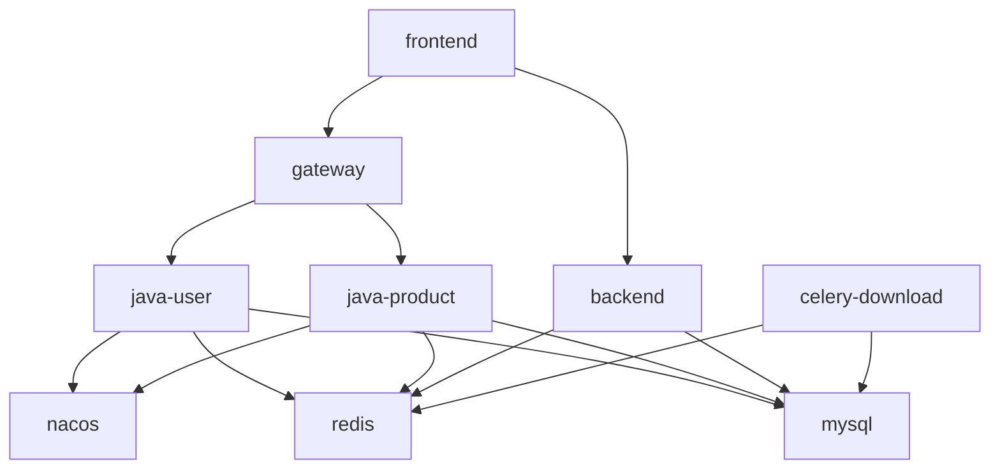

# Docker 生产部署流程

> 配置文件: `docker-compose.prod.yml`
> 启动命令: `docker compose -f docker-compose.prod.yml -p sijuelishi-prod up -d`

---

## 首次部署

### 1. Python 基础镜像（仅首次 / 依赖变更）

```powershell
docker compose -f docker-compose.base.yml build
```

### 2. 前端 dist（宿主机构建，Docker 内存不够）

```powershell
cd frontend
npx vite build --mode production --minify false
cd ..
```

### 3. 构建所有镜像

```powershell
docker compose -f docker-compose.prod.yml build --parallel
```

> Java 服务使用多阶段构建（`Dockerfile.prod`），`mvn package` 在镜像内自动执行，**不需要在宿主机手动编译 JAR**。

### 4. 启动

```powershell
docker compose -f docker-compose.prod.yml -p sijuelishi-prod up -d
```

### 5. 验证

```powershell
docker ps --format "table {{.Names}}\t{{.Status}}"
```

---

## 日常更新

### 只改 Java

```powershell
docker compose -f docker-compose.prod.yml build --no-cache java-product gateway java-user
docker compose -f docker-compose.prod.yml up -d java-product gateway java-user
```

> 改到哪个模块就 rebuild 哪个，不需要全部重建。多阶段构建只在首次或依赖变更时重下 Maven 依赖。

### 只改前端

```powershell
# 1. 宿主机构建
cd frontend
npx vite build --mode production --minify false
cd ..

# 2. 重建镜像 + 重启
docker compose -f docker-compose.prod.yml build --no-cache frontend
docker compose -f docker-compose.prod.yml up -d frontend
```

### 只改 Python

```powershell
docker compose -f docker-compose.prod.yml build --no-cache backend celery-download
docker compose -f docker-compose.prod.yml up -d backend celery-download
```

### 多服务同时改

```powershell
docker compose -f docker-compose.prod.yml build --no-cache java-product gateway frontend backend
docker compose -f docker-compose.prod.yml up -d java-product gateway frontend backend
```

---

## 经验规则

### 铁律

| # | 规则 | 原因 |
|---|------|------|
| 1 | **禁止 `docker compose down -v`** | 会销毁数据卷（MySQL/Redis），生产只用 restart/stop/start |
| 2 | **前端构建必须在宿主机** | Docker Desktop 内存不够，Vite 构建会 OOM 崩溃 |
| 3 | **禁用 `docker compose down`** | 同上，`docker compose stop/start` 即可 |
| 4 | **生产 bucket 确认** | 宿主机 `.env` 可能带 `-dev` 后缀，生产 bucket 是 `sijuelishi-1328246743` |
| 5 | **push 前确认分支** | `git branch --show-current` 先看一眼 |

### 前端构建

- 正常 `npm run build` 会 OOM → 用 `--minify false`
- 跳过压缩：JS 不混淆但功能一样，内网管理后台影响可忽略
- 输出到 `../static/vue-dist/`，`frontend/Dockerfile` 从项目根 COPY

### 镜像重建

- `--no-cache` 确保新代码被 COPY 进去（Docker 可能缓存旧层）
- 共用 `Dockerfile.prod` 的 Java 服务（user/product/gateway）可以一起 build
- 改 Python 依赖必须重建 `sjzm-python-base` 基础镜像

### Java 多阶段构建

- `Dockerfile.prod` 分两阶段：**Stage1** Maven 镜像编译 → **Stage2** JRE 镜像运行
- 最终镜像只包含 JRE + JAR，不含 Maven/源码（体积 ~200MB）
- 首次构建较慢（下载 Maven 依赖），后续依赖层缓存，只重编改过的模块
- `-T 4` 4 线程并行编译

---

## 常用命令

```powershell
# 查看所有容器状态
docker ps --format "table {{.Names}}\t{{.Image}}\t{{.Status}}\t{{.Ports}}"

# 查看容器日志（最近 50 行）
docker logs prod-gateway --tail 50

# 查看日志（带时间过滤）
docker logs prod-backend --since 5m

# 搜索日志中的错误
docker logs prod-java-product --tail 100 2>&1 | Select-String "ERROR|Exception"

# 重启单个容器
docker compose -f docker-compose.prod.yml restart gateway

# 停止所有容器
docker compose -f docker-compose.prod.yml stop

# 启动所有容器
docker compose -f docker-compose.prod.yml start

# 查看镜像列表
docker images --format "table {{.Repository}}\t{{.Tag}}\t{{.Size}}\t{{.CreatedAt}}"

# 清理构建缓存
docker builder prune -f
```

---

## 端口速查

| 服务 | 端口 | 容器名 |
|------|------|--------|
| 前端 | 5173 | prod-frontend |
| Gateway | 9003 | prod-gateway |
| Java User | 8014 | prod-java-user |
| Java Product | 8025 | prod-java-product |
| Python | 7093 | prod-backend |
| Celery | - | prod-celery-download |
| MySQL | 3310 | prod-mysql |
| Redis | 6383 | prod-redis |
| Nacos | 8852 | prod-nacos |

---

## 服务依赖关系


