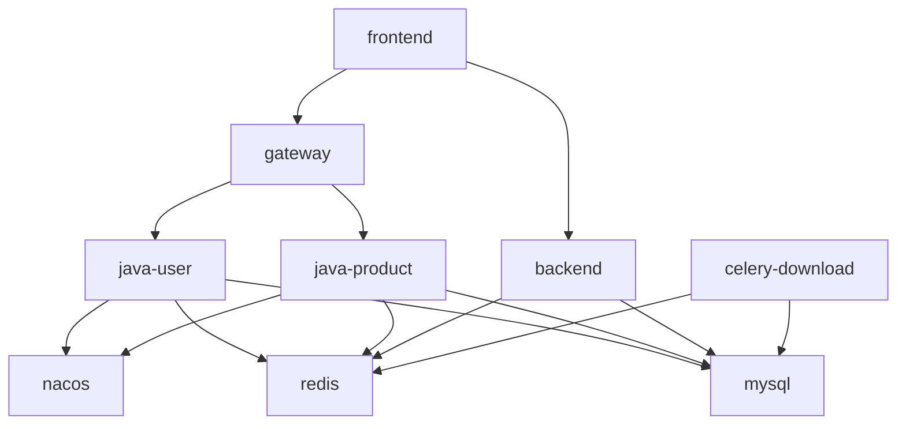

# Docker 生产部署流程

> 配置文件: `docker-compose.prod.yml` + `config/public/prod.env` + `config/secrets/prod.env`
> 启动: `docker compose -f docker-compose.prod.yml -p sijuelishi-prod up -d`

---

## 🚨 避坑清单 (实战提取, 部署前必读)

### 1. `docker compose restart` 不会重新读 env_file

改了 `config/*.env` 之后:
- ❌ `docker compose restart backend` — 不会重读 env_file, 容器还是旧值
- ❌ `docker restart prod-backend` — 同上
- ✅ `docker compose up -d --force-recreate backend` — 重建容器, 读最新 env_file

**自查方式**: `docker exec <容器名> printenv | grep <变量名>` 看实际生效的值。

### 2. `docker-compose.yml` 的 `environment: ${VAR}` 是从宿主机读

```yaml
environment:
  MYSQL_ROOT_PASSWORD: ${MYSQL_ROOT_PASSWORD}   # ← 从宿主 .env 读, 不是 env_file!
```

`${MYSQL_ROOT_PASSWORD}` 是 Compose **YAML 变量替换**, 优先读宿主机环境变量 + 项目根 `.env`, **不读 env_file**。

这会导致 `env_file` 给的 prod 值被宿主机 dev 值覆盖。

**解决**: 不要在 `environment:` 用 `${}` 引用 env_file 已经设的变量。把所有变量统一放 env_file, 用 env_file 注入。

### 3. 重建 backend 后 nginx 缓存了旧 IP

`docker compose up -d --force-recreate backend` 之后, backend 拿到新 IP, 但 nginx 上一次解析的旧 IP 还在缓存。

**症状**: 重建 backend 后所有 `/api/v1/*` (Python 兜底) 返回 502。

**解决**: `docker restart prod-frontend` 让 nginx 重新解析 DNS。

### 4. 配置变更后 rebuild 优先级

```
config/secrets/*.env / config/public/*.env  →  up -d --force-recreate
docker-compose.prod.yml                     →  up -d (变更影响范围内重建)
frontend/nginx.conf                         →  build --no-cache frontend + up -d --force-recreate frontend
java-backend/sjzm-*/application.yml         →  build java-* + up -d java-*
backend/app/**                              →  build --no-cache backend + up -d --force-recreate backend
frontend/src/**                             →  npm run build (宿主) + build --no-cache frontend
```

### 5. Nginx 默认上传限制 1MB

不加 `client_max_body_size` 会导致**所有图片上传 413**。

`frontend/nginx.conf` 必须有:
```nginx
client_max_body_size 100m;
```

### 6. JWT 跨端口不共享

`localhost:8179` (dev) 和 `localhost:5173` (prod) 是**不同 localStorage 域**, 浏览器 token 互相看不见。生产域必须**重新登录**。

### 7. 真生产 COS 桶 vs Dev 桶

**严格分离, 不可混用**:
- 生产: `sijuelishi-1328246743`
- 开发: `sijuelishi-dev-1328246743`

数据库里图片 URL 必须和 `COS_BUCKET` 配置**指向同一个桶**, 否则 `image-proxy` 找不到文件返回 SVG 占位。

dev 数据库导入 prod 后, **不能**只改 `COS_BUCKET` 配置 — 数据库里的 URL 也得 `REPLACE(dev→prod)`, 并且**dev 桶的图片必须复制到 prod 桶**。

### 8. mysqldump 警告会污染 SQL 文件

```bash
docker exec mysql mysqldump ... > dump.sql 2>&1   # ❌ stderr 警告会混进 dump.sql
docker exec mysql mysqldump ... > dump.sql 2>/dev/null   # ✅ 正确
```

如果导入报 `ERROR 1064 (42000)` near `mysqldump: [Warning]...`, 把 dump 文件第一行删了再导。

### 9. Git Bash 中文路径 docker cp 会失败

Git Bash 把 Windows 中文路径误转换。1.1GB 备份文件如果在中文目录:

```bash
# ❌ 在 Git Bash 里
docker cp "产品数据/数据库备份/6.23/xxx.sql" prod-mysql:/tmp/

# ✅ 改用 cmd 或 PowerShell
docker cp "F:\项目\si-jue-zhi-mao-up\产品数据\数据库备份\6.23\xxx.sql" prod-mysql:/tmp/
```

### 10. 大文件导入沉默 1-2 分钟正常

1GB+ 的 SQL 导入没进度条, 看着像卡住但实际在跑。耐心等 2 分钟。需要进度可用 `pv`。

### 11. Docker Desktop 内置镜像源可能崩

报错 `image-mirror.r2.daocloud.vip ... EOF` 时, **手动 pull 一遍**:

```powershell
docker pull eclipse-temurin:21-jre-alpine
docker pull maven:3.9-eclipse-temurin-21
docker pull python:3.11-slim
docker pull nginx:alpine
docker pull mysql:8.0
docker pull redis:7-alpine
docker pull nacos/nacos-server:v2.3.1
```

拉完后 build 就走本地缓存了。

### 12. 9 个容器不是全部 healthy

只有 `mysql/redis/backend/celery/frontend` 配了 healthcheck。
`nacos/java-user/java-product/gateway` 状态显示 **`Up xxx`(无 healthy 标记)是正常的**, 不是有问题。

验证 Java 服务是否真起来: `docker logs prod-java-product --tail 30 | grep "Started.*Application"`。

### 13. 登录 admin 密码

dev/prod 数据库里的 admin 密码是 **`123456`**(不是 `admin` 或 `admin123`)。

---

## 生产部署要点

> ⚠️ 部署前先看这，避免翻车

### 1. 启动命令

```powershell
docker compose -f docker-compose.prod.yml -p sijuelishi-prod up -d
```

### 2. 密钥管理 (config/ 集中化)

所有密钥/配置都在 `config/` 下，**不在 compose 文件里硬编码**：

```
config/
├── public/
│   ├── dev.env       ✅ 进 git (非敏感)
│   └── prod.env      ✅ 进 git (非敏感)
└── secrets/
    ├── dev.env.example   ✅ 进 git (模板)
    ├── prod.env.example  ✅ 进 git (模板)
    ├── dev.env           ⛔ 不进 git (真密钥)
    └── prod.env          ⛔ 不进 git (真密钥)
```

**首次部署需创建真密钥文件**：

```powershell
# 方式 1: 从开发机同步真密钥过来
scp dev-machine:/path/to/repo/config/secrets/prod.env config/secrets/prod.env

# 方式 2: 从 .example 复制后填值
cp config/secrets/prod.env.example config/secrets/prod.env
# 编辑填入真实值 (JWT_SECRET 必须 >= 32 字符)
```

### 3. 启动顺序

```
nacos → mysql/redis → java-user → java-product → gateway → backend/frontend
```

| 服务 | 先等谁 |
|------|--------|
| nacos | 无依赖，第一个启 |
| java-user / java-product | mysql(healthy) + redis(healthy) + nacos(started) |
| gateway | nacos + java-user + java-product 全部 started |
| backend | mysql(healthy) + redis(healthy) |
| frontend | gateway + backend |

> 🚨 **gateway 最晚启动**，因为它依赖 user 和 product 都就绪。

### 4. JWT 一致性 (关键!)

**`config/secrets/prod.env` 里的 JWT_SECRET 必须保持当前生产实际值**，否则改了之后所有用户 token 失效，需要重新登录。

核对生产实际值：
```powershell
docker exec prod-backend printenv | findstr JWT_SECRET
```

**gateway / java-user / java-product / backend 四者的 JWT_SECRET 必须完全相同且 >= 32 字符**，否则 HMAC-SHA256 校验失败。

### 5. 路由架构

```
浏览器
  ↓
Nginx(prod-frontend:80, 宿主 5173)
  ├─ /api/v1/(auth|users)/             ─→ Gateway:9000 ─→ java-user
  ├─ /api/v1/(competitor|product-performance|category-baseline|category-dislocation|
  │   element-discovery|seller|filter-config|asin-import|scoring|filter-presets|
  │   sellersprite-config|click-logs|deng-zong-shop|blue-ocean|clean-layer|
  │   subcategory-alias|modules)/      ─→ Gateway:9000 ─→ java-product
  ├─ /api/v1/product-line/(aggregated-data|analysis-results|guidance|tree)
  │                                    ─→ Gateway:9000 ─→ java-product
  └─ /api/* (其他 Python 独有)         ─→ Python:8090 (FastAPI)
```

### 6. Java 多阶段构建

所有 Java 服务共用 `java-backend/Dockerfile.prod`，通过 `SERVICE_MODULE` 环境变量区分 (gateway/user/product)。Maven 依赖使用阿里云镜像源加速。

```powershell
# 带进度输出的构建
docker compose -f docker-compose.prod.yml -p sijuelishi-prod build --progress=plain java-product

# 重启
docker compose -f docker-compose.prod.yml -p sijuelishi-prod up -d java-product
```

### 7. 前端构建（宿主机构建）

```powershell
cd frontend
npm run build
cd ..
docker compose -f docker-compose.prod.yml -p sijuelishi-prod build --no-cache frontend
docker compose -f docker-compose.prod.yml -p sijuelishi-prod up -d frontend
```

Docker Desktop 里跑 Vite 会 OOM，必须在宿主机 Windows 上构建。

### 8. 数据卷保护

| 卷名 | 丢数据的后果 |
|------|-------------|
| `prod-mysql-data` | ❌ **MySQL 全量数据丢失** |
| `prod-redis-data` | ❌ Redis 缓存丢失（可恢复） |
| `prod-nacos-logs / prod-nacos-data` | ⚠️ Nacos 配置丢失 |

**绝对禁止 `docker compose down -v`**（小写 `-v` 删卷），生产环境只用 `stop/start/restart`。

---

## 首次部署 (从零开始)

### 1. 拉代码

```powershell
git clone https://github.com/puletire9-leo/si-jue-zhi-mao-up.git
cd si-jue-zhi-mao-up
git checkout 生产测试    # 或者 master
```

### 2. 创建密钥文件 (必须!)

```powershell
# 用 example 当模板
cp config/secrets/prod.env.example config/secrets/prod.env

# 编辑填入真实密钥
notepad config/secrets/prod.env
```

**必填密钥**：

```
JWT_SECRET=sjzm-local-test-jwt-secret-2024-prod-min32chars
SECRET_KEY=sjzm-local-test-secret-key-2024-prod-min32chars
MYSQL_ROOT_PASSWORD=root123456
MYSQL_PASSWORD=sijue123456
COS_SECRET_ID=AKID...
COS_SECRET_KEY=...
SELLERSPRITE_SECRET_KEY=...
```

> ⚠️ JWT_SECRET 必须与现有生产值一致，否则用户登录失效。如果是全新项目，可用 `openssl rand -base64 32` 生成。

### 3. 前端 dist 构建 (宿主机)

```powershell
cd frontend
npm install        # 首次需要装依赖
npm run build      # 输出到 ../static/vue-dist/
cd ..
```

### 4. 构建所有镜像

```powershell
docker compose -f docker-compose.prod.yml -p sijuelishi-prod build --progress=plain
```

> Java 服务使用多阶段构建 + 阿里云 Maven 源，首次约 3-5 分钟。

### 5. 启动

```powershell
docker compose -f docker-compose.prod.yml -p sijuelishi-prod up -d
```

### 6. 验证

```powershell
# 看所有容器是否健康
docker ps --format "table {{.Names}}\t{{.Status}}"

# 应该看到 9 个容器全部 Up:
#   prod-mysql / prod-redis / prod-nacos
#   prod-backend / prod-celery-download
#   prod-java-user / prod-java-product / prod-gateway
#   prod-frontend

# 测试登录接口
curl http://localhost:5173/api/v1/auth/login -X POST -H "Content-Type: application/json" \
  -d '{"username":"admin","password":"xxx"}'
```

---

## 日常更新流程

### 只改 Java 后端

```powershell
# 改 java-product (其他模块同理)
docker compose -f docker-compose.prod.yml -p sijuelishi-prod build --progress=plain java-product
docker compose -f docker-compose.prod.yml -p sijuelishi-prod up -d java-product
```

> 改到哪个模块就 rebuild 哪个。pom 没变时依赖层走缓存，只重新编译源码（几十秒）。

### 只改前端

```powershell
cd frontend
npm run build
cd ..
docker compose -f docker-compose.prod.yml -p sijuelishi-prod build --no-cache frontend
docker compose -f docker-compose.prod.yml -p sijuelishi-prod up -d frontend
```

### 只改 Python 后端

```powershell
docker compose -f docker-compose.prod.yml -p sijuelishi-prod build --no-cache backend
docker compose -f docker-compose.prod.yml -p sijuelishi-prod up -d backend celery-download
```

> backend 和 celery-download 共用同一个镜像（prod-backend）。

### 只改 Nginx 配置

```powershell
# 直接 rebuild frontend (Nginx 配置在 frontend/nginx.conf)
docker compose -f docker-compose.prod.yml -p sijuelishi-prod build --no-cache frontend
docker compose -f docker-compose.prod.yml -p sijuelishi-prod up -d frontend
```

### 只改 Gateway 路由

```powershell
docker compose -f docker-compose.prod.yml -p sijuelishi-prod build --progress=plain gateway
docker compose -f docker-compose.prod.yml -p sijuelishi-prod up -d gateway
```

### 只改密钥 (无需 rebuild)

```powershell
# 改 config/secrets/prod.env 后直接 restart
docker compose -f docker-compose.prod.yml -p sijuelishi-prod restart
```

> env_file 在容器启动时读取，不进镜像。改了 env 只需 restart 不需要 rebuild。

---

## 经验规则

### 铁律

| # | 规则 | 原因 |
|---|------|------|
| 1 | **禁止 `docker compose down -v`** | 会销毁数据卷（MySQL/Redis），生产只用 restart/stop/start |
| 2 | **前端构建必须在宿主机** | Docker Desktop 内存不够，Vite 构建会 OOM 崩溃 |
| 3 | **禁用 `docker compose down`** | 同上，`docker compose stop/start` 即可 |
| 4 | **JWT_SECRET >= 32 字符且不变** | 改了会让所有用户重新登录；JJWT HMAC-SHA256 要求 256 bits |
| 5 | **真密钥不进 git** | `config/secrets/*.env` 已被 .gitignore 屏蔽,但小心别 `git add -f` |
| 6 | **push 前确认分支** | `git branch --show-current` 先看一眼 |

### C 盘空间管理

- Docker 的镜像/缓存/临时文件默认存 C 盘
- **C 盘满了 Docker build 会卡死** —— 先清理再 build
- `docker builder prune -f` 清构建缓存（不影响已有镜像）
- `docker system prune -f` 清无用容器/网络/镜像
- **不要随便 prune**，清完后下次 build 要重新下载依赖
- 长期方案：Docker Desktop → Settings → Resources → Disk image location 迁到 D/E 盘

### Java 多阶段构建

- `Dockerfile.prod` 分两阶段：**Stage1** Maven 镜像编译 → **Stage2** JRE 镜像运行
- Maven 依赖使用阿里云镜像源（`maven.aliyun.com`），Alpine apk 也用阿里源
- 最终镜像只包含 JRE + JAR，不含 Maven/源码（体积 ~200MB）
- **pom 没变 = 依赖层缓存命中**，只重编源码（几十秒）
- **pom 变了 or 缓存被清 = 重新下载依赖**（3-5 分钟）
- 构建带进度：`--progress=plain`

### Python 自包含构建

- `backend/Dockerfile` 是多阶段自包含构建
- pip 使用阿里云源（`mirrors.aliyun.com/pypi/simple`）
- 容器内端口统一 8090（dev/prod 一致）

### 前端构建

- `npm run build` 输出到 `../static/vue-dist/`
- `frontend/Dockerfile` 从项目根 COPY
- nginx.conf 直接 COPY 进镜像，改了要 `--no-cache` rebuild

---

## 常用命令

```powershell
# 查看所有容器状态
docker ps --format "table {{.Names}}\t{{.Image}}\t{{.Status}}\t{{.Ports}}"

# 查看容器日志 (最近 50 行)
docker logs prod-gateway --tail 50

# 查看日志 (带时间过滤)
docker logs prod-backend --since 5m

# 搜索日志中的错误
docker logs prod-java-product --tail 100 2>&1 | Select-String "ERROR|Exception"

# 看容器实际生效的环境变量 (核对密钥)
docker exec prod-backend printenv | findstr "JWT_ MYSQL_ COS_"

# 重启单个容器
docker compose -f docker-compose.prod.yml -p sijuelishi-prod restart gateway

# 停止所有容器 (保留数据卷)
docker compose -f docker-compose.prod.yml -p sijuelishi-prod stop

# 启动所有容器
docker compose -f docker-compose.prod.yml -p sijuelishi-prod start

# 查看镜像列表
docker images --format "table {{.Repository}}\t{{.Tag}}\t{{.Size}}\t{{.CreatedAt}}"

# 清理构建缓存
docker builder prune -f
```

---

## 端口速查

| 服务 | 宿主端口 | 容器内端口 | 容器名 |
|------|---------|-----------|--------|
| 前端 | 5173 | 80 | prod-frontend |
| Gateway | 9003 | 9000 | prod-gateway |
| Java User | 8014 | 8001 | prod-java-user |
| Java Product | 8025 | 8002 | prod-java-product |
| Python | 7093 | 8090 | prod-backend |
| Celery | - | 8090 | prod-celery-download |
| MySQL | 3310 | 3306 | prod-mysql |
| Redis | 6383 | 6379 | prod-redis |
| Nacos | 8852 | 8848 | prod-nacos |

---

## 服务依赖关系



---

## 踩坑记录

### 2026-06-26: 设置页 sellersprite-config 报"请求的资源不存在"

**现象**: 设置页加载报 404 / "请求的资源不存在"。

**根因**: 前端 `GET /api/v1/sellersprite-config` **不带尾部斜杠**, 但 nginx 正则末尾是 `/` 强制要求, 匹配失败后落到 `/api/` 兜底打到 Python (Python 没这接口) → 404。

```nginx
# 错误: 强制要求尾部 /
location ~ ^/api/v1/(...|sellersprite-config|...)/ { ... }

# 正确: 尾部斜杠可选, 也能精确匹配整个 path
location ~ ^/api/v1/(...|sellersprite-config|...)(/|$) { ... }
```

**预防**: nginx 路由 regex 用 `(/|$)` 而不是 `/`, 允许两种调用方式。

### 2026-06-26: Nginx 把所有 /api/* 转到 Python, Java 微服务在生产形同虚设

**现象**: 调用 `/api/v1/category-baseline/compute-bsr` 返回 404, 但 dev 模式正常。

**根因**: 旧版 `frontend/nginx.conf` 里 `location /api/ { proxy_pass http://backend:8090; }` 把所有 API 转到 Python, Java 服务虽然在 docker-compose 里启动了但根本收不到请求。

**解决**: 重写 `nginx.conf`, 用 `location ~ ^/api/v1/(auth|users|...)/` 精细路由, Java 接口走 Gateway, Python 独有走 backend。

### 2026-06-26: MySQL root 密码不对, env_file 被宿主 .env 覆盖

**现象**: 启动 prod-mysql 后 `docker exec ... mysql -uroot -proot123456` 报 `Access denied`。

**根因**: docker-compose.prod.yml 的 mysql 服务里有
```yaml
environment:
  MYSQL_ROOT_PASSWORD: ${MYSQL_ROOT_PASSWORD}
```
`${}` 是 Compose YAML 替换, 从**宿主机 `.env`** 读 (`MYSQL_ROOT_PASSWORD=root`), 覆盖了 `env_file` 提供的 `root123456`。

**解决**: 去掉 mysql 服务的 `environment:` 块, 所有变量统一从 `env_file` 注入。

**自查**: `docker exec prod-mysql printenv | grep PASSWORD` 确认实际生效的密码。

### 2026-06-26: MYSQL_USERNAME 同样被宿主机污染

**现象**: java-user 启动失败连不上 MySQL。

**根因**: 同上, `environment: MYSQL_USERNAME: ${MYSQL_USER}` 也是 YAML 替换。

**解决**: 把 `MYSQL_USERNAME=sijue` 加到 `config/public/{dev,prod}.env`, 去掉 YAML 里的 `${}`。

### 2026-06-26: 改了 prod.env 但容器还在用旧值

**现象**: 把 `COS_BUCKET` 改成生产桶, `docker compose restart backend` 后 `printenv` 显示还是旧值。

**根因**: `docker restart` / `docker compose restart` **只发 SIGTERM+SIGCONT, 不重新读 env_file**。

**解决**: `docker compose -f docker-compose.prod.yml -p sijuelishi-prod up -d --force-recreate backend celery-download`。

### 2026-06-26: --force-recreate 后 nginx 502

**现象**: backend 重建完, 浏览器所有 `/api/*` (Python 兜底) 报 502, Java 接口正常。

**根因**: backend 新容器拿到新 IP, nginx 缓存的旧 IP 已失效。

**解决**: `docker restart prod-frontend` 重新解析 DNS。

### 2026-06-26: 定稿图片全占位 (COS 桶不匹配)

**现象**: 定稿/产品页面图片全是灰色 SVG 占位。

**根因**: 数据库 URL 指向 dev 桶 (`sijuelishi-dev-1328246743`), 但 `COS_BUCKET` 配的是生产桶 (`sijuelishi-1328246743`), `image-proxy` 用 `COS_BUCKET` 构造 URL, 在生产桶里找不到这些文件, fallback 到 SVG 占位。

**解决**: 用真生产数据库备份 `产品数据/数据库备份/6.23/sijuelishi_20260623.sql` (URL 全是生产桶), 替换从 dev 同步的数据。

**预防**: dev 数据导 prod 时必须 `REPLACE(images, 'sijuelishi-dev-1328246743', 'sijuelishi-1328246743')`, 并把 dev 桶图片复制到生产桶。

### 2026-06-26: nginx 上传图片 413

**现象**: 定稿页面上传图片报 `Request failed with status code 413`。

**根因**: nginx 默认 `client_max_body_size 1m`, 图片肯定超。

**解决**: `frontend/nginx.conf` 加 `client_max_body_size 100m;`, rebuild frontend。

### 2026-06-26: docker compose build 报 image-mirror EOF

**现象**: build 时报 `failed to resolve source metadata for ... image-mirror.r2.daocloud.vip ... EOF`。

**根因**: Docker Desktop Windows 的内置代理镜像源 (`image-mirror.r2.daocloud.vip`) transient 失败, build 阶段无法走重试。

**解决**: 失败的镜像**手动 `docker pull`** 一遍, 缓存到本地后 build 直接走本地。

### 2026-06-26: Git Bash docker cp 中文路径失败

**现象**: `docker cp "产品数据/.../xxx.sql" prod-mysql:/tmp/` 在 Git Bash 里报 "No such file or directory"。

**根因**: Git Bash 把中文路径误转换成 `C:/Users/.../AppData/Local/Temp/xxx.sql` (Windows TEMP)。

**解决**: 用 cmd 或 PowerShell 跑 `docker cp`, 它们能正确处理中文路径。

### 2026-06-17: C 盘满导致 Docker build 卡死

**现象**: `docker compose build` 执行后无任何输出，完全卡住。`docker system prune` 也卡住。

**根因**: C 盘 0GB 剩余空间。Docker 的 BuildKit 需要写临时文件到 C 盘，磁盘满后 daemon 半瘫痪。

**解决**: 重启 Docker Desktop → 释放 C 盘空间 → `docker builder prune -f` 清缓存 → 重新 build。

**预防**: Docker Desktop → Settings → Resources → Disk image location 迁到 D/E 盘。

### 2026-06-17: ASIN 批量导入触发熔断（"竞品数据服务暂时不可用"）

**现象**: US 站点 69 批次导入，前面几批成功，后面全部报 "竞品数据服务暂时不可用"。

**根因**: 批次间无间隔，40 次/分钟瞬间打满，卖家精灵服务端限流 → Resilience4j 熔断器失败率超 50% → 进入 OPEN 状态 → 后续所有请求直接降级。

**解决**: `AsinImportService` 批次循环加 `Thread.sleep(2000)`，均匀分布请求。

**验证**: 直接 curl 调用卖家精灵 API（US 站点）返回正常，确认是频率问题而非 API 权限问题。

### 2026-06-17: JWT_SECRET 长度不够导致 500 错误

**现象**: 登录接口返回 `{"code":500,"message":"系统内部错误，请联系管理员"}`。

**根因**: JWT_SECRET 设为 31 字符（248 bits），JJWT 库要求 HMAC-SHA256 密钥 >= 256 bits（32 字符）。

**解决**: `config/secrets/prod.env` 中 JWT_SECRET 改为 >= 32 字符的字符串。

### 2026-06-17: docker builder prune 后 build 变慢

**现象**: `docker builder prune -f` 清了 10GB 缓存后，build Java 镜像要重新下载所有 Maven 依赖。

**教训**: 不要随便清 builder cache。依赖层缓存是 build 速度的关键。只在磁盘实在不够时才清，清完做好心理准备等一次完整下载。
