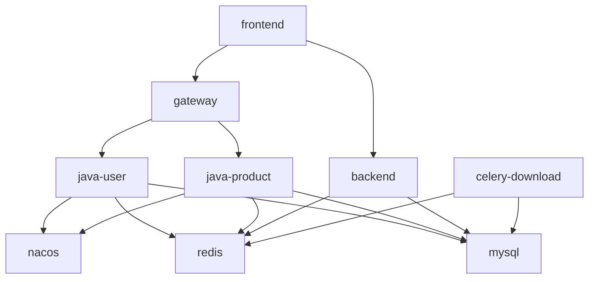

# Docker 生产部署流程

> 配置文件: `docker-compose.prod.yml` + `.env.prod` + `.env.prod.secrets`
> 基础启动: `docker compose -f docker-compose.prod.yml -p si-jue-zhi-mao-up up -d`
> 全量启动: `docker compose -f docker-compose.prod.yml -p si-jue-zhi-mao-up --profile full up -d`

---

## 生产部署要点

> ⚠️ 部署前先看这，避免翻车

### 1. 启动命令

```powershell
# 基础（不含 selection-agent）
docker compose -f docker-compose.prod.yml -p si-jue-zhi-mao-up up -d

# 全量（含 selection-agent-v2）
docker compose -f docker-compose.prod.yml -p si-jue-zhi-mao-up --profile full up -d
```

### 2. 密钥管理

密钥不在 compose 文件里硬编码，通过 `env_file` 注入：
- `.env.prod` — 非敏感配置（进 git）
- `.env.prod.secrets` — 敏感密钥（不进 git）

首次部署需创建密钥文件：
```powershell
cp .env.prod.secrets.example .env.prod.secrets
# 编辑填入真实值（JWT_SECRET 必须 >= 32 字符）
```

### 3. 启动顺序

```
nacos → mysql/redis → java-user → java-product → gateway → backend/frontend
```

| 服务 | 先等谁 |
|------|--------|
| nacos | 无依赖，第一个启 |
| java-user / java-product | mysql(healthy) + redis(healthy) + nacos(started) |
| gateway | nacos + java-user + java-product 全部 started |
| backend | mysql(healthy) + redis(healthy) |
| frontend | gateway + backend |

> 🚨 **gateway 最晚启动**，因为它依赖 user 和 product 都就绪。

### 4. Gateway 独有注意

**JWT 密钥必须一致** — gateway / java-user / java-product 三者的 `JWT_SECRET` 必须完全相同且 >= 32 字符，否则 HMAC-SHA256 校验失败。

**两个网关层：**
```
用户 → Nginx(prod-frontend:80) → Gateway(prod-gateway:9000) → Java 服务
                              └──→ Python(prod-backend:8090) 直接
```

- 正则匹配到的 API（auth/users/competitor/scoring/modules…）走 Gateway
- 其余 `/api/v1/` 走 Python 直连

### 5. Java 多阶段构建

所有 Java 服务共用 `java-backend/Dockerfile.prod`，通过 `SERVICE_MODULE` 环境变量区分。
Maven 依赖使用阿里云镜像源加速。

```powershell
# 带进度输出的构建
docker compose -f docker-compose.prod.yml -p si-jue-zhi-mao-up build --progress=plain java-product

# 重启
docker compose -f docker-compose.prod.yml -p si-jue-zhi-mao-up up -d java-product
```

### 6. 前端构建（宿主机构建）

```powershell
cd frontend
npm run build
cd ..
docker compose -f docker-compose.prod.yml -p si-jue-zhi-mao-up build --no-cache frontend
docker compose -f docker-compose.prod.yml -p si-jue-zhi-mao-up up -d frontend
```

Docker Desktop 里跑 Vite 会 OOM，必须在宿主机 Windows 上构建。

### 7. 数据卷保护

| 卷名 | 丢数据的后果 |
|------|-------------|
| `prod-mysql-data` | ❌ **MySQL 全量数据丢失** |
| `prod-redis-data` | ❌ Redis 缓存丢失（可恢复） |
| `prod-nacos-logs / prod-nacos-data` | ⚠️ Nacos 配置丢失 |

**绝对禁止 `docker compose down -v`**（小写 `-v` 删卷），生产环境只用 `stop/start/restart`。

---

## 首次部署

### 1. 创建密钥文件

```powershell
cp .env.prod.secrets.example .env.prod.secrets
# 编辑填入真实密钥值（JWT_SECRET >= 32字符）
```

### 2. 前端 dist（宿主机构建，Docker 内存不够）

```powershell
cd frontend
npm run build
cd ..
```

### 3. 构建所有镜像

```powershell
docker compose -f docker-compose.prod.yml build --progress=plain
```

> Java 服务使用多阶段构建 + 阿里云 Maven 源，首次约 3-5 分钟。

### 4. 启动

```powershell
docker compose -f docker-compose.prod.yml -p si-jue-zhi-mao-up up -d
```

### 5. 验证

```powershell
docker ps --format "table {{.Names}}\t{{.Status}}"
```

---

## 日常更新

### 只改 Java

```powershell
docker compose -f docker-compose.prod.yml -p si-jue-zhi-mao-up build --progress=plain java-product
docker compose -f docker-compose.prod.yml -p si-jue-zhi-mao-up up -d java-product
```

> 改到哪个模块就 rebuild 哪个。pom 没变时依赖层走缓存，只重新编译源码（几十秒）。

### 只改前端

```powershell
cd frontend
npm run build
cd ..
docker compose -f docker-compose.prod.yml -p si-jue-zhi-mao-up build --no-cache frontend
docker compose -f docker-compose.prod.yml -p si-jue-zhi-mao-up up -d frontend
```

### 只改 Python

```powershell
docker compose -f docker-compose.prod.yml -p si-jue-zhi-mao-up build --no-cache backend
docker compose -f docker-compose.prod.yml -p si-jue-zhi-mao-up up -d backend celery-download
```

> backend 和 celery-download 共用同一个镜像（prod-backend）。

---

## 经验规则

### 铁律

| # | 规则 | 原因 |
|---|------|------|
| 1 | **禁止 `docker compose down -v`** | 会销毁数据卷（MySQL/Redis），生产只用 restart/stop/start |
| 2 | **前端构建必须在宿主机** | Docker Desktop 内存不够，Vite 构建会 OOM 崩溃 |
| 3 | **禁用 `docker compose down`** | 同上，`docker compose stop/start` 即可 |
| 4 | **JWT_SECRET >= 32 字符** | JJWT 要求 HMAC-SHA256 密钥至少 256 bits，否则 500 错误 |
| 5 | **push 前确认分支** | `git branch --show-current` 先看一眼 |

### C 盘空间管理

- Docker 的镜像/缓存/临时文件默认存 C 盘
- **C 盘满了 Docker build 会卡死** —— 先清理再 build
- `docker builder prune -f` 清构建缓存（不影响已有镜像）
- `docker system prune -f` 清无用容器/网络/镜像
- **不要随便 prune**，清完后下次 build 要重新下载依赖
- 长期方案：Docker Desktop → Settings → Resources → Disk image location 迁到 D/E 盘

### Java 多阶段构建

- `Dockerfile.prod` 分两阶段：**Stage1** Maven 镜像编译 → **Stage2** JRE 镜像运行
- Maven 依赖使用阿里云镜像源（`maven.aliyun.com`），Alpine apk 也用阿里源
- 最终镜像只包含 JRE + JAR，不含 Maven/源码（体积 ~200MB）
- **pom 没变 = 依赖层缓存命中**，只重编源码（几十秒）
- **pom 变了 or 缓存被清 = 重新下载依赖**（3-5 分钟）
- 构建带进度：`--progress=plain`

### Python 自包含构建

- `backend/Dockerfile` 是多阶段自包含构建，不再依赖本地 `sjzm-python-base` 镜像
- pip 使用阿里云源（`mirrors.aliyun.com/pypi/simple`）
- 容器内端口统一 8090（dev/prod 一致）

### 前端构建

- `npm run build`（不需要 `--minify false`，已在 vite.config 配置）
- 输出到 `../static/vue-dist/`，`frontend/Dockerfile` 从项目根 COPY

---

## 常用命令

```powershell
# 查看所有容器状态
docker ps --format "table {{.Names}}\t{{.Image}}\t{{.Status}}\t{{.Ports}}"

# 查看容器日志（最近 50 行）
docker logs prod-gateway --tail 50

# 查看日志（带时间过滤）
docker logs prod-backend --since 5m

# 搜索日志中的错误
docker logs prod-java-product --tail 100 2>&1 | Select-String "ERROR|Exception"

# 重启单个容器
docker compose -f docker-compose.prod.yml restart gateway

# 停止所有容器
docker compose -f docker-compose.prod.yml stop

# 启动所有容器
docker compose -f docker-compose.prod.yml start

# 查看镜像列表
docker images --format "table {{.Repository}}\t{{.Tag}}\t{{.Size}}\t{{.CreatedAt}}"

# 清理构建缓存
docker builder prune -f
```

---

## 端口速查

| 服务 | 宿主端口 | 容器内端口 | 容器名 |
|------|---------|-----------|--------|
| 前端 | 5173 | 80 | prod-frontend |
| Gateway | 9003 | 9000 | prod-gateway |
| Java User | 8014 | 8001 | prod-java-user |
| Java Product | 8025 | 8002 | prod-java-product |
| Python | 7093 | 8090 | prod-backend |
| Celery | - | 8090 | prod-celery-download |
| MySQL | 3310 | 3306 | prod-mysql |
| Redis | 6383 | 6379 | prod-redis |
| Nacos | 8852 | 8848 | prod-nacos |
| Selection Agent | - | 8011 | prod-selection-agent-v2 |

---

## 服务依赖关系



---

## 踩坑记录

### 2026-06-17: C 盘满导致 Docker build 卡死

**现象**: `docker compose build` 执行后无任何输出，完全卡住。`docker system prune` 也卡住。

**根因**: C 盘 0GB 剩余空间。Docker 的 BuildKit 需要写临时文件到 C 盘，磁盘满后 daemon 半瘫痪。

**解决**: 重启 Docker Desktop → 释放 C 盘空间 → `docker builder prune -f` 清缓存 → 重新 build。

**预防**: Docker Desktop → Settings → Resources → Disk image location 迁到 D/E 盘。

### 2026-06-17: ASIN 批量导入触发熔断（"竞品数据服务暂时不可用"）

**现象**: US 站点 69 批次导入，前面几批成功，后面全部报 "竞品数据服务暂时不可用"。

**根因**: 批次间无间隔，40 次/分钟瞬间打满，卖家精灵服务端限流 → Resilience4j 熔断器失败率超 50% → 进入 OPEN 状态 → 后续所有请求直接降级。

**解决**: `AsinImportService` 批次循环加 `Thread.sleep(2000)`，均匀分布请求。

**验证**: 直接 curl 调用卖家精灵 API（US 站点）返回正常，确认是频率问题而非 API 权限问题。

### 2026-06-17: JWT_SECRET 长度不够导致 500 错误

**现象**: 登录接口返回 `{"code":500,"message":"系统内部错误，请联系管理员"}`。

**根因**: JWT_SECRET 设为 31 字符（248 bits），JJWT 库要求 HMAC-SHA256 密钥 >= 256 bits（32 字符）。

**解决**: `.env.prod.secrets` 中 JWT_SECRET 改为 >= 32 字符的字符串。

### 2026-06-17: docker builder prune 后 build 变慢

**现象**: `docker builder prune -f` 清了 10GB 缓存后，build Java 镜像要重新下载所有 Maven 依赖。

**教训**: 不要随便清 builder cache。依赖层缓存是 build 速度的关键。只在磁盘实在不够时才清，清完做好心理准备等一次完整下载。
