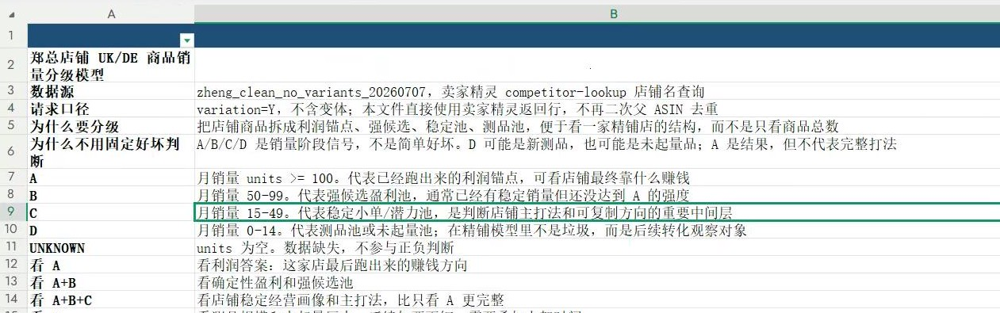
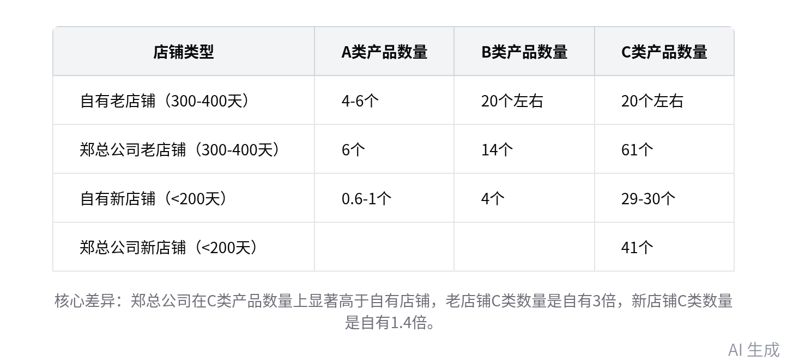
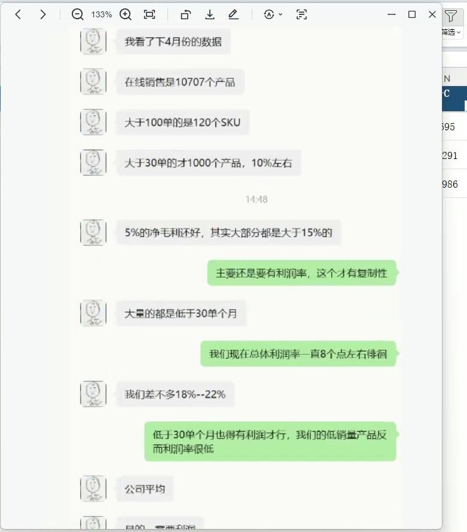

# 智能纪要：竞品店铺运营数据对比分析会 2026年7月7日

> 会议主题：竞品店铺运营数据对比分析会
> 
> 会议时间：2026年7月7日（周二） 17:45 \- 2026年7月8日 09:03 （GMT\+08）
> 
> 参会人：@蒋舒@唐若
> 
> 

> 智能会议纪要由 AI 生成，可能不准确，请谨慎甄别后使用
> 
> 

# 总结

本次会议围绕郑总公司店铺数据展开分析，对比自有店铺在产品等级分类、利润、出单率等方面的差异，探讨了产品开发、运营策略以及人员招聘问题，并提出后续需深入研究数据、优化模式、调整产品开发思路和解决人员观念等工作方向，内容如下：

- **数据抓取与分类**

    - **数据抓取情况**

        - 抓取依据与范围：将郑总公司所有店铺数据按标准抓取，依据是产品要有排名，无排名的新品或未出单产品无法抓取。共抓取两个国家（英国和德国）的数据，去掉副体后有 6813 条，加上实体及遗漏店铺，与在售链接数量相近。英国店铺占比超 60%，德国较少。

        - 数据偏差说明：抓取的数据为卖家精灵推导，与实时后台数据可能存在偏差，且数据为最近一个月的，可能不能代表未来表现。

    - **产品等级分类**

        - 分类标准：将店铺产品分为 A、B、C、D 四级，A级月销量大于 100，B 级为 50 \- 99，C 级为 15 \- 50，D 级为 0 \- 14。郑总公司分为 S、A、B、C、D 五档，标准与自有分类有差别，且自有标准更严格。

            

            

        - 各级产品数量：英国 A 类产品有 263 个，与郑总反馈数据有偏差；汇总数据显示 A 类有 271 个，B 类有 708 个，C 类将近 3000 个。

- **不同时期店铺对比分析**

    - **上架时间统计**

        - 平均上线天数：统计了 50 个店铺（主要是英国，部分德国未统计完）的上架时间，平均上线天数为 350 天，而自有店铺上架最早约一年（360 天左右）。

        - 对比分析意义：通过对比同一时期店铺的数据，分析差异，为自有店铺发展提供参考。

    - **不同时期店铺产品表现对比**

        - 老店铺（300 \- 400 天）对比：A 类产品自有店铺平均约 4 \- 6 个，郑总公司为 6 个；B 类自有店铺平均 20 出头，郑总公司较不平均，总体平均 14 个；C 类自有店铺 20 个左右，郑总公司有 61 个。可见 A、B 类产品差别不大，主要差异在 C 类产品。

        - 新店铺（小于 200 天）对比：A 类产品平均 0\.6 \- 1 个，B 类平均 4 个，C 类平均 41 个（排除特殊情况后平均 29 \- 30 个）。同样，差异集中在 C 类产品。

    - **出单率分析**

        - 自有店铺出单率：小于 90 天新品出单率为 9%，大于 90 天过新品期出单率为 26%，超过半年出单率为 36%，270 天以上出单率为 63%。

        - 郑总公司出单率：以 1 万个链接为例，4 月份出单 8000 单，出单率达 80%，约为自有店铺的 3 倍。

- **利润与成本分析**

    - **利润率差异**

        - 郑总公司利润率：郑总公司产品利润率较高，平均在 18% \- 22%，部分产品单毛利可达 30%以上。

        - 自有店铺利润率：自有店铺开品毛利约 20%，最好的品利润率为 30%，整体利润率低于郑总公司。

    - **成本因素分析**

        - 广告成本：郑总公司部分产品广告占比较低，新品广告占比与自有店铺相近，但定价毛利率较高。

        - 物流成本：推测物流成本可能存在差异，但因物流价格透明且共享，差距可能不大。需统计各成本占比明细，分析影响毛利的关键因素。

    - **利润计算方式探讨**：讨论了结算毛利与销售毛利的区别，结算毛利包含广告推广成本、店铺平摊费用等，销售毛利不涵盖这些。需明确郑总公司利润计算方式，以准确对比分析。

- **产品开发与运营策略**

    - **产品开发思路**

        - 借鉴多元素开发模式：郑总公司会在同一载体上采用不同图案元素同时开发，且选用之前好卖的经典元素。自有产品开发应更具发散性思维，大胆尝试新载体和新元素，避免局限于固定载体和图案。

        - 提前规划季节性产品：对于季节性产品，如夏季和冬季产品，应提前规划和准备，避免临近季节才开发，可参考郑总公司 4 月份上架夏季产品的做法。

    - **运营模式优化**

        - 确保高毛利和出单率：运营模式要成熟，保证产品有 20%以上的毛利和较高的出单率。在模式成熟后，可通过增加人员和复制模式实现业务增长。

        - 提高出图效率：虽然目前出图后还需修改，但应把控好图片质量，提升出图效率，以支持业务发展。

- **人员问题与解决思路**

    - **人员招聘困难**：目前运营人员招聘紧张，部分人员认为新铺没有前途，不愿意加入。需解决人员观念问题，让其认识到新铺也有发展潜力。

    - **加强模式管控**：对运营模式进行严格管控，确保模式的有效性和稳定性，提高团队整体绩效。

- **后续工作计划**

    - **数据深入研究**：将图片表格转成可分析的数据表格，统计不同时间段（如最近半年、90 天等）的产品数据，分析 3 个月推广期内负利润产品情况，以及超过 50 天推广期后产品的盈利情况。

    - **成本占比统计**：统计自有店铺各成本（如运费、广告、产品采购等）的占比明细，找出占比高的成本项目，分析与郑总公司的差异。

    - **产品开发调整**：产品开发人员应增强发散性思维，借鉴郑总公司的开发模式，提前规划季节性产品的开发和上架时间。

    - **模式研究与优化**：组织相关人员（如蒋舒等四人）研究运营模式，减少与郑总公司的差异，探索适合自有业务的高效模式。

    - **人员观念引导**：解决运营人员对新铺的观念问题，通过案例分析、培训等方式让其认识到新铺的发展潜力，吸引更多人员加入。

# 待办

* [ ] 图片转表处理：将对应图片转换为可编辑的表格格式，为后续相关数据的整理分析提供支撑 @唐若

* [ ] 成本明细统计：统计各成本项的占比明细，定位占比偏高的成本类别，结合运费占比较高的感知核查相关数据，明确高利润率竞品的费用占比情况及核心影响因素 @唐若

* [ ] 毛利情况询问：结合当前讨论的定价、退货、广告费等成本项，于次日核实相关合作方的毛利数据情况

* [ ] 美工相关事项研讨：推进美工招聘工作，同步把控图片质量，结合开品模型落地需求，合理优化出图效率

# 相关链接

- 妙记：[无主题](https://bcnx1jc60afj.feishu.cn/minutes/obcnodj885xlp76945rs8c32?from=ai_minutes)

- 文字记录

    - [竞品店铺运营数据对比分析会 2026年7月7日](https://bcnx1jc60afj.feishu.cn/docx/YAocd2ro9ovGIIxcuIkccJBxnde)

