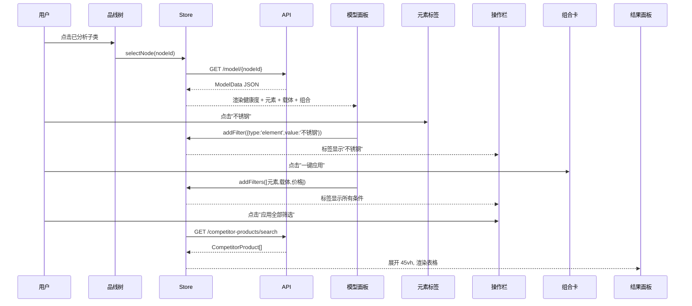

# 品线选品页面 — 实现蓝图

> 基于原型 `frontend/product-line-selection-prototype.html`  
> Amber Classic 设计系统 · 即时可用

---

## 页面结构

```
┌─────────────┬──────────────────────────────────────────────┐
│  顶部工具栏 (52px)                                          │
│  品牌名 · 面包屑 · 站点/月份/版本下拉                        │
├─────────────┬────────────────────────────────────┬─────────┤
│ 品线树      │         品线模型                     │ 结果面板  │
│ 280px       │         flex: 1                     │ 可折叠   │
│ 可拖拽      │         竖向滚动                     │ 45vh     │
│             │                                     │          │
│ 搜索框      │ 健康度横幅 (环形图 + 指标)            │ 表格     │
│ L1 分类     │ 已验证元素 (标签云, 可点击筛选)       │ 批量操作  │
│ L2 子类     │ 载体画像 (2列卡片, 可点击筛选)        │ 分页     │
│ 分析状态点  │ 推荐组合 (一键应用)                   │          │
│             │ 底部操作栏 (标签 + 应用全部筛选)      │          │
└─────────────┴────────────────────────────────────┴─────────┘
```

## 已实现的组件和交互

| 组件 | 文件位置建议 | 关键功能 |
|------|-------------|----------|
| `ProductLineTree` | `modules/product-line-selection/components/` | 搜索过滤、L1分类折叠、L2点击激活、分析状态圆点 |
| `ProductLineModel` | `modules/product-line-selection/components/` | 健康度环形图、元素标签云、载体卡片网格、推荐组合卡片 |
| `HealthBanner` | `components/selection/` | 环形进度图 + 四项指标 + 品类名称 |
| `CompetitorResultTable` | `modules/product-line-selection/components/` | 复选框多选、固定表头、状态标签、分页 |
| `FilterActionBar` | `modules/product-line-selection/components/` | 筛选标签展示、删除单个标签、一键应用 |

## Vue 组件结构建议

```
src/modules/product-line-selection/
├── manifest.ts                    # 路由 /product-line-selection, 菜单组"选品中心"
├── index.vue                      # 主容器: workspace 三栏布局
├── components/
│   ├── ProductLineTree.vue        # 左侧品线树
│   ├── ProductLineModel.vue       # 中间模型面板
│   ├── HealthBanner.vue           # 健康度横幅
│   ├── ElementTagCloud.vue        # 已验证元素标签云
│   ├── CarrierGrid.vue            # 载体画像网格
│   ├── ComboCards.vue             # 推荐组合卡
│   ├── FilterActionBar.vue        # 底部筛选操作栏
│   └── CompetitorResultTable.vue  # 竞品结果表格
└── stores/
    └── productLineSelection.ts     # Pinia Store
```

## Pinia Store 数据模型

```typescript
interface ProductLineSelectionState {
  marketplace: 'US' | 'UK' | 'DE'
  month: string
  version: string
  selectedNodeId: string | null
  modelData: ModelData | null
  activeFilters: FilterCondition[]
  results: CompetitorProduct[]
  resultsTotal: number
  resultsPage: number
}

interface FilterCondition {
  type: 'element' | 'carrier' | 'combo' | 'price'
  label: string
  value: string
  source: string  // 节点ID 或 'manual'
}
```

## 关键交互流程



## 额外优化想法

### 1. 散点图替代纯表格
结果面板上半部分放 ECharts 价格-BSR 散点图（实现类 PriceSalesScatter），下半部分表格。散点图让用户一眼看到甜点区（低价格+低BSR）。

### 2. 健康度环形图动画
用 `requestAnimationFrame` 让环形图从 0 增长到目标值，800ms ease-out 动画（已在原型中静态展示）。

### 3. 元素标签热度标注
🔥已验证（销量好）用红色角标，⭐新兴（销量上升快）用橙色角标。原型中已通过 `.hot` 和 `.rising` 类实现。

### 4. 推荐组合一键对比
在推荐组合卡片右侧加"对比"按钮，点击后结果面板切到"对比模式"，只显示两个组合的差异行。

### 5. 键盘快捷操作
- `Ctrl+K` — 打开品线搜索
- `Ctrl+Enter` — 应用全部筛选
- `Escape` — 关闭结果面板
- `← →` — 焦点在品线树时切换节点

### 6. 版本快速切换
顶部版本下拉切换时，左侧品线树保持当前选中品类的 L2 节点位置不滚动。
