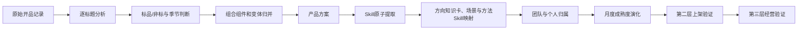

# 开发Skill提取分析流程

## 一、这套流程要解决什么

把开发人的每一条商品标题，逐步整理成可追溯、可复用、可跨月积累的开发Skill。第一层只回答“开发了什么、面向什么场景、怎样组织产品”，不能直接说明产品已经上架或盈利。

正式观察从2025年7月开始，当前核心开发人为陈杨、蒋舒、宋凤莉。

## 二、输入源、筛选口径与最终输出

### 2.1 唯一输入源

当前第一层逐标题分析固定读取：

`产品数据/思考理实团队的开品方向/第一版/第一层_核心开发人开品分析_陈杨宋凤莉蒋舒/00_三人开品基础明细_2025-04至2026-06.csv`

除非人工明确更换基础表，否则AI不得自行改读其他Excel、历史分析文件或模型产物。命令行可以使用`--source`显式覆盖，但必须在当月审核记录中写出实际来源文件。

### 2.2 输入字段

必须存在的原始字段：

- `创建月份`：固定开发批次，不能用上架月份替代；
- `开发人`：只接受陈杨、蒋舒、宋凤莉；
- `SKU`：原始SKU，不得丢失；
- `产品名称`：原始完整标题，不得截断；
- `创建时间`：用于识别同一创建批次；
- `是否组合主SKU`：标记组合主商品。

可选但优先使用的字段：`关联组合主SKU`、`组合主SKU`或`父SKU`。只要原始表提供了明确父子关系，就必须优先使用，不再依赖语义推断。当前基础表没有明确父SKU列时，才允许根据“同开发人、同月份、同创建批次、标题组件语义包含”推断，并把结果写入输出字段`关联组合主SKU`。

### 2.3 固定筛选条件

- 只保留指定创建月份；
- 只保留陈杨、蒋舒、宋凤莉；
- SKU和产品名称不能为空；
- SKU以`TEST`、`DEMO`或`测试`开头，或状态字段明确等于“测试/测试数据/Demo”的记录排除；
- 不得仅因商品标题中出现“测试”二字而排除，例如“水温测试仪”是正常商品。

### 2.4 最终输出

最终输出分为五类：

1. 逐标题分析：保留每一个SKU和完整标题的语义分析。
2. 产品方案：把颜色、尺寸、数量变体和组合组件合并为真实产品方案。
3. 四层Skill：商品方向、场景主题、开发方法、组合打法。
4. 月度演化：记录Skill首次出现、跨月复现和成熟度变化。
5. 开发人画像：使用统一Skill编号描述个人特点，不复制Skill定义。

## 三、完整数据流

## 四、逐步分析流程

### 第1步：确定月份和人员范围

- 按创建月份固定一批开品，不能使用后来上架月份替代开发月份。
- 当前只纳入陈杨、蒋舒、宋凤莉。
- 2025年4—6月不参与Skill成熟度和三人横向比较。
- 原始记录必须保留开发人、SKU和完整标题，不能先按关键词粗略汇总。
- 开始分析前必须验证输入文件路径、表头和筛选结果，并把实际来源、原始行数、排除行数写入质量审核记录。

### 第2步：逐标题读取，不跳过任何商品

每一个标题都要独立分析，至少填写：

- 规范产品名称、产品本体、产品族；
- 核心功能、使用场景、适用人群、适配对象；
- 主题元素、材质与结构、数量与组合；
- 季节属性、建议售卖时间；
- 标品或非标、差异化方式和风险提示。

标题是第一层最重要的事实来源。标题已经明确的信息必须直接使用；标题没有直接写明的信息，可以根据商品常识进行受控推断，但必须记录补充依据和分析置信度。

如果标题只有编号、颜色、数量、内部代号或无法识别商品本体，必须标记`待复核原因=标题不足以分析`，并遵守三条禁令：不得猜测产品本体、不得写“其他商品/小商品/杂项商品”等占位本体、不得强行映射到宽泛Skill。记录必须保留在待复核区，但不得进入正式证据。

### 第3步：提取产品本体和核心功能

- 产品本体回答“这个商品本质是什么”，不能把颜色、数量、节日元素写进本体。
- 核心功能回答“买它主要用来做什么”。
- 套装标题应识别主商品和主要组件，不能只取标题中的第一个名词。
- 型号、编号或内部代号不能直接当作产品本体。

### 第4步：补全六个分析维度

对每个标题继续分析：使用场景、适用人群、适配对象、主题元素、材质与结构、建议售卖时间。

- 能从标题直接确认的，标记为标题事实。
- 能依据商品用途合理判断的，写明推断依据。
- 确实无法判断的，保留未知并进入质量复核，不能批量填入空洞的“标题未明确”。

### 第5步：判断标品和非标

非标判断遵守当前团队定义：

- 标题中明确写有“定制”的，直接判为非标。
- 玩具、装饰、服装造型、首饰等以外观、图像、主题或审美元素主导购买决策的，判为非标。
- 主要依靠功能、规格、适配关系和解决具体问题成交的，判为标品。
- 同时具备功能和主题元素时，判断真正主导购买决策的因素，并写入标准化判断依据。

### 第6步：判断季节性和售卖时间

- 标题明确出现节日、季节、开学、婚礼等时间场景时，按明确场景判断。
- 常驻功能品原则上判为全年，但可以补充需求旺季。
- 不能因为标题中出现颜色或普通装饰元素就强行判断季节性。
- 建议售卖时间是开发辅助判断，不是销量事实。

### 第7步：识别组合产品、组件和规格变体

SKU用于保留开发工作量，产品方案用于计算Skill证据。

- 组合商品按实际售卖的组合主SKU算一个产品方案。
- 被拆出的组件SKU关联回组合主SKU，不能重复贡献Skill证据。
- 仅颜色、尺寸、数量或轻微款式不同的SKU，合并为同一产品方案。
- 功能、目标人群、适配对象或使用场景已经发生实质变化的，保留为不同产品方案。
- 每条标题都必须保留产品方案ID和关联组合主SKU，保证可以反查。
- 产品方案同时保留稳定的`产品方案键`。同一开发人的同一产品方案在后续月份再次出现时，必须复用历史产品方案ID；不得因为月份变化重新创建ID。

### 第8步：提取Skill原子

先从产品方案提取细粒度原子，不立即创建正式Skill：

- 方向Skill原子：商品或产品线方向。
- 开发方法原子：套装、规格、人群、主题、适配、维修替换等方法。
- 组合打法原子：方向、场景和方法共同形成的开发套路。

商品方向层执行强制1对1：每条标题和每个产品方案只能保留一个最主导的方向原子。判断顺序是标题事实与产品本体优先，其次是明确适配/使用对象，最后才使用基础表主方向兜底。无法确定唯一主导方向时进入待复核，不允许同时挂多个方向。

同义词要统一，不能因为措辞不同重复创建Skill。

### 第9步：映射到分层知识与Skill库

四层含义不可混用：

1. 商品方向知识卡：开发什么商品，用于AI定位相关历史证据。
2. 跨产品场景Skill：面向什么时间、节日、场景和购买需求。
3. 开发方法Skill：怎样组织套装、规格、主题、人群和适配。
4. 组合打法案例：商品方向与场景、方法形成的历史组合，经营验证前不作为基础Skill。

优先复用已有Skill编号。只有现有定义确实无法覆盖，并且有清晰边界和商品证据时，才新增候选Skill。

已有编号、名称和边界是跨月约束。不得为近义表达新建条目，例如不能把“发夹”另建为“头发装饰品开发”。新增候选必须同时提交：最相似已有编号、两者边界差异、不能复用旧条目的原因、代表产品方案，并先进入`05_证据演化/03_候选与待确认`，不得直接认定形成中或稳定。

### 第10步：建立证据账本

每个Skill证据必须能够反查：Skill编号、月份、开发人、产品方案ID、代表SKU、完整标题、产品本体和判定依据。

Skill数量统计使用产品方案，不使用重复SKU。一个产品方案在商品方向层必须且只能支持一个Skill；场景主题、开发方法和组合打法可以多对多，但同一层不能被近义Skill重复计算。

### 第11步：判断归属和成熟度

归属表示谁主要表现出该能力：

- 团队共同：三人各至少3个产品方案证据。
- 个人标志候选：非团队共同前提下，一人占比至少65%，总证据至少5个方案。
- 团队共享候选：至少两人有证据，但未达到团队共同。
- 个人候选：当前只有一人提供少量证据。

成熟度表示是否经过时间和经营验证：

- 1个月为候选；2个月为形成中；3个月及以上为稳定。
- 第二层证明能够稳定上架后，才可以认定核心Skill。
- 第三层证明有销量、利润、留存或回本价值后，才可以认定有效经营Skill。

### 第12步：生成渐进式文件

- 主目录：设计、流程、质量审核、导航和阅读总览。
- `05_逐标题分析基础`：逐标题XLSX、CSV和跨月检索索引。
- `06_数据处理底表`：结构化Skill总表和证据账本。

会被后续商品图片、ASIN上架和利润证据持续修正的内容，单独存放在同级的`持续更新团队开品skll集合`：

- `01_AI审核入口`：AI首先读取的审核流程和输出模板。
- `02_商品方向知识卡`：商品方向定义和历史证据。
- `03_核心开发Skill`：跨产品场景、开发方法和统一边界。
- `04_组合打法案例`：方向、场景与方法形成的历史案例。
- `05_证据演化`：月度变化、开发人画像和候选条目。

### 第13步：强制AI自检

每次生成逐标题文件后，AI必须执行自检；每次重建四层Skill库后必须再次执行。任一硬性项目失败时，脚本应中止，文件只能视为草稿，AI不得把结果交付为正式成果。

逐标题阶段至少检查：

1. 原始有效标题数等于逐标题分析数，覆盖率100%；
2. SKU、完整标题和产品方案ID覆盖率100%；
3. 每条记录的方向Skill原子数量不超过1；
4. 非待复核记录中“其他商品/小商品/杂项商品/待确认产品本体”为0条；
5. 同产品跨月复用历史产品方案ID；
6. 低置信度或待复核记录不会进入正式证据。

四层Skill阶段至少检查：

1. 每个有效“月份+产品方案”恰好映射一个`SK-PD`；
2. Skill编号唯一且层级固定；
3. 新增候选Skill已提供与最相似已有Skill的边界对比；
4. 证据账本能够反查月份、开发人、SKU、标题和产品方案ID。

## 五、每个月怎样继续

1. 新增当月逐标题数据，不覆盖历史月份。
2. 优先复用已确认的产品本体、产品族和Skill编号。
3. 对新商品、新用法和边界冲突进行单独复核。
4. 更新产品方案证据数、开发人分布和活跃月份。
5. 记录Skill是新增、复现、修正、合并还是停止出现。
6. 通过质量审核后，才能更新正式总览和个人画像。

## 六、终审退回后的修正路径

终审发现问题时，不允许只修改最终Markdown数字。必须沿证据链修正：

1. 定位出错的SKU和产品方案ID；
2. 修正逐标题字段、组合关系或产品方案归并；
3. 查找该产品方案支持的全部Skill证据；
4. 重新生成受影响月份；若修改了通用分类规则、产品方案键或组合规则，则从2025年7月起重跑全部已分析月份；
5. 重建跨月总索引和证据账本；
6. 重新计算Skill方案数、开发人归属、活跃月份和成熟度；
7. 更新对应月度演化、总览和开发人画像；
8. 重新执行全部自检，并在人工复核记录中写明“错误原因、影响范围、修正结果”。

局部字段措辞错误可以只重跑受影响月份；会改变产品方案ID、Skill方向或跨月成熟度的问题，必须连带重算后续汇总。

## 七、流程完成标准

只有同时满足以下条件，本月分析才算完成：

- 原始标题全部进入逐标题分析；
- 每条记录都有可追溯的产品方案ID；
- 组合组件和规格变体已经正确归并；
- Skill全部映射到统一编号或进入待确认区；
- 商品方向层每个有效产品方案恰好映射一个Skill；
- 同产品跨月产品方案ID保持一致；
- 证据账本能够反查到完整标题；
- 已完成《开发Skill提取分析质量审核》中的全部验收门槛。
